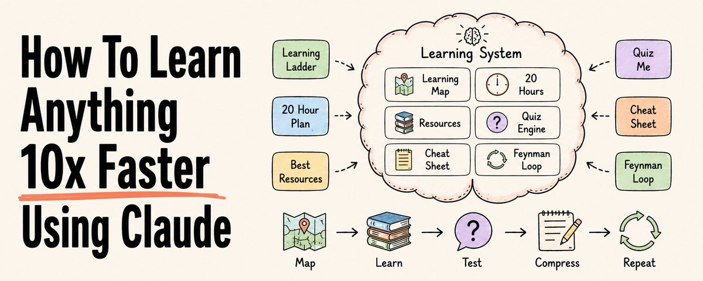
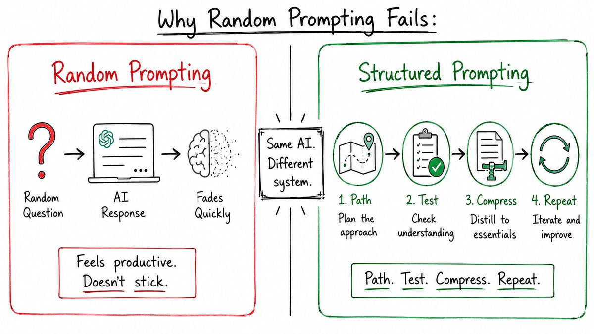
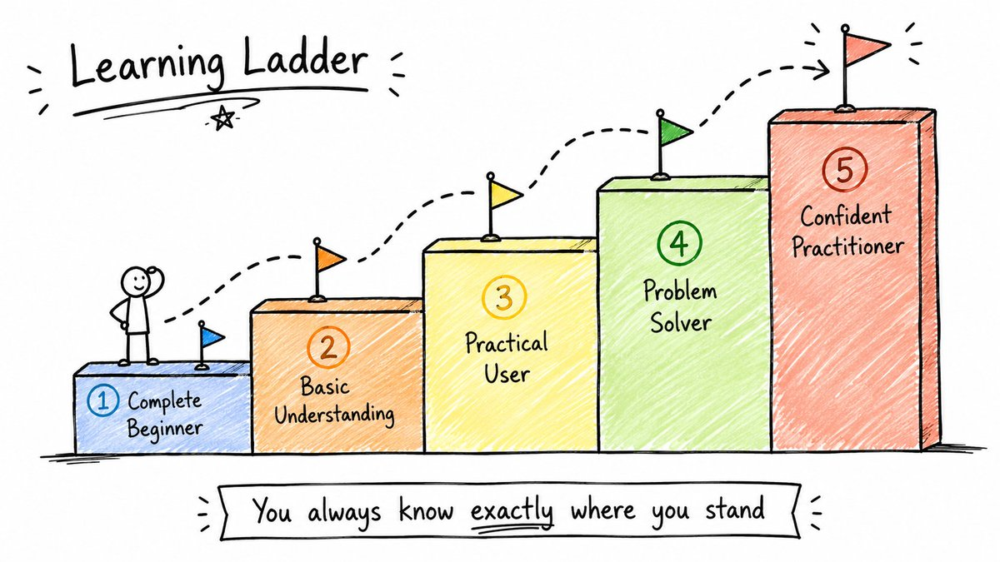
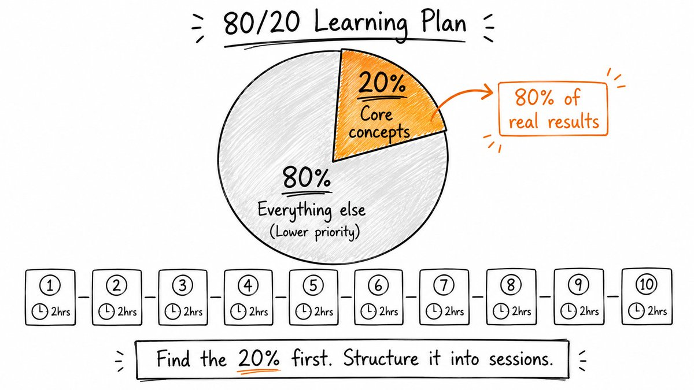
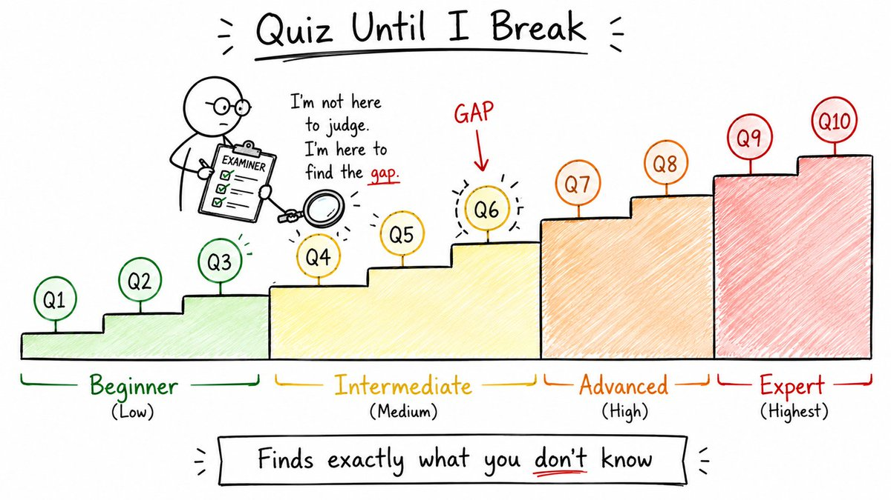
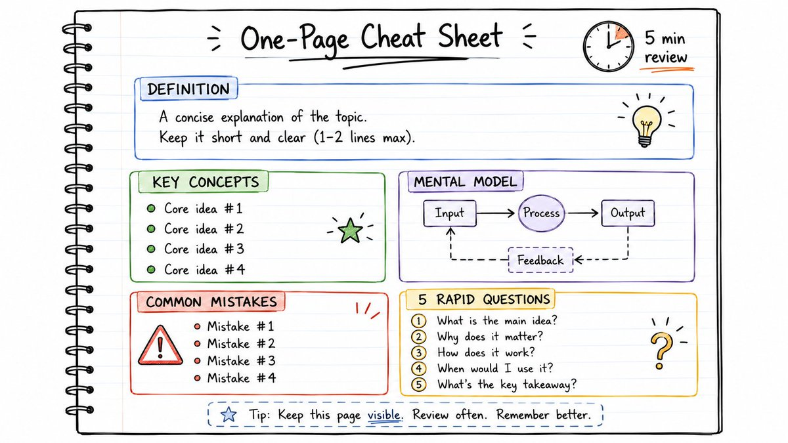
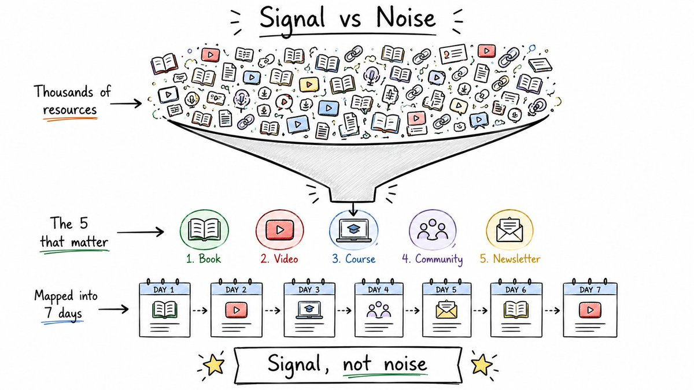
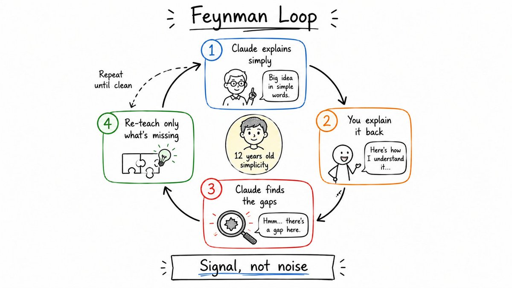
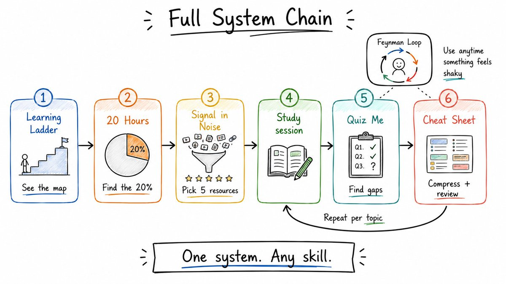

# 如何用 Claude 以 10 倍速度学会任何东西

**原文标题：** How To Learn Anything 10x Faster Using Claude
**作者：** Rahul（@sairahul1）
**原文链接：** https://x.com/sairahul1/article/2068250224532050089
**发布时间：** 2026 年 6 月 20 日



如今，学习任何东西都既容易又令人困惑。
容易，是因为 AI 几乎能在几秒钟内解释任何东西。
困惑，是因为大多数人只是随口提问、得到随机的答案，然后感觉自己正在学习。
一周之后，这些什么都没留下。

问题不在 AI，而在你使用它的方式。
这里有 6 个提示词，能把 Claude 变成你的私人教师、考官、资源策展人和学习伙伴。
不是为了得到答案，而是为了真正学会。
收藏这篇。今后每当你想掌握任何技能，都会用到它。

## 为什么随手提问行不通



你问 Claude：「解释一下量子计算。」
你得到一个不错的答案。
你觉得自己聪明了 10 分钟。
然后什么都没留下——因为没有结构、没有测试、没有重复，也没有反馈循环。

真正的学习需要 4 样东西，而 AI 对话通常会全部跳过：
→ 一条路径——让你知道按什么顺序学什么
→ 一场测试——让你发现自己其实并不懂什么
→ 一份压缩——让你在需要之前能快速复习
→ 一个反馈循环——让漏洞被立刻发现并补上

下面的每个提示词，各构建其中一样。

## 1. 构建学习阶梯（确切知道你在哪里、下一步是什么）



大多数人学习失败，是因为在基础打牢之前就跳进了进阶内容。
这个提示词会把任何主题拆成 5 个清晰的难度等级——从初学者到自信的实践者——每一级都配有一个里程碑和一次自测。
你永远都确切知道自己处在什么位置。

```

我想一步步学习[主题]，不跳过任何重要的基础。

请扮演一位专家教师和技能教练。把[主题]拆成 5 个清晰的难度等级，从完全新手到自信的实践者。

每个等级包含：

1. 等级名称
2. 这个阶段我应该理解什么
3. 达到这个等级的精通状态是什么样
4. 最需要专注的核心概念或技能
5. 一个证明我已经准备好继续前进的里程碑
6. 一个动手练习或迷你项目
7. 学习者在这个等级常犯的错误
8. 进入下一级之前的一个简单自测问题

等级结构如下：

- 第 1 级：完全新手
- 第 2 级：基本理解
- 第 3 级：实用使用者
- 第 4 级：问题解决者
- 第 5 级：自信的实践者

讲解要实用、对新手友好，并聚焦真实的进步。

```

## 2. 用 20 小时学会任何东西（任何技能的二八法则，结构化为 10 个学习单元）



大多数学科都有一小组能解锁其余一切的核心概念。
这个提示词会先找到那核心的 20%，再把它变成一份 10 个单元、每单元 2 小时的学习计划——每个单元都配有练习、资源和复习问题。

```

我想用 20 个专注的小时学会[主题]。

请扮演一位专家教师和学习策略师。你的任务是帮我先学会最有用的部分，而不是全部。

请按以下要求做：

1. 找出能带给我 80% 真实世界成果的那 20% 概念、技能或原理。
2. 解释这些核心领域为什么重要，以及它们如何连接到实际应用。
3. 制定一份 10 个单元的学习计划，每个单元 2 小时。
4. 每个单元包含：

- 主要学习目标
- 要学习的核心概念
- 一个实践练习或迷你项目
- 一个推荐资源，最好是免费或对新手友好的
- 完成该单元后的预期成果

5. 每个单元结束时，给我 5 个复习问题来检验我的理解。
6. 在完整计划之后，建议一个最终项目，证明我对这个主题的理解足以在现实生活中运用它。

计划要对新手友好、实用，并聚焦快速进步。

```

## 3. 考到我崩溃为止（找出你不懂之处的精确边界）



被动阅读让人感觉很高效。主动回忆才揭示真相。
这个提示词会把 Claude 变成一位严格的考官：一次只问一个问题，给每个答案打分，找出确切的漏洞，只重新讲解你漏掉的部分——并随着你的进度提高难度。

```

我刚学完[主题]，我想测试一下自己真正的理解程度。

请扮演一位严格但乐于助人的考官。你的任务是通过主动回忆，找出我理解力的边界。

先问我 10 个问题，一次一个。

规则：

1. 让问题难度逐渐提高：

- 第 1-3 题：新手级
- 第 4-6 题：中级
- 第 7-8 题：高级
- 第 9-10 题：专家级

2. 一次只问一个问题，并等待我的回答。
3. 每次回答后，做四件事：

- 给我的答案打分（满分 10 分）
- 告诉我答对了什么
- 指出确切的漏洞、错误或薄弱点
- 只用简单的语言重新讲解我漏掉的部分

4. 如果我的回答很弱，先追问一个跟进问题，再继续。
5. 如果我答得好，就稍微提高难度。
6. 最后，给我：

- 我的最终得分
- 我最强的部分
- 我最弱的部分
- 一份简短的复习计划
- 5 道终极挑战题，助我掌握这个主题

不要一次性给出所有答案。让这个过程感觉像一场真正的学习面试。

```

## 4. 制作一页速查表（你的大脑记结构比记段落更强）



这个提示词会把任何主题压缩成一页，5 分钟就能复习完——定义、规则、示例、常见错误和快问快答测试题，全部用可快速扫读的要点形式呈现。
非常适合在考试、会议、面试之前，或任何需要快速调用这个主题的真实任务中使用。

```

我想要一份关于[主题]的一页速查表。

请扮演一位能把复杂概念简化成快速复习表的专家教师。

制作一份我可以在需要使用这个主题之前花 5 分钟复习完的速查表。

请包含：

1. 用简单语言给出的主题简短定义。
2. 最重要的概念、规则、公式或步骤。
3. 用清晰的要点，而不是大段文字。
4. 如果有助于解释这个主题，配一个简单的带标注图示、流程图、表格或心智模型。
5. 3-5 个展示这个主题在现实生活中如何运用的具体例子。
6. 我应该避免的常见错误或易混淆部分。
7. 一份快速的「使用前」检查清单。
8. 5 个测试记忆的快问快答题。

保持实用、可视化、对新手友好、易于扫读。

```

## 5. 在噪音中找到信号（别再收集资源了。开始用对的那 5 个）



每个主题都有成千上万的资源。大多数人把时间浪费在收集上，而不是学习上。
这个提示词会找出 5 个杠杆最高的资源——书籍、视频、课程、社区——给它们排序，并只用这 5 个资源搭建一条 7 天学习路径。

```

我想快速学会[主题]，但不想把时间浪费在低质量的资源上。

请扮演一位专家级学习策展人。找出学习[主题]杠杆最高的 5 个资源。

资源可以包括书籍、视频、课程、网站、newsletter、社区，或值得关注的专家。

每个资源包含：

1. 资源名称
2. 资源类型
3. 它为什么值得我花时间
4. 它能帮我学会[主题]的哪个具体部分
5. 最适合这类资源的学习者类型
6. 难度等级：新手、中级或高级
7. 我应该如何高效使用它
8. 一个关于不该在什么上浪费时间的提醒

在清单之后，按最佳使用顺序给这些资源排名。

然后给我一条只用这些资源的简单 7 天学习路径。

聚焦质量、清晰度和实用性。我要的是信号，不是噪音。

```

## 6. 使用费曼循环（如果你不能简单地解释它，你就还没有理解它）



费曼学习法几乎能立刻揭穿虚假的理解。
Claude 会像对 12 岁的孩子一样解释这个主题，你用自己的话把它讲回来，Claude 找出每一个漏洞、只重新讲解缺失的部分——然后循环重复，直到你的解释干净、准确。

```

我想用费曼学习法深入理解[主题]。

请扮演一位有耐心的老师。首先，用简单的语言向我解释[主题]，就像我是一个 12 岁的孩子。

使用：

- 简单的词语
- 真实生活中的例子
- 类比
- 不要不必要的术语
- 简短的解释

解释完之后，请我用自己的话把这个主题讲回来。

然后检查我的解释，并做以下事情：

1. 指出我解释正确的部分。
2. 找出每一个漏洞、错误、混淆或缺失的概念。
3. 只重新教我答错或漏掉的部分。
4. 请我用更干净的方式再解释一遍。
5. 重复这个循环，直到我的解释简单、准确、完整。

规则：

- 在我的解释清晰之前，不要往前走。
- 不要用多余的理论压垮我。
- 温和但明确地纠正我。
- 每当我困惑时，就用例子。
- 最后，给我一份关于[主题]的最终干净版解释，让我可以保存为笔记。

让这个过程感觉像一场互动式的学习对话，而不是一场讲座。

```

## 如何把这些串起来



这不是 6 个孤立的技巧。它们是一个学习系统的各个阶段。

→ 从 **学习阶梯** 开始，看清整张地图
→ 用 **20 小时** 找到最先值得聚焦的核心 20%
→ 每次学习之后，运行 **考到我崩溃为止**，找出真实的漏洞
→ 把学到的内容压缩成 **一页速查表**，方便快速复习
→ 在开始之前，先用一次 **在噪音中找到信号**，挑出你的 5 个资源
→ 对任何仍然感觉不牢的部分，运行 **费曼循环**

路径 → 测试 → 压缩 → 重复。

这就是整个系统。

## 为什么这真的有效

大多数 AI 学习对话，只是没有结构的答案。

这个系统解决了这个问题，它强制具备任何真实学习过程都需要的 4 样东西：

一条路径，让你永远不会不知道下一步学什么。

一场测试，让你在付出代价之前——在考试、面试或真实项目中——发现自己不懂什么。

一份压缩，让复习只需 5 分钟，而不是把所有内容重读一遍。

一个反馈循环，让漏洞被立刻发现并补上，而不是无声地堆积。

AI 不会因为给出更好的答案，就让你成为更好的学习者。
当你强迫它来考你、为你压缩、纠正你时，它才会让你成为更好的学习者。