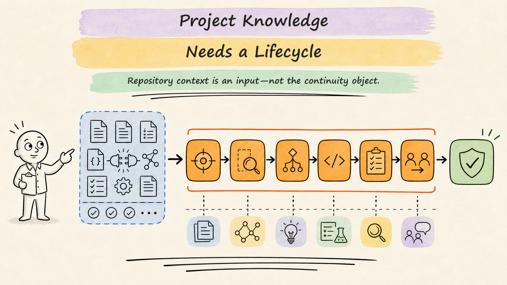
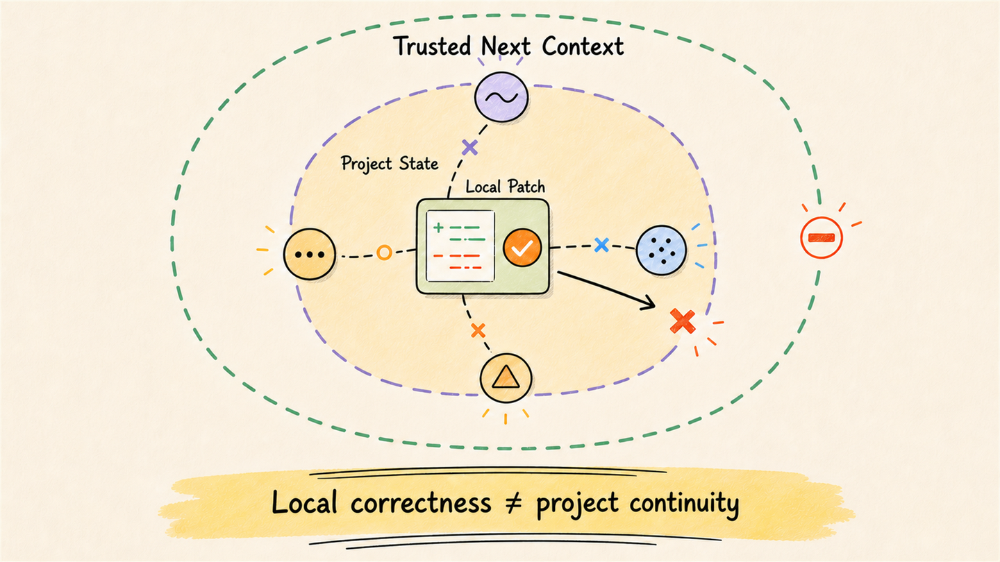
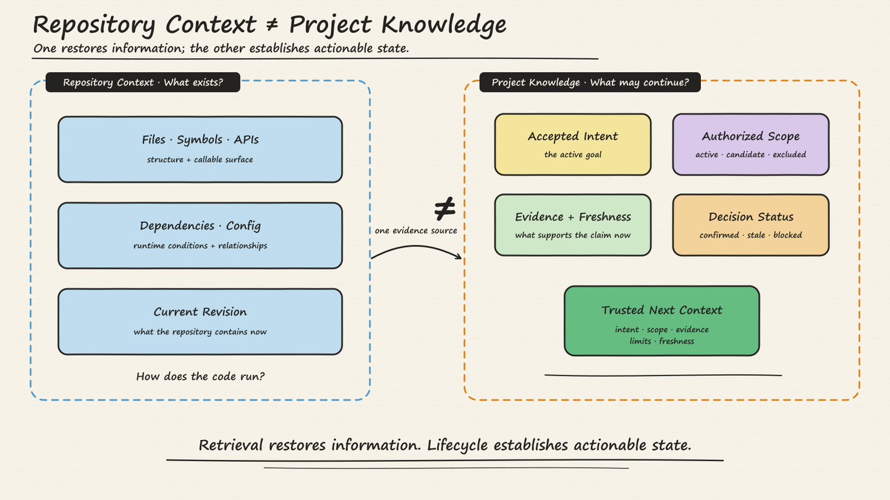
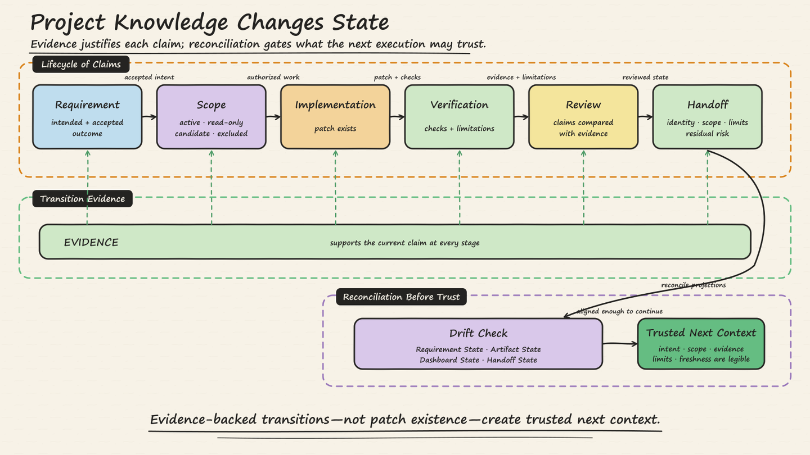
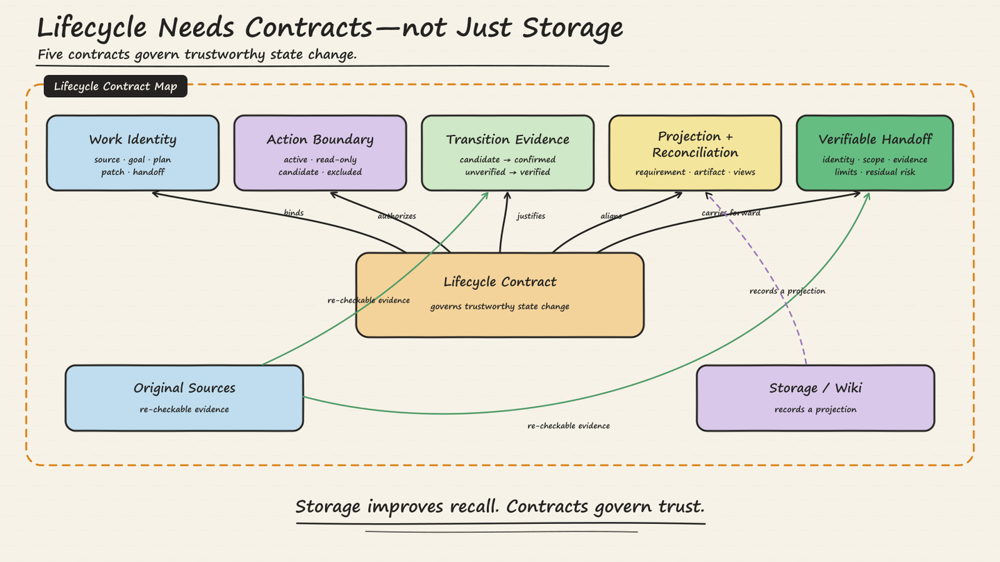
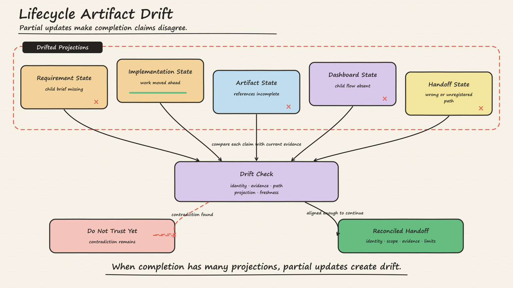
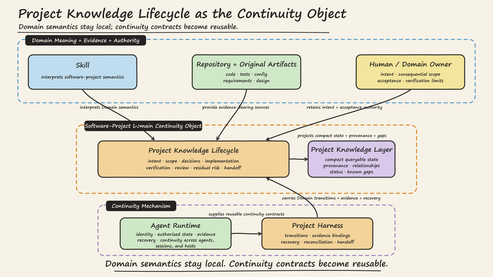
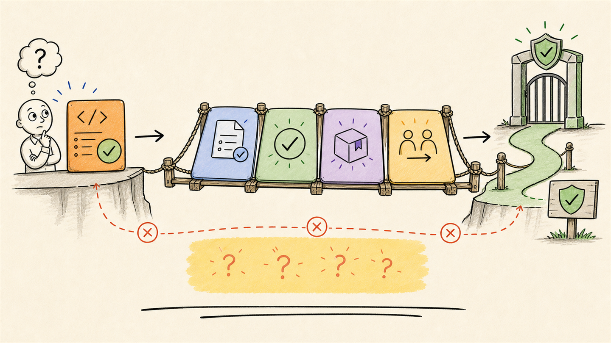

# 企业 Agent Runtime：项目知识需要生命周期

*为什么仅有 Repository Context，还不足以让 Coding Agent 真正参与项目工作*

## Patch 可以是对的，项目仍然可能是错的

*Patch 可以是对的，项目仍然可能停在互相矛盾的状态里。*

一份来自项目开发工作流的公开失败记录，描述了一次跨模块变更：实现已经向前推进，围绕代码的项目状态却发生了漂移。最终 Handoff 被写进错误目录；子实现有 Plan，却没有自己的 Lifecycle Brief；工作流依赖的 references 缺失；Dashboard 也没有投影已经被它作为 Evidence 引用的子流程。记录把它称为一次 Lifecycle Artifact Drift Failure。

如果只从代码看，这些问题很容易被归为“文档没收尾”。但从项目连续性的角度看，它们会直接改变下一个人或 Agent 可以相信什么：这项工作到底属于哪个 Requirement？真正的 Handoff 在哪里？子流程是否存在、是否已经完成？执行时所依据的 Lifecycle Contract 是否完整？

即使 Patch 本身没有问题，项目也可能停在一个互相矛盾的状态里。

这正是 Coding Agent 面临的一个更深层问题：它可以非常懂仓库，却仍然不知道项目此刻究竟处于什么状态。它也许找对了文件、符号、测试和 API，却沿用了已经失效的 Plan，进入了未经确认的 Scope，相信了没有同步完成的 Dashboard，或者把错误的 Artifact 交给下一次执行。

到了这里，整个系列的架构主线才真正落到软件项目 Domain。上一篇文章提出：Skill exposes the Domain，Harness carries the workload，而 Agent Runtime supplies composition and continuity。对软件项目来说，需要被延续的对象并不只是 Repository，而是代码周围不断变化的项目状态。

我目前的核心判断是：

> **项目知识并不是从仓库里检索出来的一组上下文，而是一条由证据支撑、贯穿需求、范围、决策、实现、验证、评审与交接的生命周期。**
>
> **对软件项目 Domain 来说，这条 Lifecycle 就是 Project Harness 所承载、Agent Runtime 帮助跨 Agent、Session 与 Host 延续的 Continuity Object。**

因此，我们要问的不只是 Agent 能否写出正确的 Patch，还要问：在 Patch 之前、之中和之后，项目能否继续保持一致。

## Repository Context 不等于 Project Knowledge

*检索恢复信息；Lifecycle 确立当前可以被安全行动和继续复用的状态。*

Repository Context 当然重要。Coding Agent 必须能找到文件、解析符号、追踪调用链、理解 API 与依赖、读取配置，并判断当前代码到底怎样运行。代码搜索、Repository Map、Embedding、RAG 和代码索引都可以为这件事提供帮助。

本文并不反对其中任何一种机制。

真正的区别在于，Repository Context 与 Project Knowledge 回答的是两类不同的问题。

|  |  |
|----|----|
| Repository Context 帮助回答 | Project Knowledge 还必须回答 |
| 有哪些文件、符号、API 与依赖？ | 当前真正被接受的目标是什么？ |
| 现有代码如何运行？ | 哪些 Scope 是 active、read-only、candidate 或 excluded？ |
| 测试、配置和文档在哪里？ | 当前状态由哪些 Evidence 支撑，还有什么没有验证？ |
| 能检索到哪些相关信息？ | 哪个 Decision 已确认、已失效、被阻塞，或仍在等待授权？ |
| 某个 Revision 的仓库包含什么？ | 下一次执行此刻可以安全相信什么？ |

检索系统可以找出一份 Implementation Plan，但“找到了”并不等于“可以执行”。它无法仅凭检索判断这份 Plan 是 candidate、已经得到 Human Confirmation，还是因为后续 Scope 变化而变成 stale。一项公开 Lifecycle Contract 正是把这些状态分开的：candidate plan 未经确认不得执行，confirmed plan 才可能属于 ready 的工作状态（来源）。

Verification 也一样。检索可以找出一条测试命令，甚至找出过去的测试结果，却不能自动证明旧结果适用于当前 Patch、覆盖当前 Acceptance，或者已经消除了所有相关风险。这些都需要基于当前 Evidence 做 Lifecycle Judgment。

**Retrieval 负责恢复信息；Project Lifecycle 负责确立当前真正被意图、被允许、被验证并可继续复用的状态。**

所以，Repository Context 是 Project Knowledge 的重要来源之一，但它不是让知识保持“当前且可行动”的完整生命周期。

## Project Knowledge 会改变状态

*项目知识的可信度来自由证据支撑的状态转换与对齐，而不是 Patch 已经存在。*

Project Knowledge 不是 Session 开始时一次性装载的一包材料。工作每向前推进一步，它的状态都会变化。

可以先用这样一条链路理解它：

**Source → Requirement 或 Bug → Scope → Design 或 Diagnosis → Plan → Development → Verification → Review → Handoff → trusted next context**

这条链路不是要求每个小改动都走一套重流程。它描述的是：当工作具有足够的范围、风险、持续时间或协作成本，已经不可能靠一次局部动作结束时，哪些状态转换必须被看见。

每跨过一个节点，Agent 才获得一种新的陈述资格：

- 找到了 Source，不代表它已经成为 Active Requirement。
- 某个模块看起来相关，不代表它已经进入 Active Scope。
- 已经写出 Plan，不代表 Plan 已经确认。
- 已经生成 Patch，不代表 Patch 已经验证。
- 某项 Check 通过了，不代表 Limitation 与 Residual Risk 可以消失。
- 已经存在 Handoff，不代表它与 Requirement、Lifecycle Record、Artifact 和 Dashboard 保持一致。

因此，与其把 Project Knowledge 理解成一包 Document，不如把它理解成一组会改变状态的 Claim。Evidence 也不是最后附在报告后面的装饰，而是让一个 Claim 从 candidate 变成 confirmed、从 unverified 变成 verified、从局部输出变成 trusted handoff 的依据。

这条生命周期最后要交付的也不是“记住整个项目”。它只需要兑现一个更小、更实际的承诺：让下一次执行能够看懂当前意图、活动范围、证据、限制与新鲜度，从而安全继续。

## Lifecycle 需要 Contract，而不只是 Storage

*Storage 提高 Recall；Contract 决定状态能否被相信、被行动和被交接。*

面对碎片化的项目状态，最自然的反应之一是把更多材料存进 Wiki。这能提高 Recall，却不能决定哪个 Requirement 仍在生效、谁可以扩大 Scope、当前 Evidence 是否足够，或者下一次执行应该相信哪份 Handoff。

本文背后的一项公开实现是 Project Develop Copilot，一组面向项目开发工作流的 Skill。这里仅把它作为有边界的实现证据，而不是文章主角。其项目级 `.llm-wiki` 被明确定位为保存关系、状态与缺口的 Index 和 Summary Layer，而不是 Source File、PRD、Issue、Design Document、Test 或 Code 的替代品（来源）。源码、测试、配置、构建文件与用户决策仍然是 Source of Truth（来源）。

真正值得保留的不是这套文件布局，而是围绕这些知识所需要的 Contract。

**Work Identity。** 一项有意义的变更需要稳定身份，把 Source、被接受的目标、Plan、Implementation、Verification 与 Handoff 连接起来。一项公开的 Change Brief Contract 正是把这些阶段绑定到稳定 Flow 与 Evidence Index（来源）。

**Action Boundary。** 发现一个模块，不等于获得修改它的授权。Scoped Working Context 区分 active、read-only、candidate 与 excluded Scope，并要求在扩大边界前提供 Evidence（来源）。

**Transition Evidence。** 一份 candidate plan 不会因为可以被检索到，就自动变成 executable plan（来源）。公开的 Bug Lifecycle 进一步区分 reported、reproduced、diagnosed、planned、executing、verified 与 done，并要求在完成前提供 Verification Evidence，或者明确接受无法验证的限制（来源）。更完整的工作流也把 Finish 与 Review 放在有 Scope 的 Development 或 Diagnosis 之后，并要求 Finish 至少包含一项 Verification Result 或被明确接受的 Limitation（Lifecycle，Finish Contract）。

**Projection 与 Reconciliation。** Requirement、Lifecycle Record、Dashboard、Artifact 与 Handoff，是相关状态的不同表示。实现中的 Review 与 Doctor 会在这些表示被共同信任之前，检查 Code、Test、Scope、Wiki、Artifact、Dashboard、Freshness、Anchor 与 Dirty Capture Drift（Review 职责，Doctor Validator）。这些检查不能证明项目一定正确，但能让缺少 Evidence 或彼此矛盾的状态更难被当作 Trusted Context。

**Verifiable Handoff。** 下一次执行不应该仅仅因为一份 Summary 足够新，就必须相信它。Handoff 需要暴露 Work Identity、Active Scope、Evidence、Limitation、Residual Risk，以及可以重新核对这些 Claim 的 Source Artifact。

这些 Artifact 的名字都可以替换。另一个项目完全可以使用 Issue、Change Spec、Pull Request Metadata、CI Evidence、Review Record 与 Release Note。真正不可替换的是稳定的 Work Identity、显式 Scope、由 Evidence 支撑的状态转换、Drift Detection、Reconciliation，以及一份能够被下一次执行重新验证的 Handoff。

## 一次 Failure 暴露了什么

*当“完成”同时存在于多个投影里，Partial Update 就会制造 Lifecycle Drift。*

开头的失败案例，如果只被处理成一份 Cleanup List，价值其实很有限。它更重要的意义是暴露了一种架构模式：

> **Implementation State ≠ Requirement State ≠ Artifact State ≠ Dashboard State ≠ Handoff State**

Requirement 可能还停在旧状态，而 Implementation 已经继续前进；Lifecycle Record 可能已经存在，但 Dashboard 没有显示；Handoff 可能已经写出，却位于 Artifact Registry 没有引用的路径；Patch 可能已经结束，却没有给下一次执行留下可靠的 Lifecycle Anchor。

因此，缺失的 Contract 并不是一句“记得同步文档”，而是至少要回答五个问题：

1.  这项工作的 Canonical Lifecycle Identity 是什么？
2.  每一次状态转换需要什么 Evidence？
3.  哪些 Artifact 与 View 只是该状态的投影？
4.  Drift 与 Partial Update 怎样被发现和 Reconcile？
5.  Handoff 到底可以把什么状态声明为可供下一次执行安全使用？

公开的失败记录后来给出了具体的 Expected Behavior 与 Regression Check：子 Execution Plan 之前必须存在子 Change Brief，最终 Handoff 应写入 handoff 路径，Flow Record 与 Dashboard Projection 必须一致，并检查旧路径或不一致路径（来源）。

这是一个公开案例能支持的有限结论。它不能证明每个项目都需要完全相同的 Artifact，但它支持一个更窄的设计原则：当“完成”同时被表示在多个地方，系统就需要为 Identity、Evidence、Projection、Reconciliation 与 Handoff 建立明确 Contract。

## 从 Project Knowledge 到 Agent Runtime

*在软件项目 Domain 中，Harness 承载生命周期，Agent Runtime 提供可复用的连续性 Contract；Domain 语义与 Human Authority 仍留在 Runtime 之外。*

现在可以把系列主线说得更精确：

- **Skill** 解释软件项目 Domain 的语义，并定义项目工作应该如何被理解。
- **项目知识层** 保存紧凑、可查询的状态、Provenance、关系、Status 与已知缺口。
- **Repository 与原始 Artifact** 继续作为代码、测试、配置、需求与设计的 Evidence Source。
- **Project Harness** 跨 Run 承载 Lifecycle Transition、Evidence Binding、Recovery、Reconciliation 与 Handoff。
- **Agent Runtime** 为不同 Agent、Session 与 Host 提供可复用的 Identity、Authorized State、Evidence、Recovery 与 Continuity Contract。
- **Human 或 Domain Owner** 保留对 Intent、重要 Scope、Acceptance 与 Verification Limitation 的最终权力。

在这套架构里，Project Knowledge Lifecycle 是一种 Domain-specific Continuity Object。它不是 Repository Snapshot，而是 Intent、Scope、Decision State、Implementation、Verification、Review、Residual Risk 与 Handoff 之间不断演化、由 Evidence 支撑的关系。Repository Context 为它提供输入，但不能替代它。

Agent Runtime 不需要把 Requirement Meaning、Bug Diagnosis、Acceptance 或项目特有的 Review 吞进一个通用 State Machine。这些语义仍然靠近 Domain Skill、Project Harness、Source Evidence 与 Human Authority。Runtime 层的机会更窄：让 Continuity Contract 可以复用，同时不假装每个 Domain 都拥有完全相同的 Lifecycle。

这仍然是一个架构假设，并不是在宣布 Project Knowledge Lifecycle 已经成为通用 Runtime Primitive。实现证据让所需 Contract 的一部分变得可见，但它并没有建立完整的 Runtime。

## 边界，以及下一个问题

*Code Complete 不是 Project Complete；下一篇将讨论 Coding Agent 在宣布完成前需要提供的最小 Evidence。*

这些边界必须保留：

- 本文不声称 RAG、代码搜索、Repository Map 或代码索引没有价值。它们是 Repository Context 的重要来源。
- 本文不声称每个问题或低风险改动都需要完整生命周期。公开实现明确保留 Lightweight Answer 与 Read-only Project Query，默认不为它们创建 Lifecycle State（来源）。
- 本文不声称 `.llm-wiki` 是 Repository、PRD、Test 或 Code 的副本，不主张它成为 Source of Truth，也不声称该实现案例已经接入 `llm-wiki-runtime`。
- 本文不声称该实现案例已经广泛证明完整的 End-to-End Lifecycle。它的公开 Static Lifecycle Review 把完整生命周期 Dry Run 标记为尚未证明，并明确要求继续进行真实或模拟验证（来源）。
- 本文不声称这些机制已经提高 Code Quality、Productivity、Cost 或 Business Outcome。
- 本文不声称 Project Knowledge Lifecycle 已经成为行业标准。

本文更窄的 Claim 是：理解仓库，与参与项目，是两种不同的能力。当 Coding Work 跨越 Requirement、Scope、Verification、Review 与 Handoff 时，Agent 仅靠检索到的 Context，还不足以知道自己被允许继续哪个状态。

如果 Project Knowledge 会改变状态，那么“完成”就不能仅从 Patch 已经存在推导出来。

下一篇要回答的问题自然是：

> **Coding Agent 在宣布一个项目任务完成之前，究竟应该提供什么 Evidence？**

这也是下一篇 **Code Complete Is Not Project Complete** 的起点。目标不是在写完代码之后增加仪式，而是寻找一组最小 Evidence，让 Implementation State、Requirement State、Verification State、Artifact State 与 Handoff State 能够诚实地收敛到项目可以继续前进的程度。

Coding Agent 不需要记住项目的一切。它需要把项目留在一种能够被下一次执行重新验证、然后再决定是否相信的状态里。

## 原文与说明

- [知乎原文](https://zhuanlan.zhihu.com/p/2078505485829923132)
- 本文由离线 HTML 页面转换而来，原文作者为小仙。图片已整理为本地资源。
