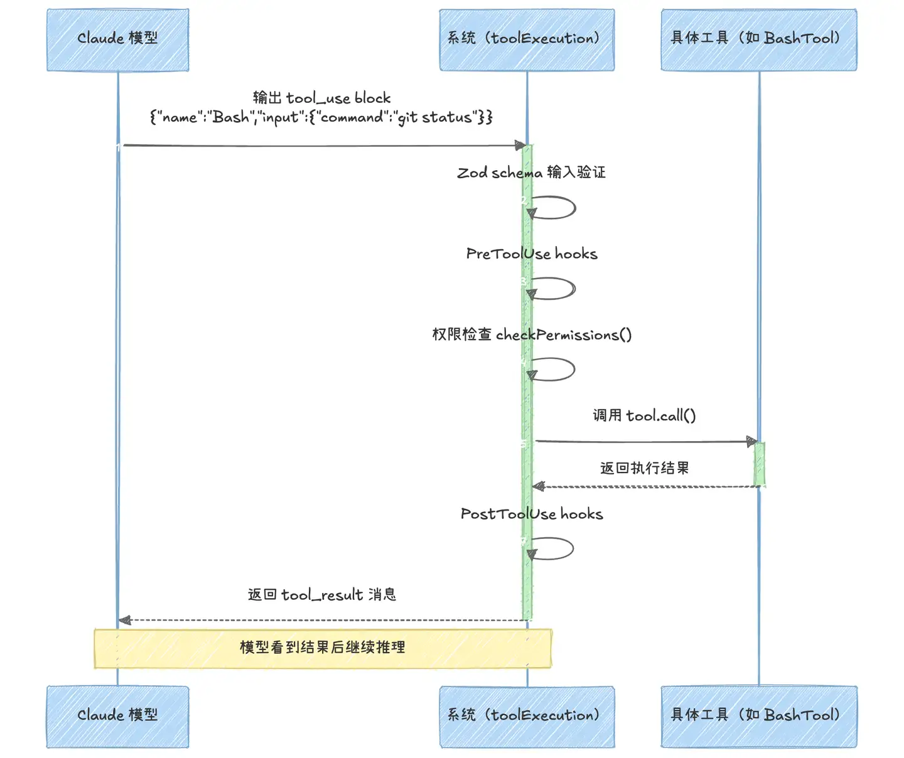
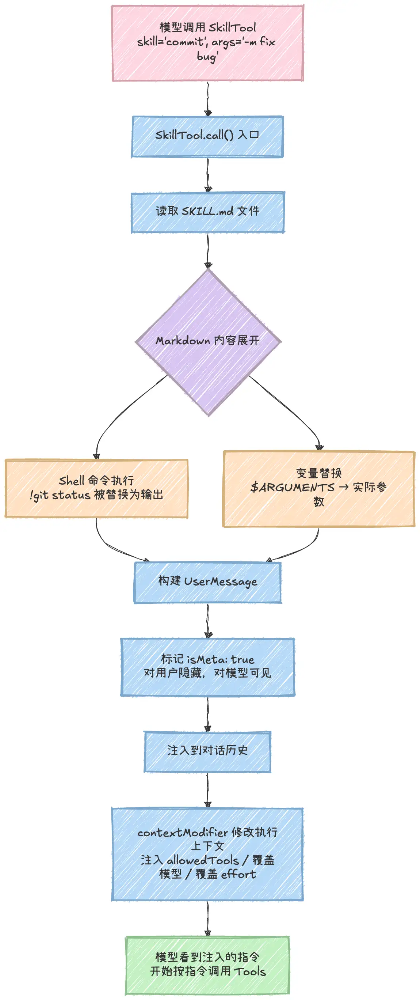
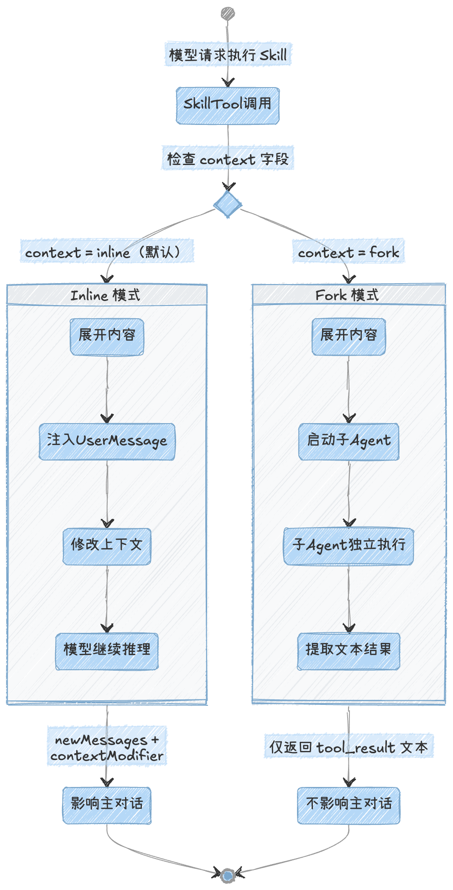
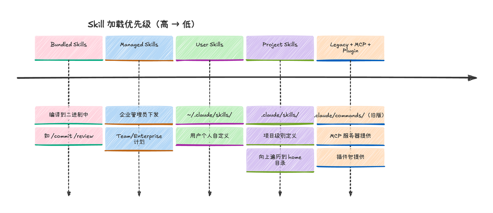
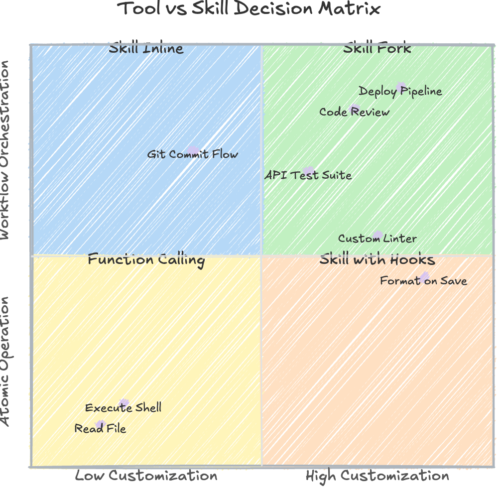
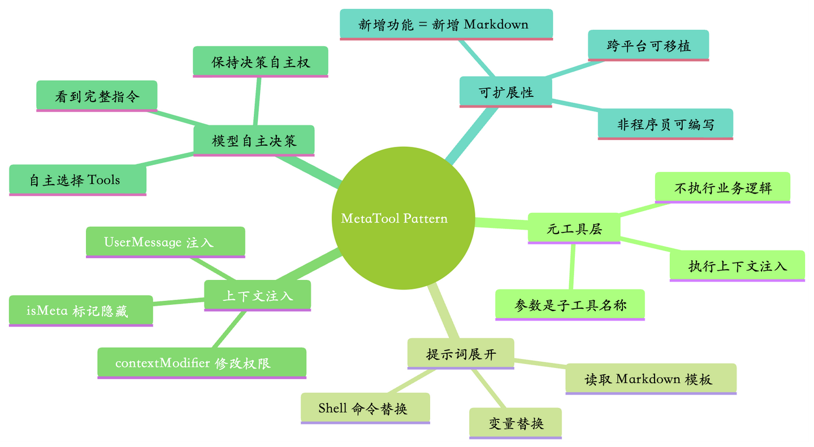

# Agent Skills 源码级解析：它和 Function Calling 到底有什么异同？

> 基于知乎回答《[agent 的 skills 是怎么在代码层面上实现的，与 function calling 有什么异同？](https://www.zhihu.com/question/2022616756980647222/answer/2024789833067889986)》（作者 chouheiwa，收录于专栏《AI Agent 碎碎念》）整理，并结合 Claude Code 官方文档与社区分析补充。

## 一、背景：一次源码泄露带来的机会

Claude Code 源码泄露后，51.2 万行 TypeScript 源码通过 npm 包里的 Source Map 文件被公开。安全研究员 Chaofan Shou 首先发现了这一泄露。这给了社区一次罕见的机会：不再靠猜测，而是直接从源码层面搞清楚 Agent 的核心机制。

本文的核心问题是：**Skills 到底是什么？它和 Function Calling 的本质区别在哪里？**

一句话结论先行：

> **Function Calling 给了模型一双手，Skills 给了模型一本手册。手可以做任何事，但手册决定了手往哪个方向伸。**

## 二、先搞清楚 Function Calling 在源码里长什么样

### 1. Tool 接口

Claude Code 中每个工具都实现了一个统一的 `Tool` 接口（定义在 `Tool.ts:362`），核心字段包括：

| 字段 | 作用 |
| :--: | :-- |
| `name` | 工具名称 |
| `inputSchema` | 用 Zod schema 定义输入参数 |
| `call` | 实际执行函数 |
| `checkPermissions` | 权限检查 |

工具通过 `buildTool()` 函数构建（合并默认值和用户定义），最终通过 `toolToAPISchema()` 序列化成 Claude API 能识别的 JSON Schema 格式，塞进请求里发给模型。

**模型看到的是什么？** 工具名称、一段自然语言描述、一个结构化的参数 schema。模型决定使用某个工具时，输出一个 `tool_use` block，系统拿到后走一条严格的执行管线。

### 2. 工具执行管线（七步）

执行管线位于 `services/tools/toolExecution.ts:599` 的 `runToolUse()` 函数：

```
Zod 验证 → 自定义校验 → PreToolUse hooks → 权限检查
→ 实际执行 → 结果映射 → PostToolUse hooks
```

整个过程是一个干净的 **request → response 循环**：模型发请求，系统执行，结果塞回对话历史，模型继续推理。


*图 1：Function Calling 工具执行管线时序图（模型输出 tool_use block → 七步执行 → 返回 tool_result → 模型继续推理）*

### 3. 工具注册与去重

工具注册走 `tools.ts` 里的 `assembleToolPool()`：合并内置工具和 MCP 工具，按名称去重，**内置优先**。也就是说，如果你的 MCP server 提供了和内置工具同名的工具，内置的永远赢。

## 三、Skills 的真面目：披着工具外衣的"提示词注入器"

### 1. 类型定义推翻直觉

看源码之前，很多人默认 Skills 是某种"高级工具"。但 `types/command.ts:25` 的类型定义直接否掉了这个假设：

- Skill 的类型是 **`PromptCommand`**，注意它的 `type` 字段：值是 **`'prompt'`**，不是 `'tool'`。
- 它有一个 `getPromptForCommand()` 方法，返回的是**展开后的 Markdown 内容**。
- 它**没有 `call()` 方法、没有 `inputSchema`、没有结构化的输入输出定义**。

**它本质上是一个提示词生成器（prompt generator）。**

### 2. SkillTool：连接两个世界的桥梁

那 Skills 怎么和模型交互？通过一个叫 `SkillTool` 的桥梁（`tools/SkillTool/SkillTool.ts`）：

- `SkillTool` 本身是一个**标准的 Tool**，有完整的 Zod schema；
- 但它的输入极其简单：一个 `skill` 字符串（技能名称）+ 一个可选的 `args` 字符串；
- 它享有 Function Calling 的**全部基础设施**（输入验证、权限检查、hooks、遥测）；
- 但它的 `call()` 方法**不执行任何业务逻辑，而是执行上下文注入**。

**这是一个教科书级的适配器模式（Adapter Pattern）：用 Function Calling 的壳，包了一个提示词注入的核。**

### 3. 关键源码证据（SkillTool.ts:580）

Skill 执行完之后返回的结果里，有一个 `newMessages` 字段，塞的是一条 `UserMessage`，带着 `isMeta: true` 标记。

> 模型调用一个 Skill，拿回来的根本不是"执行结果"，它拿到的是一份"**接下来该怎么干**"的指令书。模型看到这份指令书之后，才开始一个一个地调用真正的 Tool 去干活。**Skill 连 `tool_result` 都不走。**

## 四、两种执行模式：Inline 与 Fork

### 1. Inline 模式：注入剧本，让模型自己演（默认模式）

整个流程在 `SkillTool.ts:580-841`，拆开来看有三个关键步骤：

| 步骤 | 机制 | 说明 |
| :--: | :-- | :-- |
| ① 内容展开 | `getPromptForCommand()` | 读取 SKILL.md，替换动态内容。支持 `` !`git status` `` 这样的内联 Shell 命令、代码块级 Shell 命令（通过 `promptShellExecution.ts` 实际执行并把输出塞回原位）；变量替换支持 `$ARGUMENTS`（完整参数）、`$0`（索引参数）、`$foo`（命名参数，来自 YAML frontmatter 的 `arguments` 字段）。本质上和 CI/CD 里用模板引擎渲染配置文件没有区别 |
| ② 消息注入 | `UserMessage` + `isMeta: true` | 展开后的内容被包装成一条用户消息注入对话。`isMeta` 意味着用户在终端 UI 里**看不到**这条消息，但模型在下一轮推理时能完整"看到"它——等于有人悄悄在对话中间插入了一段 Claude 能看见但你看不见的话 |
| ③ 上下文修改 | `contextModifier` 函数 | 可修改后续执行上下文：注入 `allowedTools` 白名单（限制模型只能用特定工具）、覆盖模型（比如 Skill 指定用 Opus）、覆盖 effort level。Skill 不仅能告诉模型"做什么"，还能改变模型"能用什么"和"用哪个版本的自己" |

更进一步：Skill 甚至可以在调用时**注册 hooks**。比如一个代码格式化 Skill 可以附带一条规则："每次调用写文件工具后，自动跑 prettier"。这不只是注入提示词了，**这是在注入行为拦截器**。


*图 2：Inline 模式完整流程（SkillTool.call() 入口 → SKILL.md 展开（Shell 命令执行 + 变量替换）→ 构建 UserMessage（isMeta: true）→ contextModifier 修改上下文 → 模型按注入指令调用 Tools）*

### 2. Fork 模式：开一个分身去干活，只拿结果回来

当 SKILL.md 的 frontmatter 里写了 `context: fork`，SkillTool 会：

1. 启动一个**子 Agent**（源码里叫 `runAgent()`，与 Claude Code 的多 Agent 协调系统共享基础设施）；
2. 把展开后的 Skill 内容扔进去，让子 Agent 在**独立的 token 预算和执行上下文**里跑完；
3. 最后只把**文本结果**拿回来。

**与 Inline 模式的关键区别**：Fork 模式返回的是标准的 `tool_result`——没有 `newMessages`，没有 `contextModifier`。子 Agent 的整个执行过程对主对话完全透明。

| | Inline 模式 | Fork 模式 |
| :--: | :-- | :-- |
| 触发方式 | 默认 | frontmatter 写 `context: fork` |
| 返回内容 | `newMessages`（指令书）+ `contextModifier` | 标准 `tool_result`（纯文本结果） |
| 对主对话影响 | 注入指令、修改上下文、可持续影响后续行为 | 只拿最终结论，主对话不受污染 |
| 适合场景 | 需要模型按剧本执行多步操作 | 耗时的分析任务，只要结论不要过程 |


*图 3：Inline 与 Fork 模式对比（检查 `context` 字段分流；Inline 返回 `newMessages + contextModifier` 并影响主对话，Fork 启动子 Agent 独立执行、仅返回 tool_result 文本、不影响主对话）*

## 五、一个 `/commit` 的真实执行轨迹

当你在 Claude Code 里敲 `/commit`，到底发生了什么？

1. 模型先调用 `Skill({ skill: "commit" })`；
2. `SkillTool` 读取 commit 的 SKILL.md，展开里面的 Shell 命令（如 `` !`git status` `` 被替换为当前仓库状态）；
3. 展开后的 Markdown 被包装成 `UserMessage` 注入对话；
4. 模型在下一轮推理时看到这段指令："先检查 staged changes，再生成符合 Conventional Commits 规范的 commit message，最后执行 commit"；
5. 模型开始依次调用 `Bash({ command: "git status" })`、`Bash({ command: "git diff --staged" })`、`Bash({ command: "git commit -m '...'" })`——**这些全是标准的 Function Calling**。

一句话总结两者的协作关系：

> **Skill 定义了流程，Tools 执行了步骤。** Skill 是导演手里的剧本，Tools 是演员能做的动作。导演不亲自上台表演，演员不自己写剧本。

## 六、Skill 发现机制：预算控制和动态可见性

### 1. 上下文预算

Skills 不是无限制地暴露给模型的。`tools/SkillTool/prompt.ts` 里定义了严格的上下文预算：

```ts
export const SKILL_BUDGET_CONTEXT_PERCENT = 0.01  // 上下文窗口的 1%
export const MAX_LISTING_DESC_CHARS = 250          // 每条最多 250 字符
```

`formatCommandsWithinBudget()` 函数控制 Skill 列表在 prompt 中的呈现方式：先尝试完整描述，超预算就截断（bundled skills 不截断，其他按比例），再超就只保留名称。**这确保了往 `~/.claude/skills/` 里扔再多 Skill，也不会把上下文窗口撑爆。**

### 2. 加载优先级（从高到低）

1. **Bundled**：编译进二进制的
2. **Managed**：企业策略下发的
3. **User**：用户级 `~/.claude/skills/`
4. **Project**：项目级 `.claude/skills/`
5. **Legacy**：旧版 `.claude/commands/`
6. **MCP 来源** 与 **Plugin 来源**


*图 4：Skill 加载优先级（高 → 低）：Bundled（编译进二进制，如 /commit、/review）→ Managed（企业管理员下发，Team/Enterprise 计划）→ User（~/.claude/skills/，用户个人自定义）→ Project（.claude/skills/，项目级定义，向上遍历到 home 目录）→ Legacy + MCP + Plugin（旧版 .claude/commands/、MCP 服务器与插件包提供）*

### 3. 动态可见性

Skill 的 frontmatter 里可以写：

```yaml
paths:
  - "src/**/*.ts"
  - "tests/**"
```

只有当模型操作了匹配路径的文件后，这个 Skill 才会出现在可用列表中。你写了一个专门处理 TypeScript 测试文件的 Skill，它不会在你编辑 Python 文件时跳出来干扰。

> **模型用不到的 Skill，模型根本看不到。**

## 七、Skills 与 Function Calling 的异同总结

| 维度 | Function Calling（Tool） | Skill |
| :--: | :-- | :-- |
| 本质 | 结构化的函数执行 | 提示词模板 + 上下文注入 |
| 类型定义 | `Tool`，有 `call()` 和 `inputSchema` | `PromptCommand`，`type: 'prompt'` |
| 模型看到什么 | 工具名 + 描述 + JSON Schema | 展开后的 Markdown 指令书 |
| 输入输出 | 结构化参数 → `tool_result` | 自由文本参数 → `newMessages`（不走 `tool_result`） |
| 执行主体 | 系统执行函数，模型拿到结果 | **模型自己**按注入的指令继续调用 Tool |
| 适用任务 | 单步原子操作（读文件、跑命令、写文件） | 多步工作流（代码审查、部署流程、commit 规范） |
| 是否改变后续行为 | 否 | 可以（`contextModifier`、allowedTools、hooks、覆盖模型） |
| 定义方式 | 写代码 | 只需一个 Markdown 文件（SKILL.md） |

**选型实操建议：**


*图 5：Tool vs Skill 决策矩阵（横轴：定制化程度；纵轴：编排复杂度）——原子操作（读文件、执行 Shell）用 Function Calling；多步编排（Git Commit Flow）用 Skill Inline；耗时的独立工作流（Code Review、Deploy Pipeline）用 Skill Fork；需持续拦截行为（Format on Save）用 Skill with Hooks*

- 单步原子操作 → 用 Function Calling，不需要 Skill；
- 多步工作流 → 用 Skill 编排这些步骤；
- 需要在执行后持续影响后续行为 → Skill + Hooks 组合；
- 耗时分析、不需要改变主对话上下文 → Fork 模式。

## 八、安全考量：Skill 是最强的注入面

AISA 团队的研究已经指出：因为 Skills 本质上是"全文当作指令执行"的，第三方 Skill 里藏恶意指令比在普通数据里做 prompt injection 要容易得多。

- Skill 文件里的**每一行**都会被模型当作指令来理解，没有"数据 vs 指令"的边界；
- AgiFlow 的网络流量分析清楚地展示了 Skill 内容是如何被注入到 API 请求中的。

**实践建议：**从 Skills Marketplace 下载别人写的 Skill 之前，逐行看过 SKILL.md 和它引用的所有脚本。

## 九、从源码看 Agent 架构的通用模式：MetaTool Pattern

Claude Code 的 Skill 系统可以抽象成一个通用设计模式——**MetaTool Pattern**：

> 定义一个"元工具"，它的参数是"子工具名称"；它不执行业务逻辑，而是根据名称查找预定义的提示词模板，展开模板，把展开后的内容注入到模型的上下文中，让模型基于这些注入的内容继续推理和行动。


*图 6：MetaTool Pattern 思维导图——元工具层（参数是子工具名称、不执行业务逻辑、执行上下文注入）、提示词展开（读取 Markdown 模板、变量替换、Shell 命令替换）、上下文注入（UserMessage 注入、isMeta 标记隐藏、contextModifier 修改权限）、模型自主决策（看到完整指令、保持决策自主权、自主选择 Tools）、可扩展性（新增功能 = 新增 Markdown、跨平台可移植、非程序员可编写）*

**这个模式的优势：**

- **可扩展性极强**：给 Agent 添加新能力只需要添加一个 Markdown 文件；
- **非程序员友好**：不写代码就能定义复杂工作流；
- **上下文驱动**：模型拥有完整的决策自主权，Skill 给的是"建议"而不是"指令"（虽然模型通常会忠实执行）；
- **组合性好**：Skill 可以调用其他 Skill、可以限制可用工具集、可以切换模型版本。

**设计哲学的平衡点**（类比 iOS 的 CocoaPods vs Swift Package Manager 之争）：

> Claude Code 的 Skills 系统找到了一个巧妙的平衡：用 Function Calling 的**严格基础设施**保证安全和可靠性，用 Markdown 的**灵活性**保证可扩展性和低门槛。**执行管线是刚性的，注入内容是弹性的。**

**为什么 Skills 能成为跨平台开放标准：**2025 年 10 月 Anthropic 首次推出 Skills，12 月将其发布为[开放标准](https://agentskills.io/home)（推广路径与把 MCP 捐给 Linux 基金会的策略如出一辙），之后 OpenAI Codex、Cursor、VS Code 等工具陆续跟进支持同一格式。它足够简单（Markdown + YAML）、足够通用（任何能处理提示词的 Agent 都能用）、足够安全（通过 `allowedTools` 和权限体系约束），而且**解耦了"能力定义"和"能力执行"**。

**对自建 Agent 系统的启示：**你不需要为每个新场景都写一个 Tool，你只需要一个 SkillTool 加一堆 Markdown 文件，模型自己知道该怎么用它们。Victor Dibia 给出了一个 80 行 Python 的最小实现，足够理解核心思路。

## 十、参考链接

- [知乎原回答：agent 的 skills 是怎么在代码层面上实现的，与 function calling 有什么异同？](https://www.zhihu.com/question/2022616756980647222/answer/2024789833067889986)
- [Claude Code Skill 开发文档](https://code.claude.com/docs/en/skills)
- [Claude Code Hooks 官方文档](https://code.claude.com/docs/en/hooks)
- [Agent Skills 开放标准官网](https://agentskills.io/home)
- [Anthropic：构建有效 AI Agent 指南](https://www.anthropic.com/engineering/building-effective-agents)
- [Victor Dibia：Claude Code Skills 实现分析（含 80 行 Python 最小实现）](https://newsletter.victordibia.com/p/implementing-claude-code-skills-from)
- [Lee Hanchung：Claude Skills 深度分析](https://leehanchung.github.io/blogs/2025/10/26/claude-skills-deep-dive/)
- [dbreunig：Claude Code 系统提示构建分析](https://www.dbreunig.com/2026/04/04/how-claude-code-builds-a-system-prompt.html)
- [GitHub：Claude Code 系统提示与多 Agent 分析](https://github.com/Piebald-AI/claude-code-system-prompts)
- [DeepWiki：Claude Code 技术分析](https://deepwiki.com/anthropics/claude-code/3.7-custom-slash-commands)
- [适配器模式（refactoring.guru）](https://refactoring.guru/design-patterns/adapter)
- [Lasso Security：Claude Code 后门与提示注入分析](https://www.lasso.security/blog/the-hidden-backdoor-in-claude-coding-assistant)
- [OpenAI Codex Skills 官方文档](https://developers.openai.com/codex/skills)
- 本仓库相关笔记：[GitHub Copilot 使用指南](./github-agent101.md)（其中"Agent Skills"一节与本篇互补）

3. 展开后的 Markdown 被包装成 `UserMessage` 注入对话；
4. 模型在下一轮推理时看到这段指令："先检查 staged changes，再生成符合 Conventional Commits 规范的 commit message，最后执行 commit"；
5. 模型开始依次调用 `Bash({ command: "git status" })`、`Bash({ command: "git diff --staged" })`、`Bash({ command: "git commit -m '...'" })`——**这些全是标准的 Function Calling**。

一句话总结两者的协作关系：

> **Skill 定义了流程，Tools 执行了步骤。** Skill 是导演手里的剧本，Tools 是演员能做的动作。导演不亲自上台表演，演员不自己写剧本。

