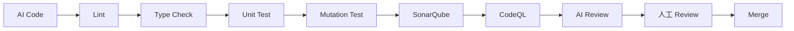

# 如何控制 AI 生成代码的质量

AI 可以快速生成代码，但“能运行”不等于“质量合格”。控制 AI 写代码的关键，不是让它少写代码，而是把需求、边界、验证和审查变成明确的工程流程。

## 一、先定义质量标准

在让 AI 修改代码前，先明确以下内容：

- 任务目标和不包含的内容
- 输入、输出和错误处理要求
- 必须保持的公共 API、数据格式和兼容性
- 性能、安全、日志和权限要求
- 使用的语言版本、框架版本和项目编码规范
- 完成任务必须通过的测试、构建和静态检查

可以把验收标准写成可验证的句子：

> 当输入为空时，接口返回 400；当输入合法时，返回 200 和规定格式的 JSON；现有测试全部通过，且不修改数据库结构。

越具体的验收标准，越容易让 AI 生成可检查的实现，也越容易发现“看起来合理但不符合需求”的代码。

## 二、让 AI 先读再改

不要一开始就让 AI 直接实现。较可靠的协作顺序是：

1. 让 AI 说明相关模块、调用链和现有约定。
2. 让 AI 列出它准备修改的文件和原因。
3. 让 AI 提出可能的风险、未知信息和需要澄清的问题。
4. 审核计划后，再允许它编辑代码。

适合的提示方式：

```text
先不要修改文件。请阅读与登录流程有关的代码，说明调用链、现有错误处理、相关测试和你的不确定点，然后给出最小修改计划。
```

这样可以减少 AI 误解项目结构、重复实现已有能力，或修改无关文件。

## 三、控制修改范围

对 AI 设置明确的边界：

- 一次只处理一个可验证的目标
- 指定允许修改的目录或文件
- 禁止未经确认修改依赖、数据库结构、部署配置和公共接口
- 要求保留现有行为，除非需求明确要求改变
- 要求避免无关重构、批量格式化和大范围重命名
- 让 AI 在完成后汇总每个文件的修改原因

对于高风险操作，可以采用只读、计划、实现三个阶段，并分别限制工具权限。规划阶段只开放搜索和读取；实现阶段才开放编辑；部署和删除操作始终要求人工确认。

## 四、用测试约束生成结果

测试是控制 AI 代码质量最有效的反馈机制。至少应覆盖：

- 正常路径
- 空值、边界值和非法输入
- 权限不足、资源不存在和外部服务失败
- 重试、超时、并发和重复请求
- 旧功能的回归行为

推荐的工作方式是先让 AI 补充或编写测试，再实现代码：

```text
请先根据验收标准设计测试用例，覆盖正常、边界、异常和回归场景。测试方案确认后，再修改实现，并运行这些测试。
```

测试通过仍不是充分条件。测试集可能没有覆盖安全、性能、可维护性和真实环境差异，因此还需要静态分析、类型检查、依赖扫描和人工审查。

## 五、建立自动质量门禁

将质量检查加入本地命令和 CI 流程，避免质量依赖个人记忆。常见门禁包括：

- 格式化和 lint
- 类型检查或编译
- 单元测试和集成测试
- API 契约测试
- 依赖漏洞扫描
- 密钥和敏感信息扫描
- 代码覆盖率和变更覆盖率
- 构建产物检查

可以要求 AI 在报告中给出实际执行的命令和结果，而不是只说“测试已通过”：

```text
完成修改后，请运行项目已有的 lint、类型检查和相关测试。报告每条命令、退出码、失败信息和未执行的检查，不要编造验证结果。
```

## 六、人工审查重点

审查 AI 生成的代码时，不要只看代码是否整齐，优先检查：

- 是否真正满足需求，而不是只满足表面示例
- 是否改变了未声明的行为或公共接口
- 是否存在越权、注入、任意文件访问和敏感信息泄露
- 是否正确处理异常、超时、重试和资源释放
- 是否引入竞态条件、重复提交或不可幂等操作
- 是否存在 N+1 查询、无界循环、过大的内存或网络开销
- 是否把业务规则、配置和密钥硬编码
- 是否新增了不必要的依赖或复杂抽象
- 测试是否验证了真实风险，而不是只为了提高覆盖率

审查时先看 `git diff`，再看测试和调用方。对于涉及支付、权限、个人信息、数据库迁移和生产部署的改动，应由熟悉业务的人复核。

## 七、让 AI 做第二轮审查

实现完成后，可以开启一个新的会话或使用不同模型进行独立审查，避免实现者只为自己的方案辩护：

```text
请只做代码审查，不要修改文件。根据需求和 git diff，按严重程度列出真实问题，重点检查安全、兼容性、异常处理、并发、性能和测试缺口。每个问题给出文件位置、影响和修复建议。
```

第二轮审查的结果必须回到测试和人工判断中验证，不能把 AI 的审查意见直接当作事实。

## 八、从 AI Code 到 Merge 的质量流水线

建议把 AI 生成代码放进一条有顺序、有证据、有阻断条件的流水线。每一关都回答一个不同的问题，不能用后面的检查替代前面的基本验证。



| 阶段 | 主要问题 | 必须留下的证据 | 建议的阻断条件 |
| --- | --- | --- | --- |
| **AI Code** | 代码是否按需求和范围生成 | Prompt、计划、变更文件和 `git diff` | 修改了未授权文件，或无法说明设计理由 |
| **Lint** | 风格、明显错误和危险写法是否存在 | lint 命令和完整输出 | lint error、格式检查失败或新增高严重度警告 |
| **Type Check** | 类型、接口和编译契约是否一致 | 类型检查或编译结果 | 类型错误、编译失败或公共接口不兼容 |
| **Unit Test** | 正常、边界和异常行为是否正确 | 测试命令、通过数量和失败日志 | 测试失败，或关键路径没有测试 |
| **Mutation Test** | 测试能否识别被故意破坏的代码 | mutation score、存活 mutant 清单 | 关键逻辑存在未杀死的 mutant，或分数低于项目门槛 |
| **SonarQube** | 代码质量、重复、复杂度和安全热点是否可接受 | Quality Gate 报告 | Quality Gate 失败，或新增 blocker/critical 问题 |
| **CodeQL** | 是否存在可利用的安全漏洞 | CodeQL SARIF/扫描结果 | 新增高严重度安全告警，或告警没有得到审查和处置 |
| **AI Review** | 是否遗漏需求、风险和测试缺口 | AI 审查报告和问题处理记录 | 未解释的高风险问题，或 AI 无法确认关键假设 |
| **人工 Review** | 人是否认可设计、业务行为和发布风险 | Pull Request 审查记录 | 必需 reviewer 未批准，或存在未解决的 blocking comment |
| **Merge** | 是否满足合并策略 | CI 总结果、审批和合并记录 | 任一必需检查未通过，禁止合并 |

### 9.1 AI Code：先限定输入和输出

AI Code 阶段不只是让模型生成代码，还要让它生成可审查的变更：

- 提供需求、范围、约束和验收标准。
- 要求先阅读代码并输出计划，再允许编辑。
- 要求只修改授权文件，不做无关重构。
- 要求保留 Prompt、计划、修改文件和验证结果。

推荐要求 AI 在提交前输出：

```text
请汇总：需求、修改文件、每个修改的原因、未解决风险、实际运行的验证命令及其结果。不要把未运行的检查写成已通过。
```

### 9.2 Lint 和 Type Check：快速拦截低成本问题

Lint 主要检查格式、代码风格、未使用变量、危险 API 和常见逻辑错误；Type Check 或编译主要检查类型契约、导入、接口和生成代码是否一致。

这两类检查应该尽早运行，因为反馈快、修复成本低。建议：

- 本地编辑后立即运行。
- CI 中使用与本地相同的版本和配置。
- 只允许经过明确评审的 lint 例外。
- 区分历史问题和本次新增问题，避免用全量遗留问题掩盖新问题。

### 9.3 Unit Test：验证可观察行为

单元测试应围绕验收标准和风险编写，而不是只追求覆盖率。至少覆盖：

- 成功路径和主要业务规则
- 空值、边界值、非法输入
- 权限失败、依赖失败、超时和重试
- 重复调用、幂等性和异常恢复
- 兼容旧行为的回归场景

测试报告应包含命令、测试数量、失败用例和覆盖范围。测试通过不代表实现正确，只能说明已覆盖的行为没有出现当前已知失败。

### 9.4 Mutation Test：验证测试本身是否有效

Mutation Test 会对实现进行受控的小改动，例如反转条件、修改返回值、删除分支或改变边界比较，再检查测试是否能够失败。被测试发现的变更称为 killed mutant；测试没有发现的变更称为 survived mutant。

它回答的是：

> 如果实现真的出现一个常见错误，现有测试能不能把它拦下来？

Mutation Test 适合重点业务逻辑、权限判断、金额计算、解析器和状态机。它通常比普通单元测试更耗时，可以只对变更文件、核心模块或定期流水线运行。

不要只看一个总分：需要检查 survived mutant 的位置和原因。合理的豁免应记录原因，例如不可达代码、第三方适配层或测试成本明显超过风险；不能用降低门槛掩盖测试缺口。

### 9.5 SonarQube：质量与安全的聚合门禁

SonarQube 适合汇总静态分析结果，包括 bug、漏洞、代码异味、重复代码、复杂度、覆盖率和安全热点。团队应优先使用 **Quality Gate** 作为 CI 门禁，而不是只查看一个综合分数。

建议重点关注“新代码”指标：

- 新增 blocker 或 critical 问题为零
- 新增代码不降低覆盖率和重复率门槛
- 新增复杂度和代码异味在可接受范围内
- 安全热点已经由具备上下文的人确认
- 例外、误报和接受风险都有记录和到期时间

SonarQube 不能替代运行时测试、CodeQL 或人工 Review。它发现的是静态质量信号，不能证明业务流程一定正确。

### 9.6 CodeQL：专门检查可利用的安全路径

CodeQL 将代码视作可查询的数据，通过查询发现数据流、注入、权限绕过、路径遍历、反序列化和其他安全问题。它适合放在 Pull Request 和主分支流水线中，并根据语言和构建方式配置分析环境。

CodeQL 阶段应做到：

- 检查新增告警，而不是只看历史总量。
- 对高严重度告警强制阻断合并。
- 将误报、接受风险和修复提交关联起来。
- 保护 SARIF 报告和扫描配置，避免为了通过检查而关闭规则。
- 对动态生成代码、脚本和不完整构建保持警惕。

CodeQL 不是通用代码质量工具，也不能替代依赖扫描、密钥扫描和业务权限审查。

### 9.7 AI Review：扩大检查面，不代替人

AI Review 可以快速检查 diff 与需求之间的关系，适合发现：

- 漏实现的验收标准
- 未覆盖的异常分支
- 可能的兼容性和性能问题
- 与现有调用方不一致的接口变化
- 测试缺口和潜在安全风险

AI Review 必须使用独立上下文，并要求按严重程度、文件位置、影响和建议输出问题。AI 提出的每个问题都需要通过代码、测试或文档验证；AI 说“没有问题”也不能视为批准。

### 9.8 人工 Review：对业务和风险做最终判断

人工 Review 不应只是确认格式检查已经通过，而应重点判断：

- 设计是否符合业务目标
- 需求和公共接口是否被正确解释
- 权限、隐私、数据迁移和回滚是否可接受
- 测试是否代表真实风险
- SonarQube 和 CodeQL 告警是否被正确处置
- 是否需要产品、架构、安全或领域专家审批

高风险改动应采用至少一名独立 reviewer；支付、身份、个人信息、数据库迁移和生产配置不应仅依赖生成代码作者本人批准。

### 9.9 Merge：合并是门禁结果，不是开发者意愿

只有当所有必需检查通过、审批完成、blocking comment 关闭，并且 CI 使用了与提交对应的代码版本时，才允许 Merge。

建议在仓库分支保护中配置：

- 必需 CI 检查：Lint、Type Check、Unit Test、SonarQube、CodeQL
- 核心模块的 Mutation Test 或定期 mutation 门禁
- 至少一名人工 reviewer 批准
- 禁止绕过检查的直接推送
- 合并后保留构建、扫描和审查记录

## 推荐的合并前清单

```text
[ ] AI Code 只修改了授权范围
[ ] Lint 通过，新增错误和警告已处理
[ ] Type Check 或编译通过
[ ] Unit Test 通过，关键验收标准有测试覆盖
[ ] Mutation Test 达到项目门槛，存活 mutant 已解释
[ ] SonarQube Quality Gate 通过
[ ] CodeQL 无未处理的高严重度告警
[ ] AI Review 的高风险问题已验证和处理
[ ] 人工 Review 已批准，blocking comment 已关闭
[ ] CI 结果对应当前提交
[ ] 满足分支保护规则后再 Merge
```

## 九、保存可追溯证据

每次 AI 改动至少应保留：

- 原始需求和验收标准
- AI 修改过的文件
- 关键决策和假设
- 测试、构建和扫描结果
- 人工审查结论
- 未解决的问题和后续任务

这样出现回归问题时，可以知道代码为什么这样写、当时验证了什么，以及哪一类检查没有覆盖到。

## 一个可复用的质量控制模板

```text
目标：
请实现……

范围：
只允许修改……；不要修改……

约束：
- 保持……兼容
- 遵守……编码规范
- 不新增……依赖
- 不改变……数据格式

验收标准：
- ……
- ……

流程：
1. 先阅读代码并说明计划，不要修改。
2. 设计正常、边界、异常和回归测试。
3. 按最小范围实现。
4. 运行 lint、类型检查、测试和相关扫描。
5. 汇总修改文件、验证命令、结果和剩余风险。
```

## 核心原则

AI 负责提高实现速度，人负责定义标准、控制权限、判断取舍并承担发布责任。高质量的 AI 编程流程应形成：

> 明确需求 → 小步修改 → 自动验证 → 人工审查 → 回归记录 → 持续改进

不要因为代码由 AI 生成，就降低原本对设计、测试、安全和可维护性的要求。

