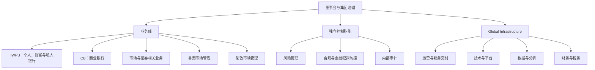

本文用于描述大型国际银行的运营组织模型，重点关注业务线、基础设施职能和控制职能如何共同完成金融产品的运营。文中的组织名称是知识整理和分析用的通用模型，不等同于任何一家银行当前有效的内部组织图。

## 1. 总体组织模型

结合本目录已有的分析，可以将银行组织分为四个层次：

1. **集团治理层**：董事会、集团管理委员会和集团级控制职能，负责战略、风险偏好、资本和重大经营决策。
2. **业务线层**：面向客户和市场提供金融产品，并对收入、客户关系和业务结果负责。
3. **Global Infrastructure 层**：为所有业务线提供共享的运营、技术、数据、财务、人力和行政能力。
4. **独立市场与区域管理层**：对香港、伦敦等具有重要战略意义或监管特殊性的市场进行本地治理、监管沟通和经营管理。

## 2. 业务线

### 2.1 IWPB

IWPB（财富与个人银行业务）面向个人客户、富裕客户和私人银行客户，通常包括零售银行、财富管理和私人银行等业务。

主要负责：

- 客户获取、客户分层和客户关系管理；
- 存款、支付、银行卡、个人贷款、按揭等零售产品；
- 投资、保险、信托、资产配置和私人银行服务；
- 客户生命周期管理，包括开户、客户资料更新、服务变更和退出；
- 个人客户适当性、销售质量和客户体验；
- 业务收入、客户资产、客户留存和服务质量目标。

IWPB 负责“向谁提供什么产品”，但不应单独决定所有风险、合规和运营控制。产品上线、客户准入、交易处理和投诉处理需要与控制职能及 Global Infrastructure 协作。

### 2.2 CB

CB（商业银行）面向中小企业、大型企业、机构客户和部分专业客户，提供融资、现金管理、贸易金融和相关银行服务。

主要负责：

- 企业客户覆盖、行业管理和客户关系；
- 对公账户、授信、贷款、贸易融资和供应链金融；
- 现金管理、收付款、流动性管理和账户服务；
- 企业客户的财务解决方案和跨境银行服务；
- 客户尽职调查、授信申请和业务方案设计；
- 业务组合、资产质量、客户盈利能力和风险调整后收益。

CB 的业务流程通常跨越客户经理、授信审批、法律、抵押品管理、放款运营、支付运营和贷后管理等多个部门，因此是银行运营流程中较典型的端到端协作场景。

### 2.3 市场与证券相关业务

在具有资本市场和交易银行能力的机构中，市场业务可能独立于 IWPB 和 CB，覆盖交易、销售、研究、资本市场和证券服务等领域。

主要负责：

- 外汇、利率、债券、股票、衍生品和结构性产品；
- 机构客户销售、交易执行和做市；
- 资本市场融资、承销和发行服务；
- 交易确认、估值、保证金和抵押品管理的业务需求；
- 交易收益、市场风险限额和客户交易关系。

市场业务对实时性、交易确认、估值、限额和监管报送要求较高，通常需要独立的交易支持、产品控制、市场风险和金融市场运营团队。

### 2.4 香港与伦敦市场管理

香港和伦敦可以作为独立的市场管理单元，原因包括：

- 具有重要的客户、资产、交易或集团职能；
- 需要面向本地监管机构承担管理责任；
- 具有独立的法律实体、分行或受监管机构；
- 适用本地数据、资本、流动性、外汇和报送要求；
- 需要协调集团业务线与本地经营实体之间的责任。

市场管理不一定等同于一条产品业务线。它更像是一个“本地经营与监管责任层”，负责把集团业务线、基础设施和控制职能落实到具体司法辖区。

## 3. Global Infrastructure

Global Infrastructure 是服务所有业务线的共享能力集合。它不直接以客户收入为主要目标，而是负责让业务能够稳定、合规、可审计地运行。

### 3.1 运营服务部门

运营服务部门负责金融产品从交易完成到入账、结算、对账、报送和客户服务的执行。

典型领域包括：

- 客户开户、客户资料维护和账户生命周期；
- 贷款放款、还款、计息、抵押品和贷后服务；
- 支付指令处理、清算、结算和异常修复；
- 证券交易确认、结算、公司行动和资产服务；
- 贸易金融单据处理、额度使用和融资后管理；
- 交易对账、现金对账、头寸核对和未达项处理；
- 监管报送数据准备、报送文件生成和回执管理；
- 客户查询、运营工单、投诉和服务请求。

运营部门的核心责任是确保“正确的交易，在正确的时间，以正确的金额，进入正确的账户和报表”。

### 3.2 技术与工程部门

技术部门提供应用、基础设施、集成、网络、安全和生产支持能力。

主要负责：

- 核心银行、支付、贷款、交易和客户管理系统；
- 数据平台、接口平台、批处理和事件驱动平台；
- 云平台、数据中心、网络、终端和基础设施；
- 身份管理、访问控制、密钥管理和安全工具；
- 软件交付、测试、发布、配置和变更管理；
- 生产监控、事件响应、问题管理和灾难恢复；
- 技术债务、系统生命周期和架构标准。

技术部门负责系统如何实现，但业务规则、会计判断、监管解释和风险接受通常需要业务与控制职能共同负责。

### 3.3 数据与分析部门

数据部门负责让银行能够找到、理解、保护和使用数据。

主要负责：

- 企业数据模型、主数据和参考数据；
- 数据字典、数据分类、数据所有权和数据质量；
- 数据血缘、元数据、数据目录和数据访问；
- 管理信息、客户分析、风险分析和监管数据集；
- 数据平台、数据仓库、湖仓和报表数据集市；
- 数据质量规则、问题分派和修复跟踪；
- 数据留存、归档、销毁和跨境数据治理。

监管报送类项目通常需要业务、数据和技术共同确认：字段的业务含义、源系统、转换规则、报表映射、数据质量阈值和可审计证据。

### 3.4 财务、会计与税务

财务部门负责银行经营结果和财务数据的准确性，典型领域包括：

- 总账、分户账、财务报表和管理报表；
- 产品损益、收入确认、费用分摊和转移定价；
- 资本、流动性、资金和资产负债表管理；
- 法定报表、税务申报和监管财务数据；
- 预算、预测、成本管理和投资回报分析；
- 会计政策、估值、减值和财务控制。

财务数据经常与监管报送、风险计量和业务绩效指标交叉，因此需要明确财务口径、监管口径和管理口径之间的差异。

### 3.5 人力、采购、法律实体与行政服务

这些部门提供集团共享的组织和运行基础：

- 人力资源：组织设计、招聘、绩效、薪酬、培训和员工关系；
- 采购与供应商管理：采购、外包、合同供应商和第三方风险；
- 法律实体管理：实体注册、董事会、授权、法定记录和公司秘书；
- 法律服务：合同、诉讼、产品法律意见和监管解释支持；
- 行政与设施：办公场所、物理安全、档案和业务连续性支持。

## 4. 独立控制职能

控制职能需要保持足够的独立性，不能完全由创造收入的业务线自我审批。

### 4.1 风险管理

风险管理负责识别、计量、监控和报告银行面临的风险，包括：

- 信用风险、市场风险、流动性风险和操作风险；
- 模型风险、利率风险、国家风险和集中度风险；
- 风险偏好、风险限额、压力测试和风险报告；
- 风险事件、损失数据和整改措施；
- 新产品风险评估和重大变更风险评估。

### 4.2 合规与金融犯罪防控

合规部门负责把法律法规和监管要求转化为可执行的政策和控制。

典型领域包括：

- 反洗钱和反恐怖融资；
- 客户尽职调查、客户风险评级和持续尽调；
- 制裁筛查、名单管理和出口管制；
- 市场行为、利益冲突和销售适当性；
- 监管报送、监管问询和监管关系；
- 隐私、数据保护、跨境数据和记录管理；
- 合规监控、调查、告警处置和整改跟踪。

### 4.3 信息安全与数据保护

信息安全和数据保护职能关注信息资产、个人数据和关键系统的保护：

- 信息安全政策、威胁管理和安全架构；
- 身份、权限、特权访问和密钥管理；
- 漏洞、恶意软件、数据泄露和安全事件响应；
- 数据分类、最小化、驻留、跨境和隐私权请求；
- 第三方访问、云安全和供应链安全；
- 安全测试、渗透测试和控制有效性评估。

### 4.4 内部审计

内部审计是相对独立的第三道防线，负责对治理、风险管理和内部控制进行独立评价。

主要工作包括：

- 制定基于风险的审计计划；
- 检查业务、运营、技术和控制流程；
- 评价控制设计和控制执行有效性；
- 跟踪审计发现和整改；
- 向审计委员会和高级管理层报告重大问题。

## 5. 三道防线与职责边界

| 防线 | 主要角色 | 责任 |
| --- | --- | --- |
| 第一道防线 | 业务线、产品、运营、技术交付团队 | 识别并管理日常业务风险，执行流程和控制 |
| 第二道防线 | 风险、合规、金融犯罪、信息安全、数据保护 | 制定政策、监督风险、挑战业务并报告风险 |
| 第三道防线 | 内部审计 | 独立评价治理、风险和控制是否有效 |

三道防线不是简单的上下级关系。关键要求是：职责清晰、相互制衡、问题可以升级，并且审批人不能批准自己创造的风险。

## 6. 金融产品运营中的协作关系

银行推出一个金融产品时，通常至少需要以下角色共同参与：

1. **业务发起人**：提出客户需求、商业目标和产品定位。
2. **产品管理**：定义产品规则、价格、客户范围和生命周期。
3. **风险管理**：评估信用、市场、流动性、操作和模型风险。
4. **合规与法律**：确认监管要求、客户保护、合同和适用政策。
5. **财务与税务**：确定会计、损益、资本和税务处理。
6. **数据与报送**：确定数据字段、血缘、质量和监管报送影响。
7. **技术与架构**：设计系统、接口、权限、测试和部署方案。
8. **运营服务**：设计开户、交易处理、结算、异常、对账和客户服务流程。
9. **安全与数据保护**：确认信息安全、隐私、驻留和跨境边界。
10. **内审或独立验证**：在适当阶段检查控制设计和执行证据。

产品只有在业务、风险、合规、技术和运营都明确“谁负责什么、如何证明完成”后，才适合进入生产。

## 7. 运营责任的核心问题

分析任何一个银行运营流程时，可以使用以下问题：

- 谁拥有客户关系和业务结果？
- 谁拥有产品规则和业务解释？
- 谁执行交易、结算、对账和异常处理？
- 谁拥有源数据、报表数据和数据质量？
- 谁批准风险、合规和数据保护例外？
- 谁可以修改系统和生产配置？
- 谁监控流程是否正常运行？
- 谁负责向监管机构解释和提供证据？
- 谁独立评价控制是否有效？

这些问题可以进一步转化为 RACI 矩阵、岗位说明书、流程图、Jira 责任字段和监管报送追溯矩阵。
