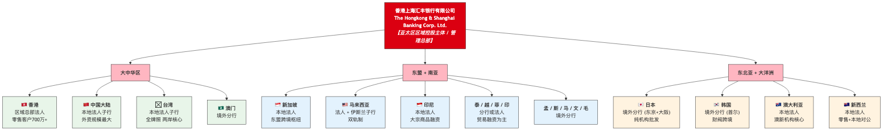
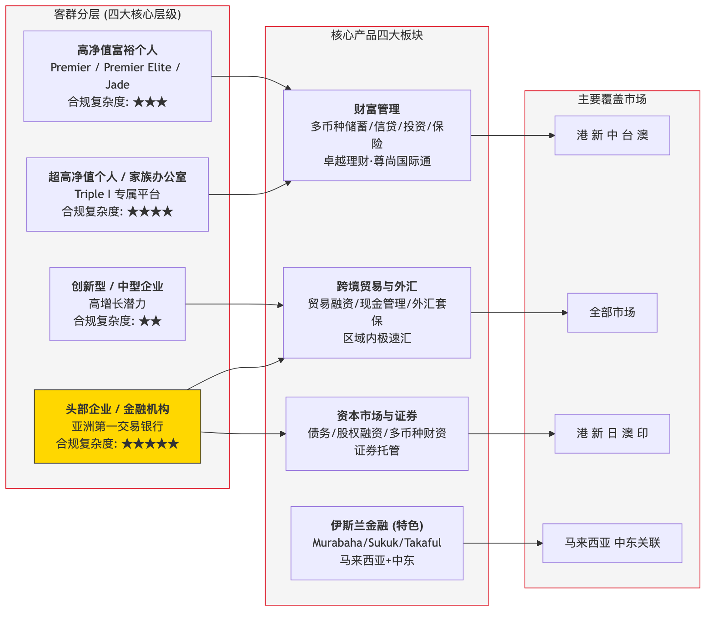
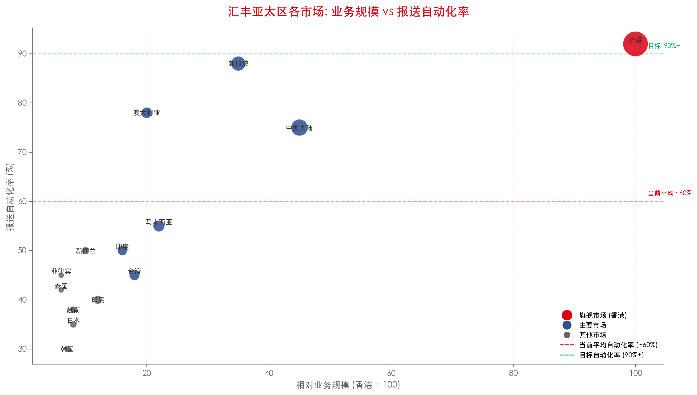

# 2. 汇丰亚太区市场覆盖与业务全景

## 2.1 全亚太市场清单（22个市场无遗漏）

汇丰亚太区管控主体统一为**香港上海汇丰银行有限公司**，所有属地分行、本地法人子银行全部纳入区域矩阵管控。

| 序号 | 市场 | ISO | 经营主体类型 | 核心业务属性 | 监管体系 |
| --- | --- | --- | --- | --- | --- |
| 1 | **中国香港** | HK | 区域总部法人银行 | 全业务枢纽+全球贸易融资中心 | HKMA+SFC |
| 2 | **中国大陆** | CN | 本地法人子行 | 外资全牌照银行（规模最大外资行之一） | NFRA+PBOC+SAFE |
| 3 | **中国台湾** | TW | 本地法人子行 | 零售+对公全业务，两岸金融核心 | 金管会+中央银行 |
| 4 | **中国澳门** | MO | 境外分行 | 零售+跨境业务 | AMCM |
| 5 | **新加坡** | SG | 本地法人子行 | 东盟跨境枢纽+全球交易银行离岸中心 | MAS |
| 6 | **马来西亚** | MY | 本地法人子行+伊斯兰子行 | 全业务+伊斯兰金融双轨制 | BNM |
| 7 | **印度尼西亚** | ID | 本地法人子行 | 大宗商品贸易融资+跨境业务 | BI+OJK |
| 8 | **泰国** | TH | 境外分行 | 企业批发为主，无大规模零售 | BOT |
| 9 | **越南** | VN | 本地法人子行 | 外资制造业供应链+贸易融资 | SBV |
| 10 | **菲律宾** | PH | 境外分行 | 跨境贸易+高端个人 | BSP |
| 11 | **印度** | IN | 本地法人子行 | 全牌照业务 | RBI |
| 12 | **日本** | JP | 境外分行(东京+大阪) | 纯机构投行批发，无零售 | FSA+BOJ |
| 13 | **韩国** | KR | 境外分行(首尔) | 财阀跨境批发，轻零售 | FSS+BOK |
| 14 | **澳大利亚** | AU | 本地法人子行 | 澳新机构业务核心 | APRA+AUSTRAC |
| 15 | **新西兰** | NZ | 本地法人子行 | 零售+本地对公 | RBNZ+FMA |
| 16 | **孟加拉** | BD | 境外分行 | 贸易融资为主 | BB |
| 17 | **斯里兰卡** | LK | 境外分行 | — | CBSL |
| 18 | **马尔代夫** | MV | 境外分行 | — | MMA |
| 19 | **毛里求斯** | MU | 境外分行 | 跨境金融服务 | BOM |
| 20 | **文莱** | BN | 境外分行 | — | BDCB |

: 2.1 全亚太市场清单（22个市场无遗漏）

> *依据：汇丰集团官方Simplified Structure Chart、2025年报、各属地机构官网公开披露文件*

## 2.2 汇丰亚太区核心经营主体架构图

> *图: 汇丰亚太区经营主体架构（关键差异: 日韩为分行制，台/新/澳/纽/中/马为本地法人制）*

## 2.3 汇丰亚太区客群分层与产品矩阵

> *图: 战略核心: "高价值、强跨境、易合规"——主动收缩非核心零售（菲/澳已执行）*

## 2.4 汇丰亚太区各市场业务规模与结构概览

基于汇丰2025年年报、各市场官网及行业报告(Dataintelo, PW Consulting)公开数据整理。以下通过 Python 图表展示各市场相对业务规模对比。

**数据口径说明**：以上数据为基于汇丰公开年报、各市场官网业务描述及行业报告的汇总估计，用于呈现相对规模对比。具体精确业务数据请参考汇丰年报各市场章节。

## 2.5 亚太区监管强度与业务复杂度综合视图

