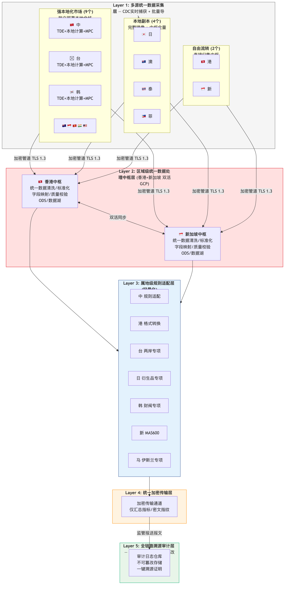
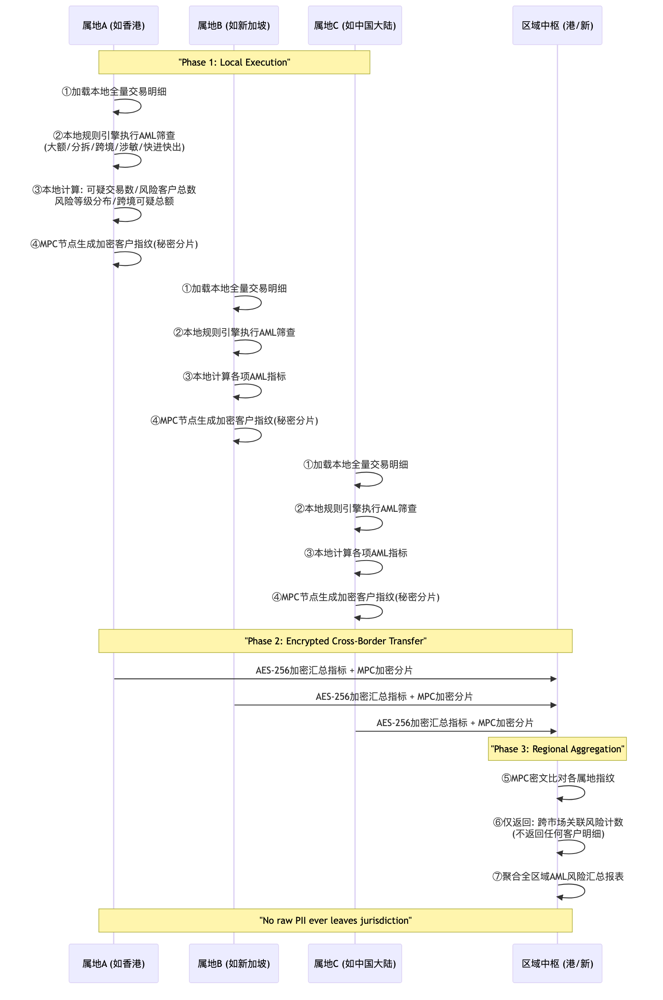
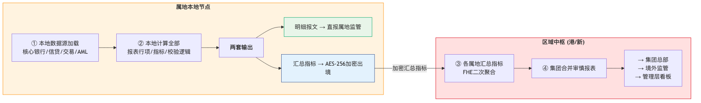

# 5. 分布式数据处理架构方案

## 5.1 架构设计核心原则

基于**"本地计算+仅汇总出境"**的核心设计理念：

1. **原始数据不出属地**：所有交易级明细在属地本地节点完成计算
2. **计算靠近数据**：监管指标运算逻辑全部下沉到属地本地执行
3. **仅加密汇总结果跨境**：仅传输不可还原至个体的聚合统计指标
4. **双活中枢容灾**：香港+新加坡双活承载全亚太汇总数据，互为灾备

## 5.2 分布式数据处理整体架构图（五层架构）

> *图: 汇丰亚太区监管报送分布式数据处理五层架构 (目标态)*

## 5.4 反洗钱（AML）跨市场关联筛查——MPC多方安全计算分布式流程

> *图: 已有落地验证：汇丰大湾区跨境理财通已采用同款MPC架构通过HKMA+人行合规验收*

## 5.5 审慎监管报表分布式处理流程

> *图: 审慎监管报表: 本地完整计算 → 明细直报属地监管 → 汇总加密出境 → 中枢聚合集团报表*
