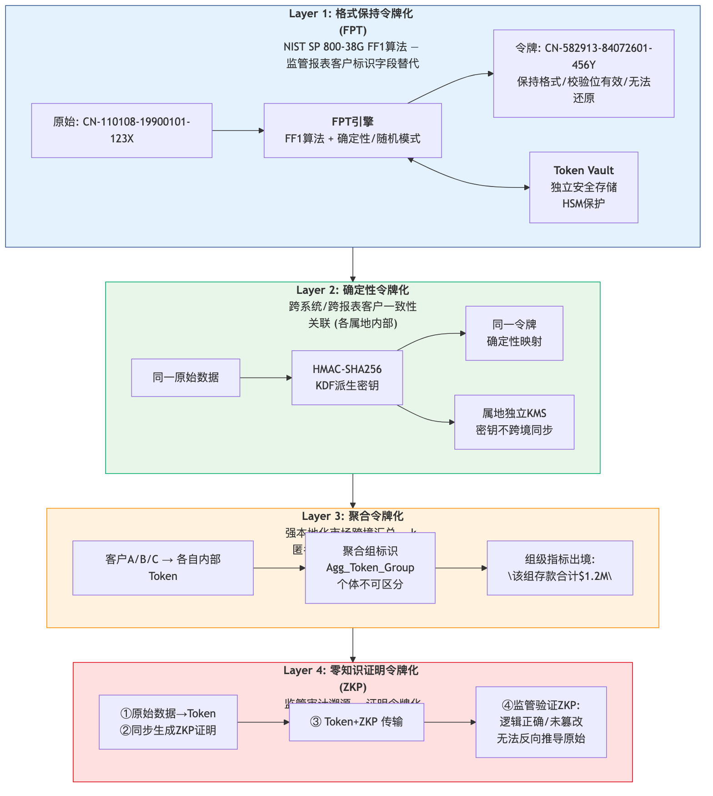

# 6. 数据 Tokenization 技术方案

## 6.1 Tokenization 在监管报送场景中的定位

**Tokenization（令牌化）**是将敏感数据替换为无实际意义的替代标识符的技术。与加密不同，Token 无法通过数学运算还原——映射关系存储在独立的、高安全级别的**令牌库 (Token Vault)** 中。

**核心价值**：在满足监管报送功能需求的同时，大幅降低敏感数据在传输和处理过程中的泄露风险。

## 6.2 Tokenization 四层方案架构

> *图: Tokenization四层方案: FPT → 确定性令牌化 → 聚合令牌化 → ZKP (安全等级递增)*

## 6.3 Tokenization与加密方案技术对比

| 维度 | 基础加密(AES/TLS) | FPT(格式保持) | 确定性令牌化 | 聚合令牌化(k-匿名) | ZKP令牌化 |
| --- | --- | --- | --- | --- | --- |
| 可还原性 | ✅ 可解密 | ❌ (需查令牌库) | ❌ | ❌ (个体不可区分) | ❌ |
| 格式保持 | ❌ | ✅ | ❌ | N/A | N/A |
| 跨系统一致性 | ✅ (同密钥) | ✅ (查令牌库) | ✅ (确定算法) | ❌ | ❌ |
| 跨境传输安全性 | ⚠️ 可解密 | ✅ (令牌库不跨境) | ✅ (密钥不跨境) | ✅ | ✅ |
| 审计可验证性 | ⚠️ 需额外日志 | ⚠️ 需令牌库日志 | ⚠️ | ⚠️ | ✅ 自带证明 |
| 计算开销 | 低 | 中 | 低 | 中 | 高 |
| 可作为本地化豁免 | ❌ | ❌ | ❌ | ✅ (聚合后) | N/A |

: 6.3 Tokenization与加密方案技术对比

## 6.4 分市场Tokenization方案适配矩阵

| 市场分类 | 推荐Tokenization层级 | 说明 |
| --- | --- | --- |
| **强本地化** (中/台/韩/新西/印尼/越/印/马) | Layer 1(FPT) + Layer 3(聚合) + Layer 4(ZKP) | 本地FPT处理客户标识；聚合令牌化后出境；ZKP满足审计 |
| **本地副本** (日/澳/泰/菲) | Layer 1(FPT) + Layer 2(确定性) + Layer 3(聚合) | 本地确定性令牌跨系统关联；聚合后出境 |
| **自由流转** (港/新) | Layer 1(FPT) + Layer 2(确定性) | 中枢可直接处理令牌化数据 |
| **伊斯兰金融** (马来西亚+中东) | 全四层 + Shariah合规令牌 | 额外标记Shariah合规状态令牌 |
| **跨境AML匹配** (全区域) | Layer 3(聚合) + MPC密文比对 | 跨市场客户关联匹配不泄露原始数据 |

: 6.4 分市场Tokenization方案适配矩阵
