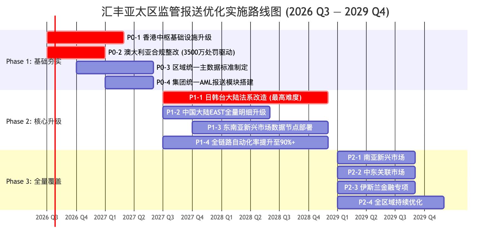

# 7. 实施优先级列表与路径规划

## 7.1 优先级评估方法论

| 维度 | 权重 | 说明 |
| --- | --- | --- |
| 合规风险敞口 | 30% | 当前合规暴露程度、已有处罚/警告记录、监管关注度 |
| 监管处罚力度 | 20% | 可能面临的最高罚款金额、高管追责风险、牌照影响 |
| 监管规则升级紧急度 | 15% | 新规落地时间表、过渡期剩余时间 |
| 业务影响范围 | 15% | 涉及客户数、交易量、收入贡献 |
| 技术改造成本 | 10% | 系统升级难度、资源投入需求 |
| 改造可复用性 | 10% | 对区域其他市场的技术溢出价值 |

: 7.1 优先级评估方法论

## 7.2 三阶段实施路线图

> *图: 三阶段实施路线图: Phase 1 基础夯实 → Phase 2 核心升级 → Phase 3 全量覆盖*

## 7.3 Phase 1: 基础夯实 (2026Q3—2027Q2) —— 立即启动

| 优先级 | 项目 | 核心理由 | 预计周期 | 投入 | 成功标准 |
| --- | --- | --- | --- | --- | --- |
| **P0-1** 🔴 | 香港中枢基础设施升级 | 香港为区域总部+自由流转市场——中枢是后续所有属地改造的前置基础设施; HKMA GDR 3.0推进中 | 6-9月 | Very High | 中枢可接收14市场汇总指标; 统一规则词典覆盖80%+通用规则 |
| **P0-2** 🔴 | 澳大利亚合规整改 | 2026年6月罚款**3500万澳元**——近年最大单笔处罚; AUSTRAC持续高压关注 | 4-6月 | High | AUSTRAC合规评级恢复满意; 自动化率85%+ |
| **P0-3** | 区域统一主数据标准 | 跨系统数据映射不一致是2025香港罚款直接技术诱因; 后续所有自动化的刚性基础 | 6-12月 | Medium | 核心主数据在港新澳三大市场跨系统一致性>99% |
| **P0-4** | 集团统一AML模块 | AML报表全亚太规则高度趋同——一次开发全区域复用，投入产出比最高 | 6-9月 | Medium | 统一模块覆盖12+/14市场AML报送需求 |

: 7.3 Phase 1: 基础夯实 (2026Q3—2027Q2) —— 立即启动

## 7.4 Phase 2: 核心升级 (2027Q3—2028Q4)

| 优先级 | 项目 | 核心理由 | 预计周期 | 投入 | 成功标准 |
| --- | --- | --- | --- | --- | --- |
| **P1-1** | 东北亚大陆法系改造 (日韩台) | 亚太合规最高压地带; 当前自动化率<40%——汇丰最大合规盲区; 大陆法系与英美法系存在根层冲突 | 12-18月 | Very High | 日韩台自动化率从<40%提升至80%+; 大陆法系规则池覆盖90%+ |
| **P1-2** | 中国大陆EAST升级 | EAST为金监总局现场检查核心抓手; 中国为最大外资行市场之一 | 9-12月 | High | EAST报送差错率降至同行前25% |
| **P1-3** | 东南亚数据节点部署 | 马/印尼/越/泰/菲均为强制本地化约束; 复用Phase 1统一架构降低成本 | 12-15月 | High | 五市场自动化率从~50%提升至85%+ |
| **P1-4** | 全链路自动化90%+ | 当前~60%自动化率→40%人工依赖→合规成本70%+为人工成本 | 18月 | High | 全亚太整体自动化率≥90% |

: 7.4 Phase 2: 核心升级 (2027Q3—2028Q4)

## 7.5 Phase 3: 全量覆盖 (2029Q1—2029Q4)

| 任务 | 核心内容 | 覆盖市场 |
| --- | --- | --- |
| P2-1 南亚新兴市场 | 印度 (RBI本地化强制) + 孟加拉 + 斯里兰卡 + 马尔代夫 本地节点+规则配置 | 4市场 |
| P2-2 中东关联市场 | 阿联酋/沙特(SABB)/巴林/卡塔尔 伊斯兰金融+传统银行报送 | 4+市场 |
| P2-3 伊斯兰金融专项 | 马来西亚IFSA专项 + AAOIFI标准适配 + Shariah合规事件报送模块 | 马来西亚+中东 |
| P2-4 全区域持续优化 | 基于Phase 1-2运营数据持续优化; 监管规则变更常态化适配（目标<10天） | 全部22市场 |

: 7.5 Phase 3: 全量覆盖 (2029Q1—2029Q4)

## 7.6 优先级矩阵

| 象限 | 特点 | 项目 | 行动 |
| --- | --- | --- | --- |
| 🔴 高合规风险 / 低成本 | 立即启动 | P0-2 澳大利亚、P0-1 香港中枢 | Phase 1 优先实施 |
| 🟠 高合规风险 / 高成本 | 重点规划 | P1-1 日韩台、P1-2 中国大陆 | Phase 2 集中资源 |
| 🟡 低合规风险 / 低成本 | 快速收益 | P0-3 主数据标准、P0-4 AML统一模块 | Phase 1 同步推进 |
| 🟢 低合规风险 / 高成本 | 渐进覆盖 | P1-3 东南亚、P2系列 | Phase 2-3 渐进实施 |

: 7.6 优先级矩阵

## 7.7 关键里程碑

| 时间节点 | 里程碑 | 关键交付物 |
| --- | --- | --- |
| **2026 Q4** | 香港中枢基础设施投产 | GCP双活中枢上线; 统一规则词典V1.0 |
| **2027 Q1** | 澳大利亚合规整改完成 | AUSTRAC合规评级恢复; 自动化率85%+ |
| **2027 Q2** | 统一主数据标准+AML模块投产 | 核心主数据标准文档; 统一AML引擎上线 |
| **2027 Q4** | 日韩大陆法系规则引擎上线 | 大陆法系规则池V1.0; 韩国实时报送链路投产 |
| **2028 Q2** | 中国大陆EAST升级完成 | EAST V3.0接口上线; 差错率达标 |
| **2028 Q4** | 全亚太自动化率达90% | 全链路自动化平台上线 |
| **2029 Q4** | 全量市场覆盖完成 | 全部22市场纳入统一报送治理体系 |

: 7.7 关键里程碑
