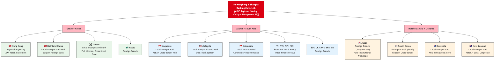
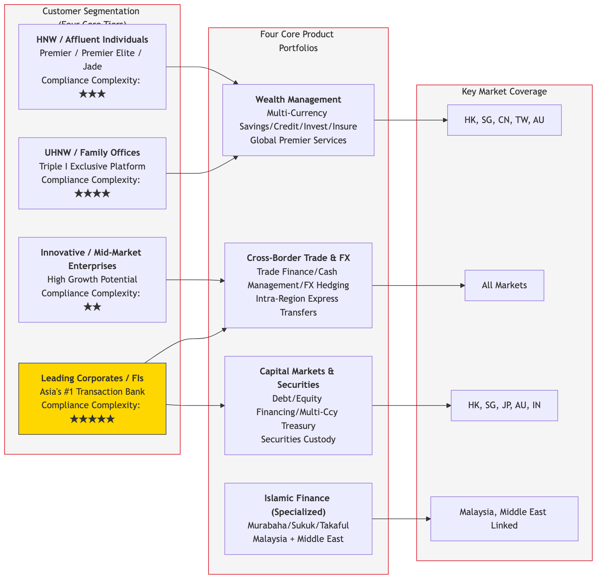
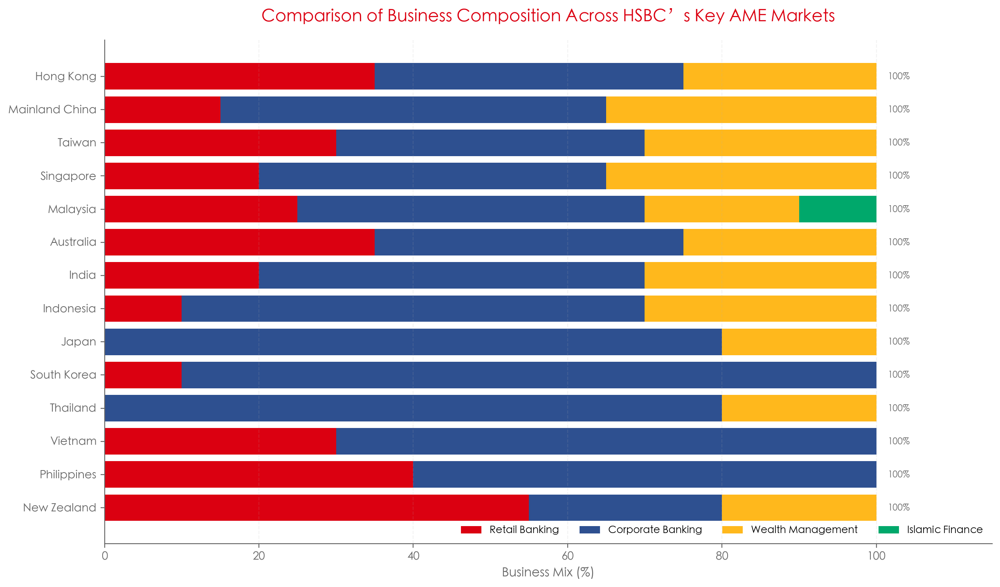
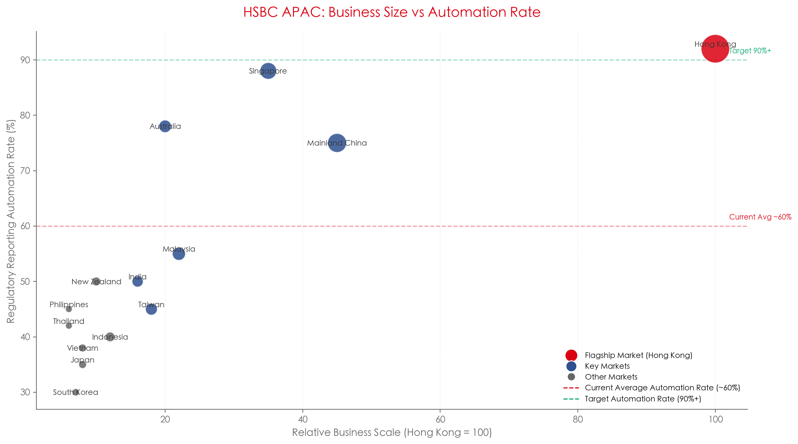
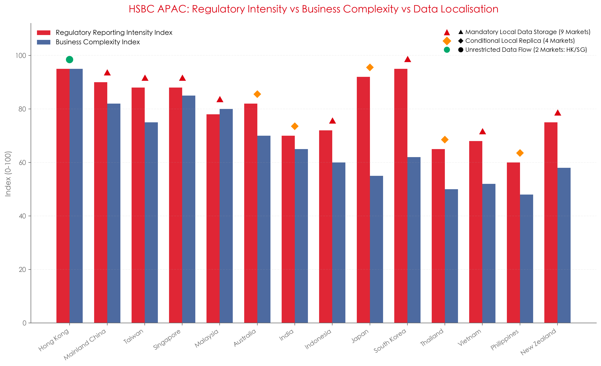

# 2. HSBC AME Market Coverage and Business Panorama

## 2.1 Full AME Market List (22 markets)

HSBC AME operations are governed by The Hongkong and Shanghai Banking Corporation Limited as the regional controlling entity. Local branches and locally incorporated banking subsidiaries fall under this regional matrix governance.

| No. | Market                             | ISO | Legal Entity Type                            | Core Business Characteristics                                | Supervisors        |
| --- | ---------------------------------- | --- | -------------------------------------------- | ------------------------------------------------------------ | ------------------ |
| 1   | Hong Kong                          | HK  | Regional headquarter legal entity            | Full-service hub + global trade finance center               | HKMA + SFC         |
| 2   | Mainland China                     | CN  | Local incorporated bank                      | Full-license foreign bank (one of the largest foreign banks) | NFRA + PBOC + SAFE |
| 3   | Taiwan                             | TW  | Local incorporated bank                      | Retail + corporate full-service; cross-strait significance   | FSC + Central Bank |
| 4   | Macau                              | MO  | Branch                                       | Retail + cross-border services                               | AMCM               |
| 5   | Singapore                          | SG  | Local incorporated bank                      | ASEAN cross-border hub + offshore transaction banking        | MAS                |
| 6   | Malaysia                           | MY  | Local incorporated bank + Islamic subsidiary | Full-service + Islamic banking dual-track                    | BNM                |
| 7   | Indonesia                          | ID  | Local incorporated bank                      | Commodity trade finance + cross-border business              | BI + OJK           |
| 8   | Thailand                           | TH  | Branch                                       | Primarily corporate wholesale, limited retail                | BOT                |
| 9   | Vietnam                            | VN  | Local incorporated bank                      | Foreign-invested manufacturing supply chain + trade finance  | SBV                |
| 10  | Philippines                        | PH  | Branch                                       | Cross-border trade + affluent retail                         | BSP                |
| 11  | India                              | IN  | Local incorporated bank                      | Full-license operations                                      | RBI                |
| 12  | Japan                              | JP  | Branches (Tokyo + Osaka)                     | Institutional investment banking and wholesale; no retail    | FSA + BOJ          |
| 13  | Korea                              | KR  | Branch (Seoul)                               | Chaebol-related cross-border wholesale; light retail         | FSS + BOK          |
| 14  | Australia                          | AU  | Local incorporated bank                      | ANZ institutional business core                              | APRA + AUSTRAC     |
| 15  | New Zealand                        | NZ  | Local incorporated bank                      | Retail + local corporate                                     | RBNZ + FMA         |
| 16  | Bangladesh                         | BD  | Branch                                       | Trade finance focused                                        | BB                 |
| 17  | Sri Lanka                          | LK  | Branch                                       | —                                                           | CBSL               |
| 18  | Maldives                           | MV  | Branch                                       | —                                                           | MMA                |
| 19  | Mauritius                          | MU  | Branch                                       | Cross-border financial services                              | BOM                |
| 20  | Brunei                             | BN  | Branch                                       | —                                                           | BDCB               |
| 21  | [Additional markets if applicable] |     |                                              |                                                              |                    |
| 22  | [Additional markets if applicable] |     |                                              |                                                              |                    |

: 2.1 Full AME Market List (22 markets)

> Sources: HSBC Group Simplified Structure Chart, HSBC Annual Report 2025, public filings per market.

## 2.2 AME Core Legal-Entity Structure (illustrative)

TODO

* [ ] Add Management Strucuture of AME COO/Technology/CIO
* [ ] Add Regualtory Reporting Ownership in respective Market

## 2.3 AME Customer Segmentation and Product Matrix (illustrative)

TODO

* [ ] In principle, all regualtory obligations inherited from the business activites, i.e. financial products HSBC offers in respective AME markets, it is necessary to collect product families sales in the market and SoR support the product transactions
* [ ] Regulatory reporting obligations should be catgorized as sLoB and xLoB; while sLoB may be in-scope of this exercise
* [ ] However, xLoB report (sets) should list out all products family involed

## 2.4 Market business scale and automation overview (illustrative charts)

Refer to the embedded charts for relative business scale and automation coverage across markets (sourced from HSBC public filings and industry reports).

TODO

* [ ] Chart should visualize that, major markets business focus on CIB, while China, India and MY hold full licence
* [ ] Compare MY with MENAT in terms of business model
* [ ] Compare IN and MY in Finance Services

TODO:

* [ ] Need data to support it

## 2.5 AME Regulatory Intensity vs Business Complexity

