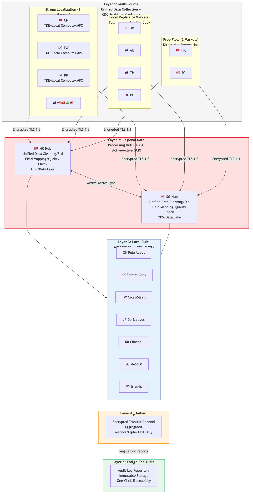
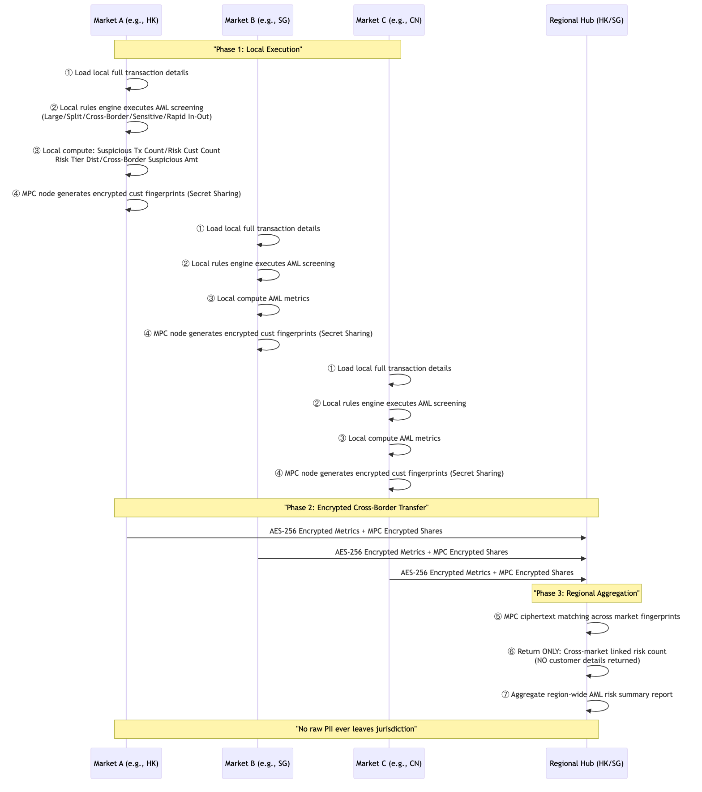
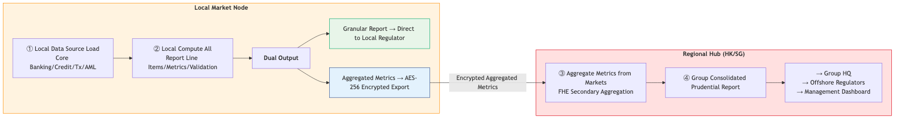

# 5. Distributed Data Processing Architecture

## 5.1 Design principles

Principles center on: local compute + aggregate-only cross-border transmission; raw data never leaves jurisdiction; compute close to data; only encrypted and de-identified aggregates cross borders; HK + SG operate active–active hubs for aggregate-level DR.

## 5.2 Five-layer distributed processing architecture (illustrative)

## 5.3 AML cross-market linkage using MPC & PETs

> *图: 已有落地验证：汇丰大湾区跨境理财通已采用同款MPC架构通过HKMA+人行合规验收*

## 5.4 Prudential reporting distributed flow

> *图: 审慎监管报表: 本地完整计算 → 明细直报属地监管 → 汇总加密出境 → 中枢聚合集团报表*
