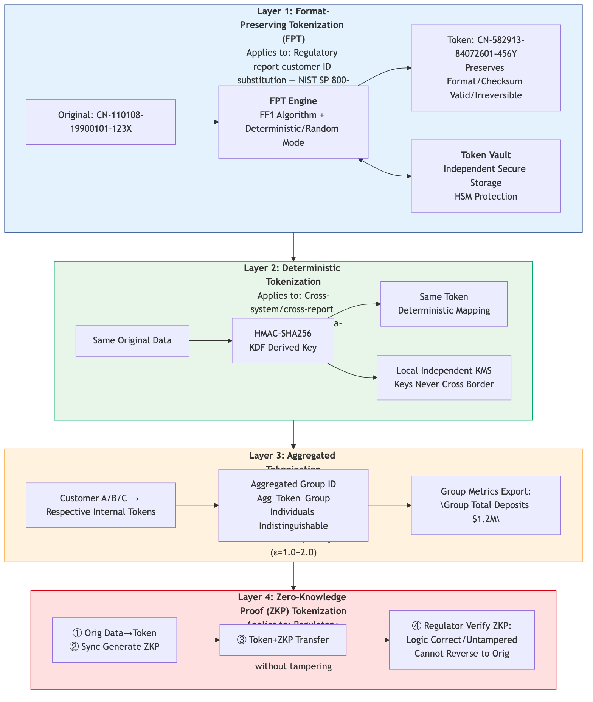

# 6. Tokenization & Privacy-Enhancing Technologies (PETs)

## 6.1 Role of Tokenization

Tokenization replaces sensitive values with irreversible tokens held in a secure token vault. Unlike symmetric encryption, tokens cannot be mathematically reversed without the vault.

## 6.2 Four-layer tokenization approach

> *图: Tokenization四层方案: FPT → 确定性令牌化 → 聚合令牌化 → ZKP (安全等级递增)*
Layers: Format-Preserving Tokenization (FPT) → Deterministic tokenization → Aggregation-based tokenization (k-anonymity) → Zero-Knowledge Proof (ZKP) proofs for audit-grade verification.

## 6.3 Technical Comparison between Tokenization and Encryption Solutions

| Dimension | Basic Encryption (AES/TLS) | FPT (Format-Preserving Tokenization) | Deterministic Tokenization | Aggregate Tokenization (k-Anonymity) | ZKP Tokenization |
| ---- | ---- | ---- | ---- | ---- | ---- |
| Reversibility | ✅ Decryptable | ❌ (Token vault lookup required) | ❌ | ❌ (Individual records are indistinguishable) | ❌ |
| Format Preservation | ❌ | ✅ | ❌ | N/A | N/A |
| Cross-system Consistency | ✅ (Shared key) | ✅ (Token vault lookup) | ✅ (Deterministic algorithm) | ❌ | ❌ |
| Cross-border Transmission Security | ⚠️ Decryptable | ⚠️ (Token vault is deployed onshore only) | ✅ (Cryptographic keys never cross borders) | ✅ | ✅ |
| Audit Verifiability | ⚠️ Dedicated external logs required | ⚠️ Token vault audit logs required | ⚠️ | ⚠️ | ✅ Built-in cryptographic proof |
| Computational Overhead | Low | Medium | Low | Medium | High |
| Eligible for Localization Compliance Exemption | ❌ | ❌ | ❌ | ✅ (After data aggregation) | N/A |

: 6.3 Technical Comparison between Tokenization and Encryption Solutions

## 6.4 Multi-market Tokenization Solution Adaptation Matrix

| Market Classification | Recommended Tokenization Layers | Description |
| ---- | ---- | ---- |
| **Strict Localization Mandate** (Chinese Mainland / Taiwan, China / South Korea / New Zealand / Indonesia / Vietnam / Malaysia) | Layer 1(FPT) + Layer 3(Aggregation) + Layer 4(ZKP) | Customer identifiers are processed locally via FPT; aggregated tokens are permitted for outbound transmission; ZKP mechanism meets regulatory audit obligations |
| **Local Replica Mode** (Japan / Australia / Thailand / Philippines) | Layer 1(FPT) + Layer 2(Deterministic Token) + Layer 3(Aggregation) | Locally generated deterministic tokens support cross-system association; aggregated token data is allowed to flow cross-border |
| **Free Data Circulation** (Hong Kong, China / Singapore) | Layer 1(FPT) + Layer 2(Deterministic Token) | Centralized authorized institutions can directly process de-tokenized plaintext data |
| **Islamic Finance Compliance Boundary** (Malaysia + Middle East jurisdictions) | Full 4-layer stack + Shariah Compliance Token | Additional metadata tags are appended to enforce Shariah-compliant token lifecycle governance |
| **Cross-border AML Matching (Global APAC)** | Layer 3(Aggregation) + MPC Ciphertext Matching | Enables cross-jurisdiction customer matching workflows while preventing leakage of original raw data |

: 6.4 Multi-market Tokenization Solution Adaptation Matrix

TODO

* [ ] Conduct a Proof of Concept (PoC) on Multi-Party Computation (MPC) performance overhead with large transaction volumes.
* [ ] Evaluate vendor solutions (e.g., existing HSBC partnerships) vs. in-house build for the Token Vault and ZKP capabilities.
