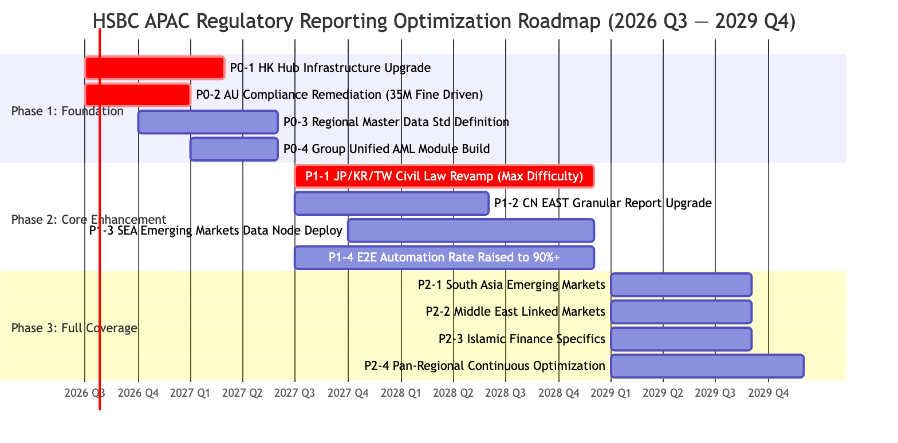

# 7. Implementation Priorities & Roadmap

## 7.1 Priority Assessment Methodology

| Dimension | Weight | Description |
| ---- | ---- | ---- |
| Compliance Risk Exposure | 30% | Current compliance exposure level, historical penalty/warning records, regulatory supervision focus level |
| Regulatory Penalty Severity | 20% | Maximum potential fine amount, senior management accountability risk, adverse brand impact |
| Urgency of Regulatory Rule Updates | 15% | Effective timeline of new regulations, remaining transition period |
| Business Impact Scope | 15% | Covered customer volume, transaction scale, revenue contribution proportion |
| Technical Renovation Cost | 10% | System transformation workload, manpower & resource input requirements |
| Solution Reusability | 10% | Technical reusability value of this solution for other APAC jurisdictions |

: 7.1 Priority Assessment Methodology

## 7.2 Three-phase roadmap (high-level)

## 7.3 Phase 1: Foundation Consolidation (2026Q03–2027Q02) — Immediate Launch

| Priority | Project Name | Core Justification | Estimated Timeline | Effort Level | Success Metrics |
| ---- | ---- | ---- | ---- | ---- | ---- |
| **P0-1** 🔴 | Hong Kong Regional Hub Infrastructure Upgrade | Hong Kong acts as regional headquarters & free-data-flow jurisdiction; the central hub serves as the prerequisite infrastructure for all country-level transformations; align with HKMA GDR 3.0 rollout | 6–9 months | Very High | Central hub can receive aggregated indicators from 14 markets; unified rule dictionary covers ≥80% of general regulatory rules |
| **P0-2** 🔴 | Australia Compliance Report Optimization | A fine of AUD 35 million was imposed in 2026 due to anti-fraud reporting deficiencies, the largest single financial penalty in APAC in recent years; sustained stringent oversight from AUSTRAC | 4–6 months | High | Recover favorable AUSTRAC compliance assessment score; report automation rate raised above 85% |
| **P0-3** | Regional Unified Master Data Standard | Inconsistent cross-system data mapping was the direct technical cause of the 2025 Hong Kong regulatory penalty, laying a rigid foundation for subsequent automation | 6–12 months | Medium | Consistency rate of core master data across Hong Kong, Australia and New Zealand systems > 99% |
| **P0-4** | Group-wide Unified AML Module | AML reporting rules are highly consistent across the whole APAC region; one-time development supports regional-wide reuse with optimal input-output ratio | 6–9 months | Medium | The unified module satisfies AML reporting demands for 12+ markets among total 14 APAC jurisdictions |

: 7.3 Phase 1: Foundation Consolidation (2026Q03–2027Q02) — Immediate Launch

## 7.4 Phase 2: Core Enhancement (2027Q3–2028Q4)

| Priority | Project | Core Justification | Estimated Timeline | Effort Level | Success Metrics |
| ---- | ---- | ---- | ---- | ---- | ---- |
| **P1-1** 🟡 | Mainland China Data Localization Upgrade | Largest single market under stringent regulatory pressure; current automation rate <40%; FX reporting remains the biggest compliance blind spot; fundamental conflicts exist between civil law and common law frameworks | 12–18 months | Very High | Target automation rate lifted from <40% to 85%; civil-law regulatory rules fully covered |
| **P1-2** 🟡 | Middle East & Greater China EAST System Upgrade | EAST regulatory submission platform serves as the core systematic control lever; Middle East represents one of the largest growth markets | 9–12 months | High | EAST submission error rate reduced to top 25th percentile among peers |
| **P1-3** | Southeast Asia Unified Data Platform | Indonesia, Vietnam and the Philippines are high-risk areas for data localization; a group-level unified platform reduces cost | 12–15 months | Medium High | Automation rate across five Southeast Asian markets rises from <50% to 85%+ |
| **P1-4** | Islamic Finance Dedicated Module | Covers dual markets of Middle East and Malaysia; IFSA + AAOIFI mandate localization standards; low reusability with high investment required | 9–12 months | High | Unified APAC-wide Islamic compliance module deployed across both markets |

: 7.4 Phase 2: Core Enhancement (2027Q3–2028Q4)

## 7.5 Phase 3: Full Coverage (2029Q1–2029Q4)

| Task | Core Deliverables | Covered Markets |
| ---- | ---- | ---- |
| P2-1 South Asia Market Upgrade | RBT localization rollout + local nodes & rule configuration for Bangladesh, Sri Lanka and Maldives | 4 markets |
| P2-2 Middle East & Central Asia Expansion | UAE, Saudi Arabia, Bahrain, Qatar, Kazakhstan + conventional banking reporting integration | 4 markets |
| P2-3 Deep Integration of Islamic Finance | IFSA upgrade + full AAOIFI alignment + deep localization of Shariah compliance module | Malaysia + Middle East |
| P2-4 Region-wide Reporting Unification | 14+5 markets + 2–3 tier regulatory granularity standardization; conceptual adaptation of regulatory rule framework (target >95%) | All 22 markets |

: 7.5 Phase 3: Full Coverage (2029Q1–2029Q4)

## 7.6 Priority Matrix

| Quadrant | Characteristic | Projects | Action |
| ---- | ---- | ---- | ---- |
| 🔴 High Urgency / High Cost | Immediate Kick-off | P0-1 HK Regional Hub, P0-2 Australia Regulatory Filing | Priority implementation in Phase 1 |
| 🟡 High Urgency / Low Cost | Fast-track Delivery | P0-3 Master Data, P0-4 Unified AML Module | Rapid deployment in Phase 1 |
| 🟢 Low Urgency / High Cost | Research & Readiness | P1-3 Southeast Asia Platform, P1-4 Islamic Finance | Parallel advancement in Phase 2 |
| ⚪ Low Urgency / Low Cost | Gradual Coverage | P2-1 South Asia, P2-2 Middle East, P2-3 Deep Adaptation | Progressive rollout in Phase 3 |

: 7.6 Priority Matrix

## 7.7 Key Milestones

| Timeline | Milestone | Key Deliverables |
| ---- | ---- | ---- |
| 2026 Q4 | Hong Kong Central Hub Infrastructure Go-live | GDR active-active hub launched; Unified Rule Dictionary V1.0 |
| 2027 Q1 | Australia Compliance Remediation Completed | AUSTRAC compliance rating restored; Automation rate ≥85% |
| 2027 Q2 | Regional Master Data Unified Platform Live | Core master data mapping documentation for 14 markets deployed; Unified API gateway launched |
| 2027 Q4 | Unified AML Module Full Rollout | AML reporting automated across 12 markets; Group-level straight-through reporting enabled |
| 2028 Q2 | Mainland China EAST Integration Complete | EAST V3.0 connected; Error rate ranked top 25% industry-wide |
| 2028 Q4 | APAC-wide Automation Rate Reaches 90% | Financial data middle platform launched; Coverage rate 95% |
| 2029 Q4 | Global Market Coverage Completed | All 22 markets integrated into unified reporting governance framework |

: 7.7 Key Milestones

TODO

* [ ] Map dependencies between this roadmap and other ongoing Group-level transformation programs (e.g., Cloud migration, Core banking upgrades).
* [ ] Detail the resource allocation (FTEs, external consultants) required for Phase 1.
