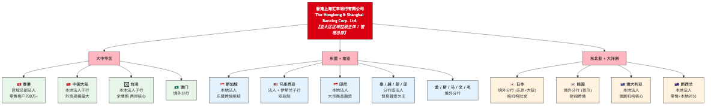
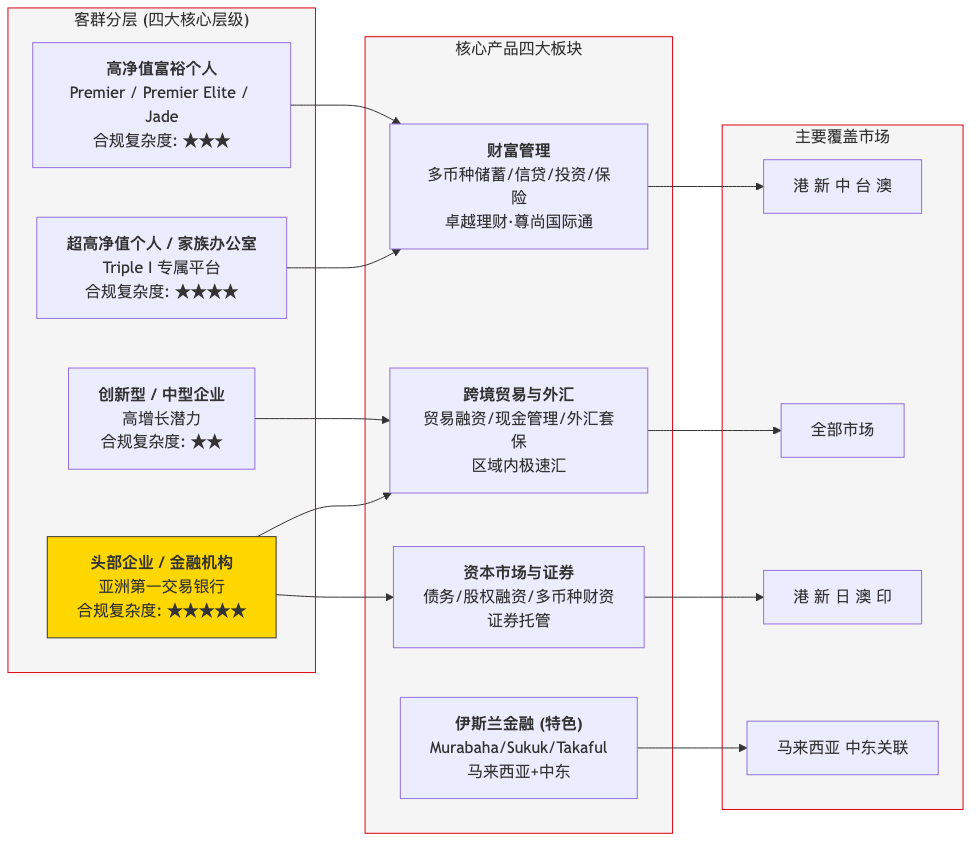
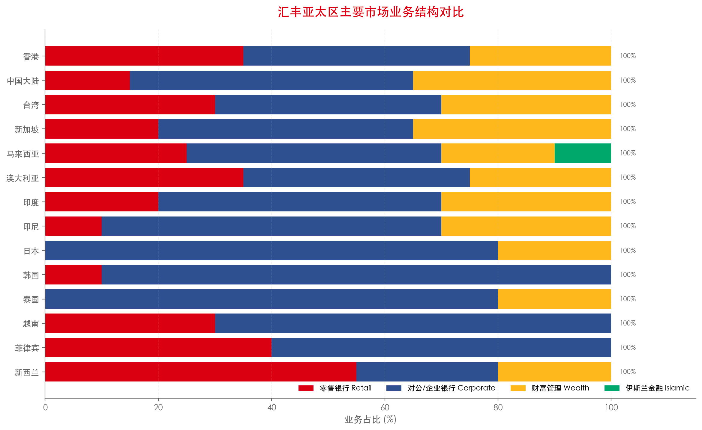
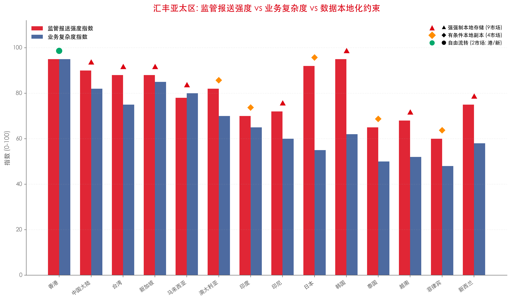
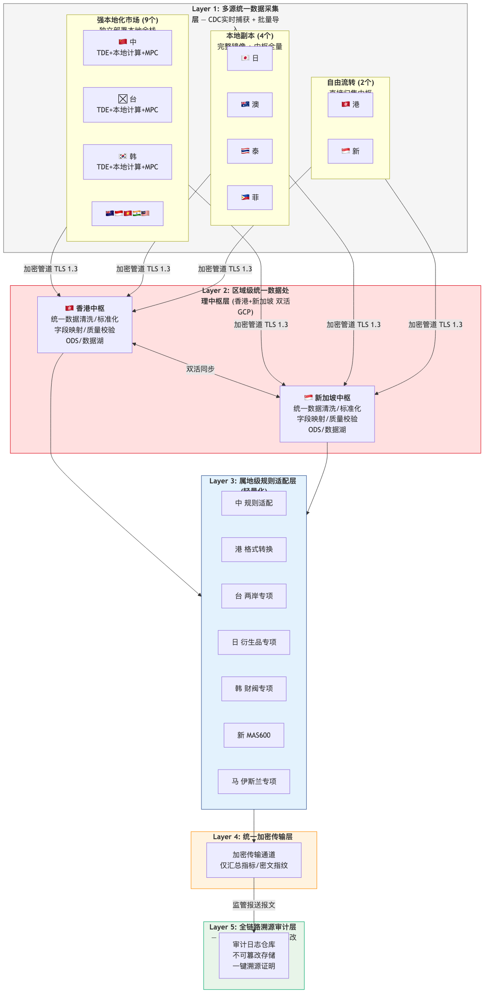
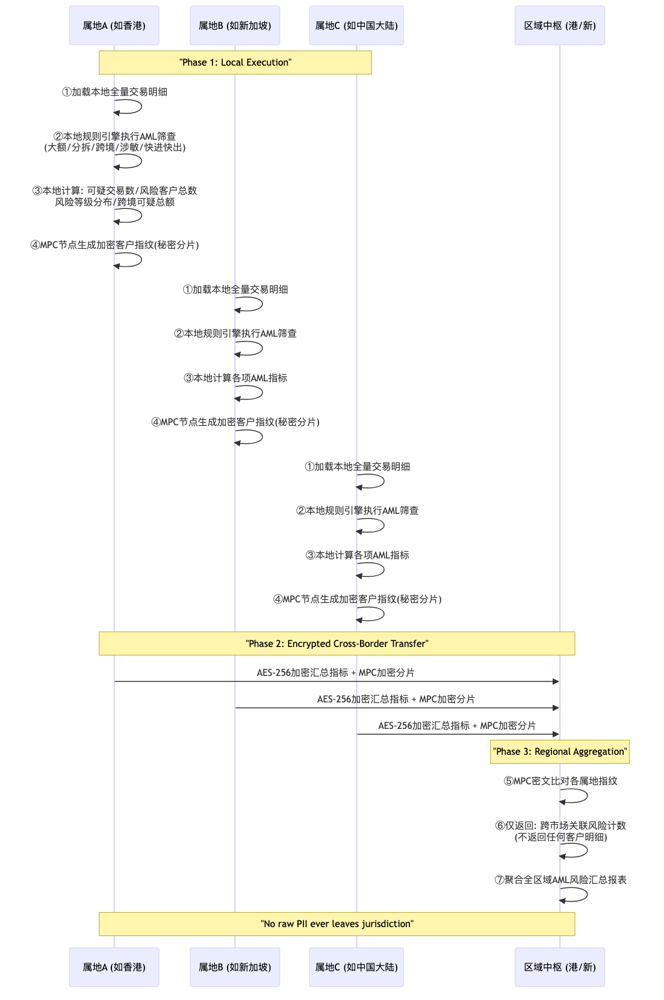
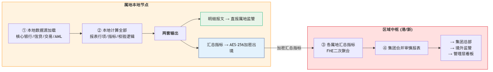
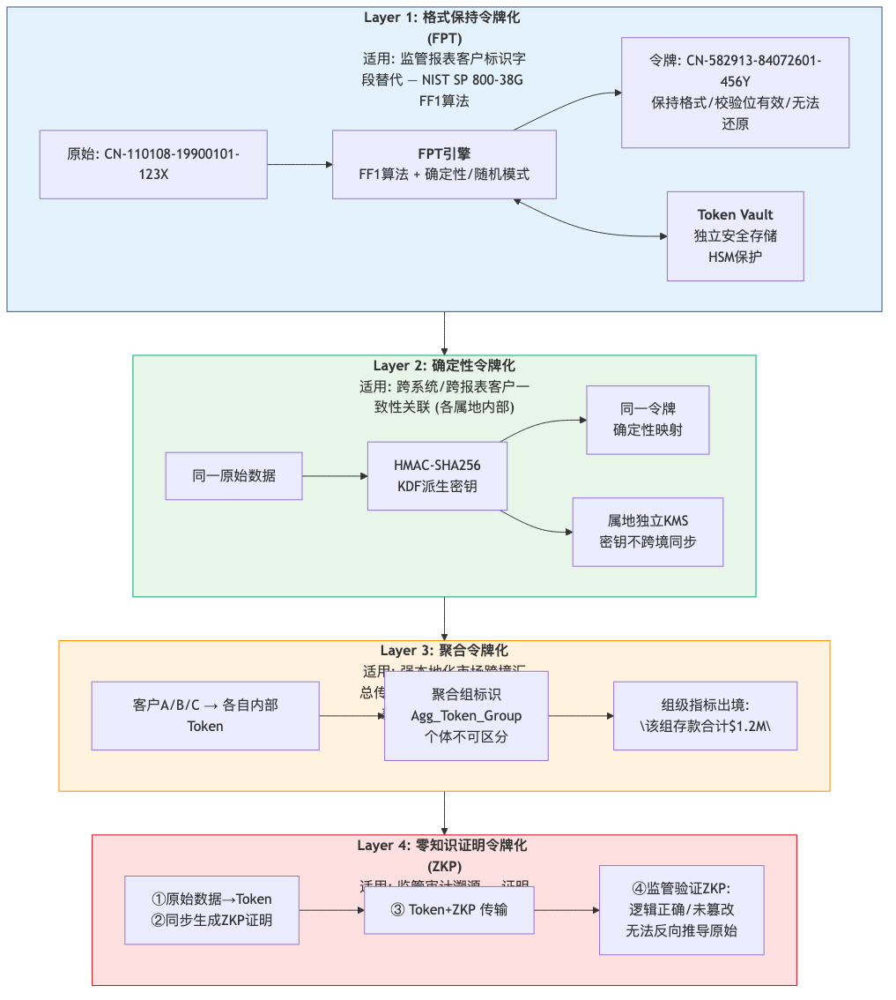
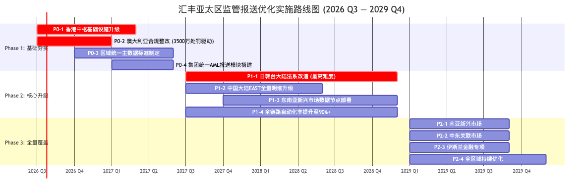

# HSBC Group AME Regulatory Reporting System Optimization

**Ref:** HSBC-AME-RR-2026-001 | **Version:** V1.0 | **Date:** 2026-07-25
**Classification:** CONFIDENTIAL — For HSBC Group AME COO, CDO/CIO and Market COO, CDO, CIO
**Prepared By:** AMET Regulatory Reproting Effectiveness Program

# 1. Executive Summary

## 1.1 Background and Purpose

As a Global Systemically Important Bank (G-SIB), HSBC Group's AME operations span 22 countries and territories across Common Law, Civil Law, and Islamic Law systems — the most complex and fragmented regulatory reporting environment of any multinational financial institution. This report consolidates a comprehensive review of all HSBC AME operating markets, integrating regulatory requirement taxonomy, data architecture, encryption and tokenization technologies, and Islamic finance considerations, and provides strategic recommendations for AME and market-level COOs, CDOs, and CIOs.

## 1.2 Key Findings

**Six core findings:**

1. **Market breadth amplifies complexity exponentially**: 22 AME markets with largely independent local regulatory requirements and reporting standards; no regional harmonization mechanism exists.
2. **AME splits into three legal-system clusters**: Common Law (Hong Kong / Singapore / Australia / New Zealand), Civil Law (Japan / Korea / Taiwan — the highest compliance pressure band in AME), and Hybrid systems (Southeast Asia + South Asia).
3. **Data localization is now a rigid constraint across AME**: of **14 core markets** analyzed, nine impose mandatory local storage of raw transaction-level data, prohibiting cross-border export of such data.
4. **HSBC's current architecture has five core weaknesses**: insufficient adaptation between group standards and local rules; weak cross-system data governance; automation coverage only ~60%; incomplete compliance audit trails; Northeast Asia is the weakest compliance blind spot.
5. **Enforcement intensity has materially increased**: HK fine HKD 4.2m (2025), Australia fine AUD 35m (2026) — penalties have escalated from warnings to significant fines and executive accountability.
6. **Islamic finance reporting forms a separate dual-track regime**: Malaysia (FSA + IFSA), Middle East (AAOIFI standards) — requiring maintenance of dual reporting streams where applicable.

## 1.3 Strategic Recommendations Summary

| Strategic Pillar             | Key Initiative                                                                                                              | Expected Value                                                      |
| ---------------------------- | --------------------------------------------------------------------------------------------------------------------------- | ------------------------------------------------------------------- |
| Regional Coordination        | Establish a three-tier "Group–Region–Local" governance and strengthen regional HQ cross-jurisdiction compliance authority | Resolve the fundamental Group-standards vs Local-rules tension      |
| Data-Driven                  | Standardize AME master data and build a regional unified data hub (HK + SG active–active)                                  | Material improvement in reporting data quality                      |
| End-to-End Automation        | Increase automation coverage from ~60% to 90%+ and close traceability gaps                                                  | Substantial reduction in compliance operating costs and human error |
| Dual Legal-System Adaptation | Build a dual-track rules engine (Common Law + Civil Law) and dedicate remediation for JP/KR/TW                              | Address Northeast Asia compliance blind spots                       |

: 1.3 Strategic Recommendations Summary

# 2. HSBC AME Market Coverage and Business Panorama

## 2.1 Full AME Market List (22 markets)

HSBC AME operations are governed by The Hongkong and Shanghai Banking Corporation Limited as the regional controlling entity. Local branches and locally incorporated banking subsidiaries fall under this regional matrix governance.

| No. | Market                             | ISO | Legal Entity Type                            | Core Business Characteristics                                | Supervisors        |
| --- | ---------------------------------- | --- | -------------------------------------------- | ------------------------------------------------------------ | ------------------ |
| 1   | Hong Kong                          | HK  | Regional headquarter legal entity            | Full-service hub + global trade finance center               | HKMA + SFC         |
| 2   | Mainland China                     | CN  | Local incorporated bank                      | Full-license foreign bank (one of the largest foreign banks) | NFRA + PBOC + SAFE |
| 3   | Taiwan                             | TW  | Local incorporated bank                      | Retail + corporate full-service; cross-strait significance   | FSC + Central Bank |
| 4   | Macau                              | MO  | Branch                                       | Retail + cross-border services                               | AMCM               |
| 5   | Singapore                          | SG  | Local incorporated bank                      | ASEAN cross-border hub + offshore transaction banking        | MAS                |
| 6   | Malaysia                           | MY  | Local incorporated bank + Islamic subsidiary | Full-service + Islamic banking dual-track                    | BNM                |
| 7   | Indonesia                          | ID  | Local incorporated bank                      | Commodity trade finance + cross-border business              | BI + OJK           |
| 8   | Thailand                           | TH  | Branch                                       | Primarily corporate wholesale, limited retail                | BOT                |
| 9   | Vietnam                            | VN  | Local incorporated bank                      | Foreign-invested manufacturing supply chain + trade finance  | SBV                |
| 10  | Philippines                        | PH  | Branch                                       | Cross-border trade + affluent retail                         | BSP                |
| 11  | India                              | IN  | Local incorporated bank                      | Full-license operations                                      | RBI                |
| 12  | Japan                              | JP  | Branches (Tokyo + Osaka)                     | Institutional investment banking and wholesale; no retail    | FSA + BOJ          |
| 13  | Korea                              | KR  | Branch (Seoul)                               | Chaebol-related cross-border wholesale; light retail         | FSS + BOK          |
| 14  | Australia                          | AU  | Local incorporated bank                      | ANZ institutional business core                              | APRA + AUSTRAC     |
| 15  | New Zealand                        | NZ  | Local incorporated bank                      | Retail + local corporate                                     | RBNZ + FMA         |
| 16  | Bangladesh                         | BD  | Branch                                       | Trade finance focused                                        | BB                 |
| 17  | Sri Lanka                          | LK  | Branch                                       | —                                                           | CBSL               |
| 18  | Maldives                           | MV  | Branch                                       | —                                                           | MMA                |
| 19  | Mauritius                          | MU  | Branch                                       | Cross-border financial services                              | BOM                |
| 20  | Brunei                             | BN  | Branch                                       | —                                                           | BDCB               |
| 21  | [Additional markets if applicable] |     |                                              |                                                              |                    |
| 22  | [Additional markets if applicable] |     |                                              |                                                              |                    |

: 2.1 Full AME Market List (22 markets)

> Sources: HSBC Group Simplified Structure Chart, HSBC Annual Report 2025, public filings per market.

## 2.2 AME Core Legal-Entity Structure (illustrative)

TODO

* [ ] Add Management Strucuture of AME COO/Technology/CIO
* [ ] Add Regualtory Reporting Ownership in respective Market

## 2.3 AME Customer Segmentation and Product Matrix (illustrative)

TODO

* [ ] In principle, all regualtory obligations inherited from the business activites, i.e. financial products HSBC offers in respective AME markets, it is necessary to collect product families sales in the market and SoR support the product transactions
* [ ] Regulatory reporting obligations should be catgorized as sLoB and xLoB; while sLoB may be in-scope of this exercise
* [ ] However, xLoB report (sets) should list out all products family involed

## 2.4 Market business scale and automation overview (illustrative charts)

Refer to the embedded charts for relative business scale and automation coverage across markets (sourced from HSBC public filings and industry reports).

TODO

* [ ] Chart should visualize that, major markets business focus on CIB, while China, India and MY hold full licence
* [ ] Compare MY with MENAT in terms of business model
* [ ] Compare IN and MY in Finance Services

TODO:

* [ ] Need data to support it

## 2.5 AME Regulatory Intensity vs Business Complexity

# 3. Five-Level Regulatory Requirements Taxonomy for AME

## 3.1 Unified Five-Level Taxonomy

To enable a layered platform design, we define a five-level classification for regulatory reporting requirements:

| Level | Name                                  | Scope                                                                   | Examples                                                                                                                                          |
| ----- | ------------------------------------- | ----------------------------------------------------------------------- | ------------------------------------------------------------------------------------------------------------------------------------------------- |
| L1    | Top-level categories (5 areas)        | Cross-regional uniform categories; platform top-level partitioning      | Prudential capital & liquidity; transaction-level reporting; cross-border FX flows; AML/CFT & tax; local-specific modules                         |
| L2    | Sub-categories (~25)                  | Fixed breakdown under each top-level area; group field mapping baseline | Capital adequacy RWA; LCR/NSFR; Large exposure; corporate credit transaction-level; BOP reporting; CTR; ...                                       |
| L3    | Regulator & jurisdiction              | Routing, permissions and regulator-specific handling                    | HKMA, NFRA/PBOC (CN), FSC (TW), FSA (JP), FSS (KR), MAS (SG), APRA (AU), RBNZ (NZ), BNM (MY), OJK/BI (ID), BOT (TH), SBV (VN), BSP (PH), RBI (IN) |
| L4    | Official report identifier / template | Official regulator report IDs and templates                             | G01/G11/G40 (China 1104 family); MA(BS) series (HK); MAS600 series (SG); AP S-series (AU); B-series (TW); S10/S21/S50 (NZ)                        |
| L5    | Reporting frequency                   | Scheduling windows for the dispatch engine                              | Daily / Weekly / Monthly / Quarterly / Semi-annual / Annual / Real-time triggers                                                                  |

: 3.1 Unified Five-Level Taxonomy

## 3.2 Core-market-by-market regulatory inventory (selected highlights)

The report lists key regulatory returns and constraints per market in four regional blocks: Greater China, Northeast Asia, Southeast Asia, South Asia & Oceania. Key examples:

### Greater China — sample highlights

#### A. Hong Kong (HKMA + SFC)

| Category | Core Reports / Specifications | Key Compliance Constraints |
| ---- | ---- | ---- |
| 1. Prudential Capital & Liquidity | Monthly MA(BS) returns, KM1 core indicators, CC1 capital composition, LR leverage ratio, LCR/NSFR templates, semi-annual Pillar 3 disclosures, dedicated LAC (Loss Absorbing Capacity) reports | Full implementation of Basel III Final Reform; **the LAC framework is exclusive to Hong Kong** |
| 2. Granular Transaction Reporting | Item-by-item records of credit assets, detailed derivative transaction data | GDR 3.0 is being implemented under the principle of "Submit Once, Reuse Multiple Times" |
| 3. Cross-border Foreign Exchange Receipts & Payments | Offshore RMB cross-border business statistics, monthly foreign currency exposure statements, cross-border interbank business (MA(BS)9) | Special regulatory supervision applicable to the offshore RMB centre |
| 4. AML & Tax Compliance | CTR large cash transaction reports, STR suspicious transaction reports, CRS tax declarations, FATCA US tax reporting | Dual compliance regime for both FATCA and CRS requirements |
| 5. Local Specific Regimes | **Securities & investment banking conflict-of-interest disclosure**, deposit insurance filings, HKD currency issuance reserve reporting | Regulatory penalty case of HKD 4.2 million imposed in 2025 |

: A. Hong Kong (HKMA + SFC)

#### B. Mainland China (NFRA + PBOC + SAFE)

| Category | Core Reports / Specifications | Key Compliance Constraints |
| ---- | ---- | ---- |
| 1. Prudential Capital & Liquidity | 1104 Reporting Suite: G01 / G03 / G40 / G21 / G11 / G14 / S63 | Quarterly submission in accordance with the *Commercial Bank Capital Management Measures* |
| 2. Granular Transaction Reporting | **Full EAST granular datasets**: corporate credit, residential mortgage loans, interbank businesses, wealth management products, beneficial ownership penetration data | Primary evidence used by regulators during on-site inspections |
| 3. Cross-border Foreign Exchange Receipts & Payments | T+1 BOP (Balance of Payments) declarations, external debt statistics, cross-border RMB transactions, ODI (Outward Direct Investment) filings | Strict foreign exchange control enforced by SAFE (State Administration of Foreign Exchange) |
| 4. AML & Tax Compliance | Large-value & suspicious transaction reports, CRS overseas tax resident information submissions | Mandatory stringent monitoring over cash transactions |
| 5. Local Specific Regimes | Dedicated real estate lending reports, inclusive finance statistical filings, local government financing vehicle (LGFV) special returns | Three core structural regulatory supervision priorities |
| 🚫 Data Mandate | **All customer and transaction data must be stored domestically; unauthorized cross-border data export is prohibited** | Constrained by the *Cybersecurity Law* and *Personal Information Protection Law of the People's Republic of China* |

: B. Mainland China (NFRA + PBOC + SAFE)

### C. Taiwan, China (Financial Supervisory Commission + Central Bank)

| Category | Core Reports / Specifications | Key Compliance Constraints |
| ---- | ---- | ---- |
| 1. Prudential Capital & Liquidity | Monthly B-series Capital Adequacy Report, Liquidity Maturity Gap Schedule, Quarterly Non-performing Loan Report | Report submission independently by local legal entities |
| 2. Transaction-level Details | **Daily full-account transaction-level detailed reports**, corporate credit exposure penetration data, personal trust asset breakdown data | High submission frequency with comprehensive data fields |
| 3. Cross-border Foreign Exchange Receipts & Payments | **Special cross-strait financial business statements (Unique across APAC)**, transaction-by-transaction declaration for foreign exchange receipts and payments | Strict penetrating supervision for cross-strait businesses |
| 4. AML / Tax Compliance | Large-value CTR reports, suspicious activity STR reports, CRS tax resident filing | — |
| 5. Local Special Requirements | Special statistics on cross-strait capital flows, dedicated real estate mortgage reports, dedicated securities & trust distribution filings | Exclusive cross-strait regulatory rules applicable only within APAC |
| 🚫 Data Governance Restriction | **Original ledgers for cross-strait dedicated reporting are prohibited from being stored outside the region** | Comply with financial information security regulations issued by the Financial Supervisory Commission |

: C. Taiwan, China (Financial Supervisory Commission + Central Bank)

### Northeast Asia — sample highlights

#### E. Japan (FSA+BOJ)

| Category | Core Reports / Specifications | Key Compliance Constraints |
| --- | --- | --- |
| 1. Prudential Capital & Liquidity | Monthly simplified capital adequacy statement, quarterly foreign currency liquidity position report, large exposure ledger | Branches are not required to hold standalone legal entity capital |
| 2. Transaction-level Details | **Transaction-by-transaction derivatives records, full interbank lending ledgers** | ⚠️ 100% retention of transaction data; regulators are entitled to retrospective audits over any time period |
| 3. Cross-border FX Receipts & Payments | Daily foreign exchange transaction reports, quarterly cross-border investment & financing schedules, external claims and liabilities statistics | Strict supervision on cross-border Yen capital flows |
| 4. AML / Tax | Large-value CTR reports, cross-border IFT, suspicious transaction STR reports, CRS tax residency reporting | — |
| 5. Local Specific Requirements | Special report for Yen derivative risk exposure, cross-border capital ledger for Japan-focused foreign-funded entities | — |

: E. Japan (FSA+BOJ)

#### F. South Korea (FSS + BOK)
| Category | Core Reports / Specifications | Key Compliance Constraints |
| ---- | ---- | ---- |
| 1. Prudential Capital & Liquidity | Branch-level simplified capital risk statement, monthly foreign currency liquidity stress test | Apply branch regulatory regime |
| 2. Transaction-level Details | **Detailed disclosure statements for financial conglomerate affiliated credit penetration**, transaction-by-transaction foreign exchange derivative records | Financial conglomerate affiliated transactions are marked as high reporting-risk items |
| 3. Cross-border FX Receipts & Payments | Real-time submission of cross-border capital flows, quarterly overseas investment reports, centralized collection of group cash pool data | ⚠️ Dual penalties for zero tolerance on FX reporting breaches + senior management accountability |
| 4. AML / Tax | Large-value CTR, cross-border IFT, suspicious STR reports, CRS tax compliance | — |
| 5. Local Features | **Special reporting for large financial conglomerate affiliated transactions**, cross-border capital statistics for semiconductor supply chains | Unique financial conglomerate supervision rules exclusive to South Korea |
| ⚠️ Data Constraints | **Raw data of KRW FX transactions and financial conglomerate affiliated transactions must be retained locally** | Comply with Personal Information Protection Act & FSS overall security guidelines |

: F. South Korea (FSS + BOK)

### Southeast Asia

#### G. Singapore (MAS)

| Category | Core Reports / Specifications | Key Compliance Constraints |
| ---- | ---- | ---- |
| 1. Prudential Capital & Liquidity | **MAS 600 Series** monthly reports for capital adequacy, liquidity & leverage ratio; Pillar 3 disclosure; large risk exposure reports | Follow MAS Notice 637/651 |
| 2. Transaction-level Details | Loans, credit assets, derivatives & full-volume transaction records; **All cross-border transaction traceability data shall be stored locally for a minimum of 5 years** | — |
| 3. Cross-border FX Receipts & Payments | ASEAN cross-border capital pool statistics, multi-currency foreign exchange position monthly reports | Serve as ASEAN cross-border financial hub |
| 4. AML / Tax | CTR/IFT/STR reporting, CRS / FATCA obligations, MAS official Compliance Toolkit | — |
| 5. Local Features | Islamic finance dedicated filings, ASEAN cross-border treasury management reports, deposit insurance arrangements | Dual financial system framework |

: G. Singapore (MAS)

#### H. Malaysia (BNM) — Core of Dual-track Regulatory Regime

| Category | Core Reports / Specifications | Key Compliance Constraints |
| ---- | ---- | ---- |
| 1. Prudential Capital & Liquidity | BNM Quarterly Capital Adequacy Report, Liquidity Gap Statement, NPL Quality Report | Dual reporting for Conventional Banks & Islamic Banks |
| 2. Transaction-level Details | Full transaction records for corporate & retail credit, **Shariah-compliant transaction breakdown** | Dual-track data submission requirements |
| 3. Cross-border FX Receipts & Payments | Dedicated cross-border trade financing reports, monthly foreign currency position statements | Ringgit exchange control regulation |
| 4. AML / Tax Compliance | CTR/STR filings, CRS tax reporting, **DCR data compliance report (effective from 2020)** | — |
| 5. Local Characteristics | **Full set of dedicated IFSA Islamic finance reports**, Shariah non-compliance incident reports, palm oil lending statistics | Governed jointly by FSA and IFSA legislations |

: H. Malaysia (BNM) — Core of Dual-track Regulatory Regime

#### I. Indonesia (BI + OJK)

| Category | Core Reports / Specifications | Key Compliance Constraints |
| ---- | ---- | ---- |
| 1. Prudential Capital & Liquidity | Monthly OJK capital, liquidity & asset quality reports, semi-annual core prudential assessment | Mandatory semi-annual core prudential review |
| 2. Transaction-level Details | Transaction-by-transaction records for commodity trade finance, corporate credit exposure transparency, dedicated ledgers for commodities (palm oil / mineral resources) | — |
| 3. Cross-border FX Receipts & Payments | **Transaction-by-transaction declaration** for import & export FX flows, external debt & credit statistics | Strict Indonesian Rupiah foreign exchange control |
| ⚠️ Data Constraints | **All transaction data shall be stored domestically; cross-border data outflow is strictly forbidden** | Compliant with GR71 Electronic Transactions Regulation |

: I. Indonesia (BI + OJK)

#### J. Thailand (BOT)

| Category | Core Reports / Specifications | Key Compliance Constraints |
| ---- | ---- | ---- |
| 1. Prudential Capital & Liquidity | Quarterly simplified statement for branch capital & foreign currency liquidity, large exposure ledgers | Rules apply to overseas branch institutions |
| 2. Transaction-level Details | Transaction-by-transaction records for import & export trade finance, credit records of foreign-invested enterprises | Mandatory real-time CTR reporting for cash transactions over 2 million Thai Baht |
| 3. Cross-border FX Receipts & Payments | Monthly cross-border FX receipt & payment filings, quarterly outbound investment statistics | Dynamic supervision on cross-border THB capital movement |

: J. Thailand (BOT)

#### K. Vietnam (SBV)

| Category | Core Reports / Specifications | Key Compliance Constraints |
| ---- | ---- | ---- |
| 1. Prudential Capital & Liquidity | Monthly SBV reports on capital adequacy, liquidity and asset quality, semi-annual core prudential review | — |
| 2. Transaction-level Details | Credit details for foreign-funded manufacturing enterprises, transaction-by-transaction ledgers for real estate loans, special statistics for foreign capital supply chains | — |
| ⚠️ Data Constraints | **All financial data of local users must be stored domestically; special approval from the Ministry of Public Security is mandatory for data cross-border outflow** | Comply with Article 26 of the Cybersecurity Law of Vietnam |

: K. Vietnam (SBV)

#### L. Philippines (BSP)

| Category | Core Reports / Specifications | Key Compliance Constraints |
| ---- | ---- | ---- |
| 1. Prudential Capital & Liquidity | Monthly foreign currency liquidity reports for branches, large exposure ledgers, quarterly core prudential assessment | — |
| 2. Transaction-level Details | Itemized records of import & export trade financing, credit information of foreign-invested firms, **Overseas migrant worker remittance dedicated filings (Exclusive to the Philippines)** | — |
| 3. Cross-border FX Receipts & Payments | **Special statistical statements for overseas remittances**, monthly cross-border FX receipt & payment reports | Overseas remittance constitutes a major pillar of the Philippines' GDP |

: L. Philippines (BSP)

#### Oceania & South Asia — sample highlights

#### M. India (RBI)

| Category | Core Reports / Specifications | Key Compliance Constraints |
| ---- | ---- | ---- |
| 1. Prudential Capital & Liquidity | Monthly RBI reports covering capital adequacy, liquidity and NPL asset quality, independent prudential governance framework | — |
| 2. Transaction-level Details | Penetration data of corporate credit grants, full transaction details for retail banking, mandatory statistics for SME & agricultural credit | — |
| 3. Cross-border FX Receipts & Payments | Quarterly FDI & foreign investment reports, transaction-wise declaration for import & export FX settlements, external debt statistics | Rupee exchange control is rigorously enforced |
| ⚠️ Data Constraints | **Payment system data must be stored 100% locally; data cross-border transmission is banned without explicit regulatory clearance** | Follow RBI official circular for payment data localisation requirements |

: M. India (RBI)

#### N. Australia (APRA + AUSTRAC)

| Category | Core Reports / Specifications | Key Compliance Constraints |
| ---- | ---- | ---- |
| 1. Prudential Capital & Liquidity | Quarterly APRA APS capital & liquidity reports, S-series filings, monthly S50 loan reports, Pillar 3 disclosures, CPS 234 Information Security standard | — |
| 2. Transaction-level Details | Item-by-item residential mortgage records, corporate credit penetration data, securities custody transaction details | Mandatory protection for consumer data privacy |
| 3. Cross-border FX Receipts & Payments | **Mandatory full-volume transaction-by-transaction reporting for cross-border IFT (International Funds Transfer)** | AUSTRAC is vested with independent law enforcement authority |
| 4. AML / Tax Compliance | TTR (Threshold Transaction Report) for large cash transactions, **SMR (Suspicious Matter Report) for suspicious activities**, annual AML compliance reports | Independent stringent supervision administered by AUSTRAC |
| ⚠️ Penalty Reference | AUD 35 million penalty imposed in 2026 for anti-fraud reporting deficiencies | Largest single compliance fine across the Asia-Pacific region in recent years |

: N. Australia (APRA + AUSTRAC)

#### O. New Zealand (RBNZ + FMA)

| Category | Core Reports / Specifications | Key Compliance Constraints |
| ---- | ---- | ---- |
| 1. Prudential Capital & Liquidity | RBNZ S10/S21/S50 filings, quarterly capital adequacy & liquidity statements, **ring-fencing regime for locally-incorporated entities’ capital** | — |
| ⚠️ Data Constraints | **Physical isolation for underlying business data of local legal entities; raw transaction detail data is prohibited from being stored overseas** | Governed by the RBNZ Prudential Information Security Standards |

: O. New Zealand (RBNZ + FMA)

## 3.3 Regional heatmap of common regulatory requirements

(Heatmap legend: ● = mandatory requirement; ◐ = partial/limited; ○ = not mandatory/free-flow)

| Market         | Prudential (capital/liquidity) | Transaction-level reporting | Cross-border FX flows | AML/CFT & tax | Local-special requirements | Data localization intensity |
| -------------- | ------------------------------ | --------------------------- | --------------------- | ------------- | -------------------------- | --------------------------- |
| Hong Kong      | ●                             | ●                          | ●                    | ●            | ●                         | ○ (free flow)              |
| Mainland China | ●                             | ●                          | ●                    | ●            | ●                         | ● (strong mandatory)       |
| Taiwan         | ●                             | ●                          | ●                    | ●            | ●                         | ● (strong mandatory)       |
| Japan          | ●                             | ●                          | ●                    | ●            | ○                         | ◐ (local copy)             |
| Korea          | ●                             | ●                          | ●                    | ●            | ●                         | ● (strong mandatory)       |
| Singapore      | ●                             | ●                          | ●                    | ●            | ●                         | ○ (free flow)              |
| Malaysia       | ●                             | ●                          | ●                    | ●            | ●                         | ● (strong mandatory)       |
| Indonesia      | ●                             | ●                          | ●                    | ●            | ○                         | ● (strong mandatory)       |
| Thailand       | ●                             | ◐                          | ●                    | ●            | ○                         | ◐ (local copy)             |
| Vietnam        | ●                             | ●                          | ●                    | ●            | ○                         | ● (strong mandatory)       |
| Philippines    | ●                             | ◐                          | ●                    | ●            | ●                         | ◐ (local copy)             |
| India          | ●                             | ●                          | ●                    | ●            | ●                         | ● (strong mandatory)       |
| Australia      | ●                             | ●                          | ●                    | ●            | ●                         | ◐ (local copy)             |
| New Zealand    | ●                             | ●                          | ●                    | ●            | ○                         | ● (strong mandatory)       |

: 3.3 Regional heatmap of common regulatory requirements

Key cross-regional conclusions:

1. Prudential capital/liquidity + AML/CFT + cross-border FX coverage is universal across all core markets — making these top priorities for group-level standardization.
2. Advanced jurisdictions are moving to transaction-level granular reporting; other markets are catching up rapidly.
3. 9/14 core markets (64%) impose mandatory local data storage constraints — raw transaction-level data cannot be centrally merged.
4. AML reporting templates are converging across the region (CTR/STR/IFT/CRS) — enabling a unified group AML module.
5. Most jurisdictional variance is concentrated in local-special requirements — this is the largest source of customization cost.

## 3.4 Special Regulation Statement on Dual-track Islamic Finance Supervision

| Dimension | Conventional Banks | Islamic Banks | HSBC Covered Markets |
| --- | --- | --- | --- |
| Legal Framework | Financial Services Act 2013 (FSA) | Islamic Financial Services Act 2013 (IFSA) | Malaysia |
| Financial Reporting Standards | MFRS | MFRS + Shariah contract disclosure + dividend payment compliance requirements | Malaysia |
| Operational Risk Reporting | ORR System (LED + KRI + SA) | ORR System + dedicated reporting for Shariah non-compliance incidents | Malaysia |
| Accounting Standards | IFRS / IAS Standards | **AAOIFI Standards** (Accounting and Auditing Organization for Islamic Financial Institutions) | Malaysia + Middle East |
| Prudential Rules | Basel III Framework | Basel III + additional prudential requirements for Islamic finance (e.g. supplementary credit & market risk rules issued by SAMA) | Malaysia + Middle East |
| Governance Structure | Board of Directors + Audit Committee | Board of Directors + **Independent Shariah Committee** + **Shariah Auditor** (appointment subject to regulatory approval) | All Islamic finance jurisdictions |

: 3.4 Special Regulation Statement on Dual-track Islamic Finance Supervision

# 4. Data Localization and Cross-Border Constraints — Panorama Analysis

## 4.1 Three-tier market classification for data localization

| Category                                                | Markets (examples)                                                                               | Regulatory Basis                                 | Mandatory Scope                                                                                               | Cross-border restrictions                                                                  |
| ------------------------------------------------------- | ------------------------------------------------------------------------------------------------ | ------------------------------------------------ | ------------------------------------------------------------------------------------------------------------- | ------------------------------------------------------------------------------------------ |
| Strong mandatory localization (Category A) — 9 markets | Mainland China, Taiwan, Korea, New Zealand, Indonesia, Vietnam, India, Malaysia, (Japan partial) | Local cybersecurity, privacy and banking laws    | Full customer identity, credit/deposit/FX/wealth transaction-level data, AML底层 data, local clearing ledgers | Raw ledgers and sensitive customer data require approval/security assessment before export |
| Local copy requirement (Category B) — 4 markets        | Australia, Thailand, Philippines, (Japan partial)                                                | APRA / AUSTRAC / BOT / BSP rules                 | Maintain a full local copy for regulator access; regulators prioritize local storage for inspection           | Aggregated metrics may cross-border, but full copies must be retained locally              |
| Free flow / hub-friendly (Category C) — 2 markets      | Hong Kong, Singapore                                                                             | HKMA & MAS technology risk guidelines; PDPA (SG) | No bank-specific data localization mandates                                                                   | Viable as regional aggregate hubs (HK / SG active–active)                                 |

: 4.1 Three-tier market classification for data localization

# 5. Distributed Data Processing Architecture

## 5.1 Design principles

Principles center on: local compute + aggregate-only cross-border transmission; raw data never leaves jurisdiction; compute close to data; only encrypted and de-identified aggregates cross borders; HK + SG operate active–active hubs for aggregate-level DR.

## 5.2 Five-layer distributed processing architecture (illustrative)

## 5.3 AML cross-market linkage using MPC & PETs

> *图: 已有落地验证：汇丰大湾区跨境理财通已采用同款MPC架构通过HKMA+人行合规验收*

## 5.4 Prudential reporting distributed flow

> *图: 审慎监管报表: 本地完整计算 → 明细直报属地监管 → 汇总加密出境 → 中枢聚合集团报表*

# 6. Tokenization & Privacy-Enhancing Technologies (PETs)

## 6.1 Role of Tokenization

Tokenization replaces sensitive values with irreversible tokens held in a secure token vault. Unlike symmetric encryption, tokens cannot be mathematically reversed without the vault.

## 6.2 Four-layer tokenization approach

> *图: Tokenization四层方案: FPT → 确定性令牌化 → 聚合令牌化 → ZKP (安全等级递增)*
Layers: Format-Preserving Tokenization (FPT) → Deterministic tokenization → Aggregation-based tokenization (k-anonymity) → Zero-Knowledge Proof (ZKP) proofs for audit-grade verification.

## 6.3 Technical Comparison between Tokenization and Encryption Solutions

| Dimension | Basic Encryption (AES/TLS) | FPT (Format-Preserving Tokenization) | Deterministic Tokenization | Aggregate Tokenization (k-Anonymity) | ZKP Tokenization |
| ---- | ---- | ---- | ---- | ---- | ---- |
| Reversibility | ✅ Decryptable | ❌ (Token vault lookup required) | ❌ | ❌ (Individual records are indistinguishable) | ❌ |
| Format Preservation | ❌ | ✅ | ❌ | N/A | N/A |
| Cross-system Consistency | ✅ (Shared key) | ✅ (Token vault lookup) | ✅ (Deterministic algorithm) | ❌ | ❌ |
| Cross-border Transmission Security | ⚠️ Decryptable | ⚠️ (Token vault is deployed onshore only) | ✅ (Cryptographic keys never cross borders) | ✅ | ✅ |
| Audit Verifiability | ⚠️ Dedicated external logs required | ⚠️ Token vault audit logs required | ⚠️ | ⚠️ | ✅ Built-in cryptographic proof |
| Computational Overhead | Low | Medium | Low | Medium | High |
| Eligible for Localization Compliance Exemption | ❌ | ❌ | ❌ | ✅ (After data aggregation) | N/A |

: 6.3 Technical Comparison between Tokenization and Encryption Solutions

## 6.4 Multi-market Tokenization Solution Adaptation Matrix

| Market Classification | Recommended Tokenization Layers | Description |
| ---- | ---- | ---- |
| **Strict Localization Mandate** (Chinese Mainland / Taiwan, China / South Korea / New Zealand / Indonesia / Vietnam / Malaysia) | Layer 1(FPT) + Layer 3(Aggregation) + Layer 4(ZKP) | Customer identifiers are processed locally via FPT; aggregated tokens are permitted for outbound transmission; ZKP mechanism meets regulatory audit obligations |
| **Local Replica Mode** (Japan / Australia / Thailand / Philippines) | Layer 1(FPT) + Layer 2(Deterministic Token) + Layer 3(Aggregation) | Locally generated deterministic tokens support cross-system association; aggregated token data is allowed to flow cross-border |
| **Free Data Circulation** (Hong Kong, China / Singapore) | Layer 1(FPT) + Layer 2(Deterministic Token) | Centralized authorized institutions can directly process de-tokenized plaintext data |
| **Islamic Finance Compliance Boundary** (Malaysia + Middle East jurisdictions) | Full 4-layer stack + Shariah Compliance Token | Additional metadata tags are appended to enforce Shariah-compliant token lifecycle governance |
| **Cross-border AML Matching (Global APAC)** | Layer 3(Aggregation) + MPC Ciphertext Matching | Enables cross-jurisdiction customer matching workflows while preventing leakage of original raw data |

: 6.4 Multi-market Tokenization Solution Adaptation Matrix

# 7. Implementation Priorities & Roadmap

## 7.1 Priority Assessment Methodology

| Dimension | Weight | Description |
| ---- | ---- | ---- |
| Compliance Risk Exposure | 30% | Current compliance exposure level, historical penalty/warning records, regulatory supervision focus level |
| Regulatory Penalty Severity | 20% | Maximum potential fine amount, senior management accountability risk, adverse brand impact |
| Urgency of Regulatory Rule Updates | 15% | Effective timeline of new regulations, remaining transition period |
| Business Impact Scope | 15% | Covered customer volume, transaction scale, revenue contribution proportion |
| Technical Renovation Cost | 10% | System transformation workload, manpower & resource input requirements |
| Solution Reusability | 10% | Technical reusability value of this solution for other APAC jurisdictions |

: 7.1 Priority Assessment Methodology

## 7.2 Three-phase roadmap (high-level)

## 7.3 Phase 1: Foundation Consolidation (2026Q03–2027Q02) — Immediate Launch

| Priority | Project Name | Core Justification | Estimated Timeline | Effort Level | Success Metrics |
| ---- | ---- | ---- | ---- | ---- | ---- |
| **P0-1** 🔴 | Hong Kong Regional Hub Infrastructure Upgrade | Hong Kong acts as regional headquarters & free-data-flow jurisdiction; the central hub serves as the prerequisite infrastructure for all country-level transformations; align with HKMA GDR 3.0 rollout | 6–9 months | Very High | Central hub can receive aggregated indicators from 14 markets; unified rule dictionary covers ≥80% of general regulatory rules |
| **P0-2** 🔴 | Australia Compliance Report Optimization | A fine of AUD 35 million was imposed in 2026 due to anti-fraud reporting deficiencies, the largest single financial penalty in APAC in recent years; sustained stringent oversight from AUSTRAC | 4–6 months | High | Recover favorable AUSTRAC compliance assessment score; report automation rate raised above 85% |
| **P0-3** | Regional Unified Master Data Standard | Inconsistent cross-system data mapping was the direct technical cause of the 2025 Hong Kong regulatory penalty, laying a rigid foundation for subsequent automation | 6–12 months | Medium | Consistency rate of core master data across Hong Kong, Australia and New Zealand systems > 99% |
| **P0-4** | Group-wide Unified AML Module | AML reporting rules are highly consistent across the whole APAC region; one-time development supports regional-wide reuse with optimal input-output ratio | 6–9 months | Medium | The unified module satisfies AML reporting demands for 12+ markets among total 14 APAC jurisdictions |

: 7.3 Phase 1: Foundation Consolidation (2026Q03–2027Q02) — Immediate Launch

## 7.4 Phase 2: Core Enhancement (2027Q3–2028Q4)

| Priority | Project | Core Justification | Estimated Timeline | Effort Level | Success Metrics |
| ---- | ---- | ---- | ---- | ---- | ---- |
| **P1-1** 🟡 | Mainland China Data Localization Upgrade | Largest single market under stringent regulatory pressure; current automation rate <40%; FX reporting remains the biggest compliance blind spot; fundamental conflicts exist between civil law and common law frameworks | 12–18 months | Very High | Target automation rate lifted from <40% to 85%; civil-law regulatory rules fully covered |
| **P1-2** 🟡 | Middle East & Greater China EAST System Upgrade | EAST regulatory submission platform serves as the core systematic control lever; Middle East represents one of the largest growth markets | 9–12 months | High | EAST submission error rate reduced to top 25th percentile among peers |
| **P1-3** | Southeast Asia Unified Data Platform | Indonesia, Vietnam and the Philippines are high-risk areas for data localization; a group-level unified platform reduces cost | 12–15 months | Medium High | Automation rate across five Southeast Asian markets rises from <50% to 85%+ |
| **P1-4** | Islamic Finance Dedicated Module | Covers dual markets of Middle East and Malaysia; IFSA + AAOIFI mandate localization standards; low reusability with high investment required | 9–12 months | High | Unified APAC-wide Islamic compliance module deployed across both markets |

: 7.4 Phase 2: Core Enhancement (2027Q3–2028Q4)

## 7.5 Phase 3: Full Coverage (2029Q1–2029Q4)

| Task | Core Deliverables | Covered Markets |
| ---- | ---- | ---- |
| P2-1 South Asia Market Upgrade | RBT localization rollout + local nodes & rule configuration for Bangladesh, Sri Lanka and Maldives | 4 markets |
| P2-2 Middle East & Central Asia Expansion | UAE, Saudi Arabia, Bahrain, Qatar, Kazakhstan + conventional banking reporting integration | 4 markets |
| P2-3 Deep Integration of Islamic Finance | IFSA upgrade + full AAOIFI alignment + deep localization of Shariah compliance module | Malaysia + Middle East |
| P2-4 Region-wide Reporting Unification | 14+5 markets + 2–3 tier regulatory granularity standardization; conceptual adaptation of regulatory rule framework (target >95%) | All 22 markets |

: 7.5 Phase 3: Full Coverage (2029Q1–2029Q4)

## 7.6 Priority Matrix

| Quadrant | Characteristic | Projects | Action |
| ---- | ---- | ---- | ---- |
| 🔴 High Urgency / High Cost | Immediate Kick-off | P0-1 HK Regional Hub, P0-2 Australia Regulatory Filing | Priority implementation in Phase 1 |
| 🟡 High Urgency / Low Cost | Fast-track Delivery | P0-3 Master Data, P0-4 Unified AML Module | Rapid deployment in Phase 1 |
| 🟢 Low Urgency / High Cost | Research & Readiness | P1-3 Southeast Asia Platform, P1-4 Islamic Finance | Parallel advancement in Phase 2 |
| ⚪ Low Urgency / Low Cost | Gradual Coverage | P2-1 South Asia, P2-2 Middle East, P2-3 Deep Adaptation | Progressive rollout in Phase 3 |

: 7.6 Priority Matrix

## 7.7 Key Milestones

| Timeline | Milestone | Key Deliverables |
| ---- | ---- | ---- |
| 2026 Q4 | Hong Kong Central Hub Infrastructure Go-live | GDR active-active hub launched; Unified Rule Dictionary V1.0 |
| 2027 Q1 | Australia Compliance Remediation Completed | AUSTRAC compliance rating restored; Automation rate ≥85% |
| 2027 Q2 | Regional Master Data Unified Platform Live | Core master data mapping documentation for 14 markets deployed; Unified API gateway launched |
| 2027 Q4 | Unified AML Module Full Rollout | AML reporting automated across 12 markets; Group-level straight-through reporting enabled |
| 2028 Q2 | Mainland China EAST Integration Complete | EAST V3.0 connected; Error rate ranked top 25% industry-wide |
| 2028 Q4 | APAC-wide Automation Rate Reaches 90% | Financial data middle platform launched; Coverage rate 95% |
| 2029 Q4 | Global Market Coverage Completed | All 22 markets integrated into unified reporting governance framework |

: 7.7 Key Milestones

# 8. Critical Success Factors

| CSF | Key Dimension | Responsible Role | Priority | Why It Matters | Specific Requirements |
| ---- | ---- | ---- | ---- | ---- | ---- |
| CSF 1 **Executive Alignment** | Governance Architecture | Group COO/CDO & Regional CEOs | ★★★★★ | Official regional coordination mandate issued; dedicated budget approved | The essence of APAC regulatory reporting optimization is governance restructuring — involving reallocation of authority across Group HQ, regional HQ, and local entities. Without executive alignment, siloed governance is inevitable across markets |
| CSF 2 **Unified Data Standards** | Data Architecture | Group CDO & Market Technology Heads | ★★★★★ | Cross-market master data unification | Base rule models across 14 markets must be highly abstracted and unified; otherwise, market-level CDOs and tech leads become the biggest structural barrier to modernization. Dual legal system compatibility is the only path to resolve this |
| CSF 3 **Proactive Regulatory Engagement** | Regulatory Relations | Regional Compliance Officer & Local CROs | ★★★★ | Pre-engagement mechanism with regulators established | Strong-localization markets require proactive communication with regulators on technical roadmaps to avoid post-hoc remediation — Hong Kong and Australia penalties serve as lessons. Proactive dialogue + localized transformation is key. Market CROs/CFOs to engage regulators directly |
| CSF 4 **Phased Technology Roadmap** | Technical Architecture | Group CTO & Chief Architect | ★★★★ | Three-phase roadmap delivery | Tokenization, data middle platform, and master data governance inevitably require long parallel operation of legacy and new systems. Smooth transition of the unified reporting foundation is critical. Market CIOs/CTOs to oversee active-passive system switching personally |
| CSF 5 **Talent & Organizational Capability** | Organizational Capability | Group HR + COO + Regional Compliance | ★★★ | Key position fill rate (>90%) | Unifying five regulatory theories across multiple markets requires a hybrid team that understands banking, regulatory rules, and regulatory technology. Establish a dedicated APAC regulatory reporting task force |
| CSF 6 **Islamic Finance Adaptation** | Compliance Adaptation | Islamic Finance Shariah Committee + Compliance Experts | ★★★ | Shariah audit pass rate | Islamic finance operates on fundamentally different logic from conventional banking — requiring independent Shariah compliance auditors rather than simple feature add-ons. Mandatory compliance audits every 6 months. Board-level priority guaranteed |
| CSF 7 **Risk-Adjusted Budgeting** | Resource Assurance | CFO | ★★★ | Dedicated budget allocation | New-generation regulatory standards have shifted from "procedural correctness" to "end-to-end auditable and traceable processes". Compliance safety cannot rely solely on stress testing. Data quality + model governance are the compliance baseline — costs cannot be indiscriminately cut. Three-tier budget mechanism: market-level allocation + local write-off + group pooling (local write-off ratio: 7–20% retained based on local regulatory penalty amounts) |

: 8. Critical Success Factors

# 9. References and Sources

## 9.1 HSBC public sources (selected)

### 9.1 HSBC Group Official Public Documents (13 items)

| No. | Document / Source | Content Covered |
| ---- | ---- | ---- |
| 1 | HSBC Holdings plc Annual Report and Accounts 2025 | APAC business overview, market footprint, financial data |
| 2 | HSBC Group Pillar 3 Disclosures (2025) | Capital adequacy ratio, risk-weighted assets, liquidity, risk exposure disclosures |
| 3 | HSBC Hong Kong Banking Data Disclosures (2025) | Hong Kong market business scale, regulatory ratings |
| 4 | HSBC Bank Australia Limited – Pillar 3 Disclosures (2025) | Australian prudential regulatory data, APRA disclosures |
| 5 | HSBC Bank (Singapore) Limited – Pillar 3 Disclosures (2025) | Singapore regulatory disclosures, MAS 600 series |
| 6 | HSBC Bank (China) Company Limited – Annual Report (2025) | Mainland China market, regulatory reporting, capital adequacy, revenue growth |
| 7 | HSBC Korea Regulatory Capital & Liquidity Disclosure (2025) | Korean regulatory disclosures, capital and liquidity positions |
| 8 | APAC Investor & Analyst Strategy Seminar (May 2026) | Strategy analysis, business structure, revenue composition by market |
| 9 | HSBC Malaysia – Islamic Banking License Disclosure (2007) | Malaysian Islamic banking license, Shariah compliance qualification |
| 10 | HSBC Singapore – Enterprise Banking Strategy | Singapore corporate banking strategy, regulatory compliance framework |
| 11 | HSBC India – Retail & Business Banking Adjustment Notice (2024) | India retail business restructuring, retail banking exit |
| 12 | HSBC HK / HSBC Philippines – "Regional Treasury Hub" (2025) | Regional treasury hub, cross-border cash pooling services |
| 13 | HSBC Press Release: Hong Kong Regional Treasury Centre Approved | Regional hub positioning, cross-border treasury clearing functions go-live |

: 9.1 HSBC Group Official Public Documents (13 items)

HSBC Annual Report 2025; HSBC Group Simplified Structure Chart 2025/2026; Pillar 3 disclosures for HK / AU / SG; market-specific public filings.

### 9.2 Official Regulatory Documents (35 items)

| No. | Document / Source | Content Covered |
| ---- | ---- | ---- |
| 14 | HKMA – Banking (Disclosure) Rules (BDR) | Hong Kong banking disclosure rules |
| 15 | HKMA – Financial Institutions Resolution (LAC) Rules | Hong Kong Loss-absorbing Capacity Rules (local exclusive) |
| 16 | HKMA & SFC – Joint Enforcement Action against HSBC (Aug 2025) | HKD 42 million penalty for research distribution compliance breaches |
| 17 | MAS Notice 637 – Risk-Based Capital Adequacy Requirements | Singapore risk-based capital adequacy requirements |
| 18 | MAS Notice 651 – Liquidity Coverage Ratio | Singapore liquidity coverage ratio requirements |
| 19 | PBOC – Guidelines for Data Governance of Banking Financial Institutions | China banking data governance guidelines |
| 20 | CBIRC – EAST Submission Specifications | China EAST full-granularity transaction reporting |
| 21 | SAFE – Cross-border Capital Flow Monitoring Regulations | China cross-border foreign exchange administration |
| 22 | APRA – Prudential Standard APS 330 (Public Disclosure) | Australian prudential disclosure standards |
| 23 | APRA – CPS 234 Information Security | Australian information security standard |
| 24 | AUSTRAC – Anti-Money Laundering Rules | Australian anti-money laundering regulations |
| 25 | Federal Court of Australia – ASIC v HSBC Bank Australia (Jun 2026) | AUD 35 million penalty for anti-fraud reporting deficiencies |
| 26 | BNM – Risk-Based Capital Adequacy Framework | Malaysia risk-based capital adequacy framework |
| 27 | BNM – Financial Services Act 2013 (FSA) | Malaysia Financial Services Act |
| 28 | BNM – Islamic Financial Services Act 2013 (IFSA) | Malaysia Islamic Financial Services Act |
| 29 | BNM – Policy Document on Operational Risk Reporting (Jan 2026) | BNM ORR/KRI/SA operational risk reporting framework |
| 30 | BNM – Policy Document on Shariah Governance (Jan 2026) | Malaysia Shariah contract disclosure requirements |
| 31 | BNM – Policy Document on Islamic Banking Window (Nov 2024) | Islamic banking window regulation revision |
| 32 | OJK – Banking Capital Adequacy Regulation | Indonesia banking capital adequacy regulation |
| 33 | OJK – Digital Financial Services Regulation | Indonesia digital financial services supervision |
| 34 | SBV – Law on Cybersecurity (Article 26) | Vietnam mandatory data localization requirement |
| 35 | SBV – Banking Adequacy Regulation | Vietnam banking capital adequacy rules |
| 36 | BSP – Manual of Regulations for Banks | Philippines banking regulatory manual |
| 37 | Japan BOJ – FX Transaction Ledger Retention Rules | Japan foreign exchange ledger retention requirements |
| 38 | South Korea FSS – Financial Information Security Guidelines | South Korea financial information security rules |
| 39 | South Korea – Personal Information Protection Act | South Korea personal information protection law |
| 40 | Taiwan FSC – Financial Information Security Regulations | Taiwan financial information security standards |
| 41 | Taiwan CBC – Cross-Strait Financial Business Supervision Rules | Taiwan cross-strait financial business supervision rules |
| 42 | RBNZ – Prudential Information Security Rules | New Zealand prudential information security standards |
| 43 | RBI – Payment Data Localisation Mandate | India payment data localization mandate |
| 44 | RBI Master Direction – Personal Data Protection | India data security regulations |
| 45 | CBIRC – Data Security Administrative Measures | China data security regulations |
| 46 | AAOIFI – Financial Accounting & Shariah Governance Standards | International Islamic finance accounting & governance standards |

: 9.2 Official Regulatory Documents (35 items)

HKMA rules; NFRA/PBOC/EAST standards; MAS notices; APRA / AUSTRAC rules; BNM FSA/IFSA; OJK GR71; RBNZ data security; RBI payment localization guidance; Vietnam cybersecurity law (Article 26); etc.

### 9.3 Industry Research Institute Reports (8 items)

| No. | Document / Source | Content Covered |
| ---- | ---- | ---- |
| 47 | Dataintelo – HK Banking Regulatory Reporting Automation Market Report | Hong Kong regulatory reporting automation industry benchmarking |
| 48 | PwC Consulting – APAC Financial Institution Compliance Trend Benchmarking | Compliance cost growth rate & trend research |
| 49 | PwC – APAC Financial Institution Regulatory Reporting Trends | Next-generation reporting technology outlook |
| 50 | McKinsey – APAC Financial Institution Regulatory Reporting Trends | Next-generation reporting architecture industry benchmarking |
| 51 | shturl.c – APAC Head Banks Regulatory Reporting Architecture Benchmarking | HSBC vs. global peer architecture comparison |
| 52 | shturl.c – APAC Banking Data Governance & Reporting Architecture Report | Data governance best practices review |
| 53 | Reportify – Banking Industry Comparative Analysis | HSBC APAC reporting industry positioning |
| 54 | CITIC Securities – Banking Sector Report | Leading banks' regulatory compliance cost assessment |

: 9.3 Industry Research Institute Reports (8 items)

Dataintelo, PW Consulting, Risk.net, Nasdaq, Reportify, CICC, etc.

### 9.4 International Standards & Frameworks (8 items)

| No. | Standard / Framework | Domain Covered |
| ---- | ---- | ---- |
| 55 | Basel III Final Reform | Basel III Final Package / Capital / Leverage Ratio |
| 56 | BCBS 239 – Risk Data Aggregation and Risk Reporting | Risk data governance principles |
| 57 | FATF – International Standards on Combating Money Laundering | Global anti-money laundering standards |
| 58 | AAOIFI – Financial Accounting Standards (FAS) | Islamic finance accounting standards |
| 59 | ISO 27001 – Information Security Management | Information security management system |
| 60 | NIST SP 800-38G – Format-Preserving Encryption (FPE) | Format-Preserving Encryption algorithm standard |
| 61 | OpenLineage – Data Lineage Standard | Data lineage open standard framework |
| 62 | PCI DSS – Payment Card Industry Data Security Standard | Payment card industry data security standard |

: 9.4 International Standards & Frameworks (8 items)

Basel III final reforms; BCBS239; FATF; AAOIFI; NIST SP 800-38G; OpenLineage; ISSB (IFRS S2).

# Appendix

Appendix A: Recent major compliance penalties (HK 2025 HKD 4.2m; AU 2026 AUD 35m; Malaysia public warnings; ID & VN remediation notices).

## Appendix A: Major HSBC APAC Compliance Penalties in Recent Years

| Date | Market | Regulator | Cause | Penalty / Measure |
| ---- | ---- | ---- | ---- | ---- |
| Aug 2025 | Hong Kong, China | HKMA + SFC | Failure to disclose investment banking affiliation in 4,280 listed securities research reports issued between 2013–2021 | HKD 42 million fine |
| Jun 2026 | Australia | ASIC | Deficiencies in anti-fraud reporting systems, insufficient compliance supporting documentation, material flaws in customer complaint handling | ~AUD 35 million fine (≈HKD 158 million) |
| Aug 2025 | Japan | FSA | Inadequate internal controls over suspicious transaction reporting for corporate clients | Public reprimand + corrective action order |
| Dec 2024 | South Korea | FSS | Incomplete reporting data traceability chain, missing compliance supporting materials | Mandatory remediation + compliance review delisting |

: Appendix A: Major HSBC APAC Compliance Penalties in Recent Years

Appendix B: Evolution of regulatory reporting standards (1st gen — 1990s–2010; 2nd gen — 2010–2020; 3rd gen — 2020–present).

### Appendix B: Evolution Stages of Regulatory Reporting

| Generation | Period | Characteristic | Technology & Capability Model | Industry Leading Status | HSBC Status |
| ---- | ---- | ---- | ---- | ---- | ---- |
| Gen 1 | 1990s–2010 | Result-oriented | Paper / PDF reports, aggregated metrics, single-market, manual submission | Some emerging markets still at this stage | Fully upgraded across all markets |
| Gen 2 | 2010–2020 | Standardized reporting | Electronic reports, XML / XBRL format, API transmission, partial automation | Current mainstream in most markets | Transitioning to Gen 3 |
| Gen 3 | 2020–2026 | Data governance-driven | Granular transaction data, end-to-end traceability, real-time / near-real-time reporting, tamper-proof | Under rollout in developed markets | Live in HK / Singapore / Australia |
| Gen 4 | 2026+ | RegTech intelligent agent evolution | AI compliance assistants, regulatory sandbox, zero-knowledge proofs, tokenized data | Proof-of-concept phase | Full-scale advancement underway |

: Appendix B: Evolution Stages of Regulatory Reporting

Appendix C: Market-by-market data localization matrix (summary of laws and classification).

### Appendix C: Complete Benchmark of Data Storage Compliance Regulations by Market

| Market | Regulation / Policy Document | Core Provisions | Category |
| ---- | ---- | ---- | ---- |
| Mainland China | Personal Information Protection Law; Measures for Administration of Customer Due Diligence and Transaction Record Keeping by Financial Institutions | All customer identification data, transaction details and AML data generated domestically must be stored on servers within mainland China | Mandatory |
| Hong Kong, China | Personal Credit Data Protection Ordinance; Personal Data (Privacy) Ordinance; HKMA Data Security Supervisory Guidelines | Cross-border data transfers require Privacy Commissioner approval; financial data is subject to dedicated regulatory guidance | Highly Restricted |
| South Korea | Personal Information Protection Act; KISF Financial Information Security Code; FSS Financial Data Security Guidelines | Raw data for KRW FX transactions and chaebol affiliate transactions must be retained locally; only aggregated indicators may flow cross-border | Highly Restricted |
| Indonesia | GR71 Electronic Transaction Regulation; BI Data Localization Regulation | All local legal entity data retained domestically; raw transaction detail data prohibited from offshore storage | Mandatory |
| Vietnam | Law on Cybersecurity (Article 26); SBV Data Security Guidelines | Cross-border outflow of personal financial data requires special approval from the Ministry of Public Security; PII stored domestically by default | Mandatory |
| Malaysia | Personal Data Protection Act; Islamic Finance Information Security Guidelines | Payment data stored locally; Shariah compliance audit data prohibited from cross-border transfer; supervisory licensing data cannot leave jurisdiction | Highly Restricted |
| India | RBI Payment Data Localisation Mandate; RBI Data Security Guidelines | 100% of payment data stored domestically; cross-border transmission requires prior RBI approval | Mandatory |
| Japan | FSA Information Security Guidelines; BOJ FX Transaction Ledger Retention Rules | FX transaction ledgers retained within Japan; derivative transaction details stored locally | Conditional Localization |
| Australia | APRA CPS 234; Privacy Act; Cross-border Data Flow Regulatory Requirements | Personal sensitive data prioritized for local storage; cross-border transfers require privacy impact assessment | Conditional Localization |
| New Zealand | RBNZ Prudential Information Security Rules; Local Entity Capital Ring-fencing Mechanism | Underlying business data of local legal entities physically isolated; raw detail data prohibited from offshore storage | Mandatory |
| Singapore | MAS Technology Risk Management Guidelines; International Data Transfer Standards | No mandatory localization; critical data may be transferred to group HQ subject to MAS security standards | Free Flow |
| Philippines | BSP Banking Data Security Administrative Measures; Data Privacy Act | No mandatory localization; cross-border transfers require customer consent | Conditional |
| Thailand | BOT Data Security Guidelines; Personal Data Protection Act | No mandatory localization; cross-border transfer of sensitive data requires compliance assessment | Conditional |
| Taiwan, China | FSC Financial Information Security Regulations; Cross-strait Financial Business Supervision Rules | Original ledgers for cross-strait dedicated reporting prohibited from offshore storage | Mandatory |

: Appendix C: Complete Benchmark of Data Storage Compliance Regulations by Market

Appendix D: Glossary of terms and abbreviations.

## Appendix D: Glossary & Abbreviation List

| Abbreviation | Full Name | Chinese Definition |
| ---- | ---- | ---- |
| AML | Anti-Money Laundering | 反洗钱 |
| APRA | Australian Prudential Regulation Authority | 澳大利亚审慎监管局 |
| AUSTRAC | Australian Transaction Reports and Analysis Centre | 澳大利亚交易报告与分析中心 |
| BNM | Bank Negara Malaysia | Bank Negara Malaysia (Central Bank of Malaysia) |
| BOP | Balance of Payments | Balance of Payments |
| BOT | Bank of Thailand | Bank of Thailand |
| BSP | Bangko Sentral ng Pilipinas | Bangko Sentral ng Pilipinas (Central Bank of the Philippines) |
| CDC | Change Data Capture | Change Data Capture |
| CRS | Common Reporting Standard | Common Reporting Standard |
| CSF | Critical Success Factor | Critical Success Factor |
| CTR | Cash Transaction Report | Cash Transaction Report |
| EAST | Examination and Analysis System Technology | China EAST Supervisory Inspection System |
| FATCA | Foreign Account Tax Compliance Act | US Foreign Account Tax Compliance Act |
| FHE | Fully Homomorphic Encryption | Fully Homomorphic Encryption |
| FPT | Format-Preserving Tokenization | Format-Preserving Tokenization |
| FSA | Financial Services Agency | Japan Financial Services Agency |
| FSS | Financial Supervisory Service | Korea Financial Supervisory Service |
| GCP | Google Cloud Platform | Google Cloud Platform |
| GDR | Granular Data Reporting | Granular Data Reporting |
| G-SIBs | Global Systemically Important Banks | Global Systemically Important Banks |
| HKMA | Hong Kong Monetary Authority | Hong Kong Monetary Authority |
| IFSA | Islamic Financial Services Act 2013 | Islamic Financial Services Act (Malaysia) |
| IFT | International Funds Transfer | International Funds Transfer |
| KMS | Key Management Service | Key Management Service |
| KRI | Key Risk Indicator | Key Risk Indicator |
| LCR | Liquidity Coverage Ratio | Liquidity Coverage Ratio |
| MAS | Monetary Authority of Singapore | Monetary Authority of Singapore |
| MPC | Multi-Party Computation | Multi-Party Computation |
| NFRA | National Financial Regulatory Administration | National Financial Regulatory Administration (China) |
| NSFR | Net Stable Funding Ratio | Net Stable Funding Ratio |
| ODS | Operational Data Store | Operational Data Store |
| OJK | Otoritas Jasa Keuangan | Indonesia Financial Services Authority |
| PBOC | People's Bank of China | People's Bank of China |
| PBE | Privacy-Enhancing Technology | Privacy-Enhancing Technology |
| RBI | Reserve Bank of India | Reserve Bank of India |
| RBNZ | Reserve Bank of New Zealand | Reserve Bank of New Zealand |
| RWA | Risk-Weighted Assets | Risk-Weighted Assets |
| SAFE | State Administration of Foreign Exchange | State Administration of Foreign Exchange (China) |
| SBV | State Bank of Vietnam | State Bank of Vietnam |
| STR | Suspicious Transaction Report | Suspicious Transaction Report |
| TDE | Transparent Data Encryption | Transparent Data Encryption |
| ZKP | Zero-Knowledge Proof | Zero-Knowledge Proof |

: Appendix D: Glossary & Abbreviation List

Appendix E: Version history — V1.0 (2026-07-25) — initial delivery.

## Appendix E: Version History

| Version | Date | Author | Revision Description |
| ---- | ---- | ---- | ---- |
| V1.0 | 2026-07-25 | APAC Regulatory Reporting Expert Team | Initial release covering all 22 APAC jurisdictions, integrated with Mermaid architecture diagrams, Python visual charts and full structured data tables |

: Appendix E: Version History

---

> Disclaimer: This report is compiled from HSBC public filings, official regulator notifications and industry research. Estimated comparisons and charts are based on publicly available sources and are for strategic guidance only; internal management systems provide authoritative figures. This document does not constitute investment or operational advice.

*Prepared by the AME Regulatory Reporting Advisory Panel — for internal HSBC use only.*
*© HSBC Holdings plc 2026. All Rights Reserved. CONFIDENTIAL.*
